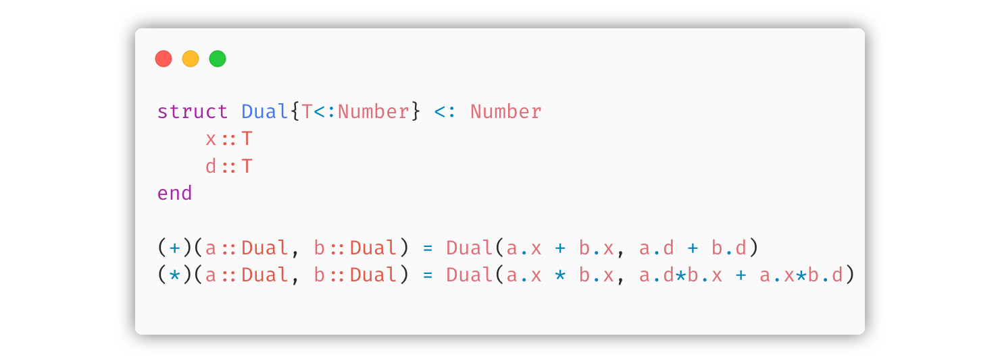

```@raw html


```

---

```@setup grsetup
using Plots
ENV["GKSwstype"] = "100"
gr()
```

Scientific Programming requires the highest performance but we also want to
write very high level code to enable rapid prototyping and avoid error prone,
low level implementations.

The [Julia](https://docs.julialang.org/en/v1/) programming language is designed
with exactly those requirements of scientific computing in mind.  In this
course we will show you how to make use of the tools and advantages that
*jit-compiled* Julia provides over *dynamic*, high-level languages like Python
or lower level languages like C++.


```@raw html
<figure>
  
  <figcaption>
    Learn the power of abstraction.
    Example: The essence of <a href="https://juliadiff.org/ForwardDiff.jl/dev/dev/how_it_works/">forward mode</a> automatic differentiation.
  </figcaption>
</figure>
```

Before joining the course, consider reading the following two blog posts to figure out if Julia is
a language in which you want to invest your time.
- What is [*great*](https://viralinstruction.com/posts/goodjulia/) about Julia.
- What is [*bad*](https://viralinstruction.com/posts/badjulia/) about Julia.


## What will you learn?

First and foremost you will learn how to _**think julia**_ - meaning how write
fast, extensible, reusable, and easy-to-read code using things like *optional
typing*, *multiple dispatch*, and functional programming concepts.  The later
part of the course will teach you how to use more advanced concepts like
*language introspection*, *metaprogramming*, and *symbolic computing*.
Amonst others you will _**implement your own automatic differetiation**_ (the
backbone of modern machine learning) package based on these advanced techniques
that can transform intermediate representations of Julia code.


## Organization

This course webpage contains all information about the course that you need,
including lecture notes, lab instructions, and homeworks. The official format
of the course is 2+2 (2h lectures/2h labs per week) for 4 credits.

The official course code is: **B0M36SPJ** and the timetable for the winter semester
2022 can be found [here](https://fel.cvut.cz/cz/education/rozvrhy-ng.B221/public/html/predmety/69/85/p6985906.html).

The course will be graded based on points from your homework (**max. 20 points**)
and points from a [final project](@ref final_project) (**max. 30 points**).

Below is a table that shows which lectures have homeworks (and their points).

| Homework | 1   | 2   | 3   | 4   | 5   | 6   | 7   | 8   | 9   | 10  | 11  | 12  | 13  |
| :--      | :-- | :-- | :-- | :-- | :-- | :-- | :-- | :-- | :-- | :-- | :-- | :-- | :-- |
| Points   | 2   | 2   | 2   | 2   | 2   | 2   | 2   | 2   | -   | 2   | -   | 2   | -   |

Hint: The **first few homeworks are easier**. Use them to fill up your points.


## [Final project](@id final_project)

The final project will be individually agreed on for each student. Ideally you
can use this project to solve a problem you have e.g. in your thesis, but don't
worry - if you cannot come up with an own project idea, we will suggest one to
you. More info and project suggestion can be found [here](@ref projects).


## Grading

Your points from the homeworks and the final project are summed and graded by
the standard grading scale below.

| Grade  | A     | B     | C     | D     | E     | F    |
| :--    | :--   | :--   | :--   | :--   | :--   | :--  |
| Points | 45-50 | 40-44 | 35-39 | 30-34 | 25-29 | 0-25 |


## [Teachers](@id emails)

| --          | E-mail                                                     | Room     | Role           |
| :--         | :--                                                        | :--      | :--            |
| Tomáš Pevný | [pevnak@protonmail.ch](mailto:pevnak@protonmail.ch)        | KN:E-406 | Lecturer       |
| Vašek Šmídl | [smidlva1@fjfi.cvut.cz](mailto:smidlva1@fjfi.cvut.cz)      | KN:E-333 | Lecturer       |
| Matěj Zorek  | [zorekmat@fel.cvut.cz](mailto:zorekmat@fel.cvut.cz)       | KN:E-333 | Lab Instructor |
| Niklas Heim | [heimnikl@fel.cvut.cz](mailto:heimnikl@fel.cvut.cz)        | KN:E-333 | Lab Instructor |


## Prerequisites

There are no hard requirements to take the course, but if you are not at all familiar
with Julia we recommend you to take [Julia for Optimization and Learning](https://github.com/JuliaTeachingCTU/Julia-for-Optimization-and-Learning) before enrolling in this course. The [Functional Programming](https://cw.fel.cvut.cz/b202/courses/fup/start) course also contains
some helpful concepts for this course. And knowledge about computer hardware, namely basics of how CPU works, how it interacts with memory through caches, and basics of multi-threadding certainly helps.

## References

- [Official documentation](https://docs.julialang.org/en/v1/)
- [Modern Julia Workflows](https://modernjuliaworkflows.github.io)
- [Workflow tips, and what is new in v1.9](https://www.youtube.com/watch?v=qM9NtiYlXck)
- [Think Julia: How to Think Like a Computer Scientist](https://benlauwens.github.io/ThinkJulia.jl/latest/book.html#chap01)
- [From Zero to Julia!](https://techytok.com/from-zero-to-julia/)
- [WikiBooks](https://en.wikibooks.org/wiki/Introducing_Julia)
- [Justin Krumbiel's](https://jkrumbiegel.com/pages/2022-08-26-pkg-introduction/) excellent introduction to the package manager.
- [juliadatascience.io](https://juliadatascience.io) contains an excellent introduction to plotting with Makie.
- The art of [multiple dispatch](https://scientificcoder.com/the-art-of-multiple-dispatch)
- MIT Course: [Julia Computation](https://github.com/mitmath/JuliaComputation)
- Tim Holy's [Advanced Scientific Computing](https://github.com/timholy/AdvancedScientificComputing)
