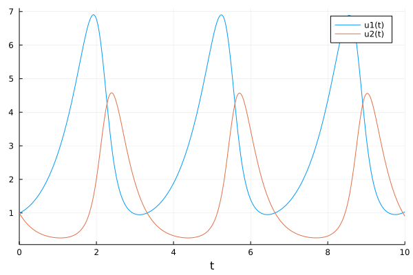
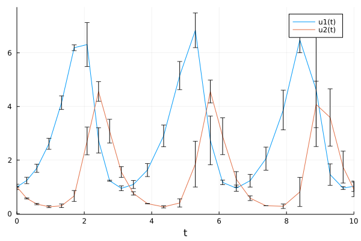

# Extensibility of the language

## DifferentialEquations

A package for solving differential equations, similar to ```odesolve``` in Matlab.

Example:

```julia
using DifferentialEquations
function lotka_volterra(du,u,p,t)
  x, y = u
  α, β, δ, γ = p
  du[1] = dx = α*x - β*x*y
  du[2] = dy = -δ*y + γ*x*y
end
u0 = [1.0,1.0]
tspan = (0.0,10.0)
p = [1.5,1.0,3.0,1.0]
prob = ODEProblem(lotka_volterra,u0,tspan,p)

sol = solve(prob)
using Plots
plot(sol)
```



## Measurements

A package defining "numbers with precision" and complete algebra on these numbers:

```julia
using Measurements

a = 4.5 ± 0.1
b = 3.8 ± 0.4

2a + b
sin(a)/cos(a) - tan(a)
```

It also defines recipes for Plots.jl how to plot such numbers.

## Starting ODE from an interval

```julia
using Measurements
u0 = [1.0±0.1,1.0±0.01]

prob = ODEProblem(lotka_volterra,u0,tspan,p)
sol = solve(prob)
plot(sol)
```



- all algebraic operations are defined, 
- passes all grid refinement techniques
- plot uses the correct  plotting for intervals

## Integration with other toolkits

Flux: toolkit for modelling Neural Networks. Neural network is a function.
  - integration with Measurements,
  - Integration with ODE (think of NN as part of the ODE)

Turing: Probabilistic modelling toolkit
  - integration with FLux (NN)
  - interation with ODE
  - using arbitrary bijective transformations, Bijectors.jl
