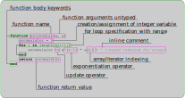

# Lab 01: Introduction to Julia
This lab should get everyone up to speed in the basics of Julia's installation, syntax and basic
coding. For more detailed introduction you can check out Lectures 1-3 of the bachelor
[course](https://juliateachingctu.github.io/Julia-for-Optimization-and-Learning/stable/).

## Testing Julia installation (custom setup)
In order to proceed further let's run a simple [script](https://github.com/JuliaTeachingCTU/Scientific-Programming-in-Julia/blob/master/docs/src/lecture_01/test_setup.jl) to see, that the setup described in chapter [Installation](@ref install) is working properly.
After spawning a terminal/cmdline run this command:
```bash
julia ./test_setup.jl
```
The script does the following 
- "Tests" if Julia is added to path and can be run with `julia` command from anywhere
- Prints Julia version info
- Checks Julia version.
- Checks git configuration (name + email)
- Creates an environment configuration files
- Installs a basic pkg called BenchmarkTools, which we will use for benchmarking a simple function later in the labs.

There are some quality of life improvements over long term support versions of Julia and thus throughout this course we will use the latest stable release of Julia 1.6.x.

## Polynomial evaluation example
Let's consider a common mathematical example for evaluation of nth-degree polynomial
```math
f(x) = a_{n}x^{n} + a_{n-1}x^{n-1} + \dots + a_{0}x^{0},
```
where $x \in \mathbb{R}$ and $\vec{a} \in \mathbb{R}^{n+1}$.

The simplest way of writing this in a generic fashion is realizing that essentially the function $f$ is really implicitly containing argument $\vec{a}$, i.e. $f \equiv f(\vec{a}, x)$, yielding the following Julia code

```@example lab01_base
function polynomial(a, x)
    accumulator = 0
    for i in length(a):-1:1
        accumulator += x^(i-1) * a[i] # ! 1-based indexing for arrays
    end
    return accumulator
end
nothing #hide
```

```@raw html
<div class="admonition is-category-exercise">
<header class="admonition-header">Exercise</header>
<div class="admonition-body">
```
Evaluate the code of the function called `polynomial` in Julia REPL and evaluate the function itself with the following arguments.
```@example lab01_base
a = [-19, 7, -4, 6] # list coefficients a from a^0 to a^n
x = 3               # point of evaluation
nothing #hide
```

```@raw html
</div></div>
<details class = "solution-body">
<summary class = "solution-header">Solution:</summary><p>
```

The simplest way is to just copy&paste into an already running terminal manually. As opposed to the default Python REPL, Julia can deal with the blocks of code and different indentation much better without installation of an `ipython`-like REPL. There are ways to make this much easier in different text editors/IDEs:
- `VSCode` - when using Julia extension is installed and `.jl` file is opened, `Ctrl/Cmd+Enter` will spawn Julia REPL
- `Sublime Text` - `Ctrl/Cmd+Enter` with `Send Code` pkg (works well with Linux terminal or tmux, support for Windows is poor)
- `Vim` - there is a Julia language [plugin](https://github.com/JuliaEditorSupport/julia-vim), which can be combine with [vimcmdline](https://github.com/jalvesaq/vimcmdline) to gain similar functionality

Either way, you should see the following:
```@repl lab01_base
function polynomial(a, x)
    accumulator = 0
    for i in length(a):-1:1
        accumulator += x^(i-1) * a[i] # ! 1-based indexing for arrays
    end
    return accumulator
end
```

Similarly we enter the arguments of the function `a` and `x`:
```@repl lab01_base
a = [-19, 7, -4, 6]
x = 3
```


Function call intuitively takes the name of the function with round brackets as arguments, i.e. works in the same way as majority of programming languages. The result is printed unless a `;` is added at the end of the statement.
```@repl lab01_base
polynomial(a, x)    # function call
```

```@raw html
</p></details>
```

Thanks to the high level nature of Julia language it is often the case that examples written in pseudocode are almost directly rewritable into the language itself without major changes and the code can be thus interpreted easily.



Due to the existence of the `end` keyword, indentation is not necessary as opposed to other languages such as Python, however it is strongly recommended to use it, see [style guide](https://docs.julialang.org/en/v1/manual/style-guide/#Style-Guide).

Though there are libraries/IDEs that allow us to step through Julia code (`Debugger.jl` [link](https://github.com/JuliaDebug/Debugger.jl) and `VSCode` [link](https://www.julia-vscode.org/docs/stable/userguide/debugging/)), here we will explore the code interactively in REPL by evaluating pieces of code separately.

### Basic types, assignments and variables
When defining a variable through an assignment we get the representation of the right side, again this is different from the default 
behavior in Python, where the output of assignments `a = [-19, 7, -4, 6]` or `x = 3`, prints nothing. Internally Julia returns the result of the `display` function.

```@repl lab01_base
a = [-19, 7, -4, 6]
display(a) # should return the same thing as the line above
```
As you can see, the string that is being displayed contains information about the contents of a variable along with it's type in this case this is a `Vector/Array` of `Int` types. If the output of `display` is insufficient the type of variable can be checked with the `typeof` function:
```@repl lab01_base
typeof(a)
```
Additionally for collection/iterable types such as `Vector` there is also the `eltype` function, which returns the type of elements in the collection.
```@repl lab01_base
eltype(a)
```

In most cases variables store just a reference to a place in memory either stack/heap (exceptions are primitive types such as `Int`, `Float`) and therefore creating an array `a`, "storing" the reference in `b` with an assignment and changing elements of `b`, e.g. `b[1] = 2`, changes also the values in `a`.

```@raw html
<div class="admonition is-category-exercise">
<header class="admonition-header">Exercise</header>
<div class="admonition-body">
```
Create variables `x` and `accumulator`, storing floating point `3.0` and integer value `0` respectively. Check the type of variables using `typeof` function.
```@raw html
</div></div>
<details class = "solution-body">
<summary class = "solution-header">Solution:</summary><p>
```
```@repl lab01_base
x = 3.0
accumulator = 0
typeof(x), typeof(accumulator)
```
```@raw html
</p></details>
```

### For cycles and ranges
Moving further into the polynomial function we encounter the definition of a for cycle, with the de facto standard syntax
```julia
for iteration_variable in iterator
    # do something
end
```
As an example of iterator we have used an instance of a range type 
```@repl lab01_base
r = length(a):-1:1
typeof(r)
```
As opposed to Python, ranges in Julia are *inclusive*, i.e. they contain number from start to end - in this case running from `4` to `1` with negative step `-1`, thus counting down. This can be checked with the `collect` and/or `length` functions.
```@repl lab01_base
collect(r)
length(r)
```

```@raw html
<div class="admonition is-category-exercise">
<header class="admonition-header">Exercise</header>
<div class="admonition-body">
```
Create variable `c` containing an array of even numbers from `2` to `42`. Furthermore create variable `d` that is different from `c` only at the 7th position, which will contain `13`.

**HINT**: Use `collect` function for creation of `c` and `copy` for making a copy of `c`.
```@raw html
</div></div>
<details class = "solution-body">
<summary class = "solution-header">Solution:</summary><p>
```
```@repl lab01_base
c = collect(2:2:42)
d = copy(c)
d[7] = 13
d
```
```@raw html
</p></details>
```

### Functions and operators
Let us now move from the function body to the function definition itself. From the picture at the top of the page, we can infer the general syntax for function definition:
```julia
function function_name(arguments)
    # do stuff with arguments and define output value `something`
    return something
end
```
The return keyword can be omitted, if the last line being evaluated contains the result.

By creating the function `polynomial` we have defined a variable `polynomial`, that from now on always refers to a function and cannot be reassigned to a different type, like for example `Int`.
```@repl lab01_base
polynomial = 42
```
This is caused by the fact that each function defines essentially a new type, the same like `Int ~ Int64` or `Vector{Int}`.
```@repl lab01_base
typeof(polynomial)
```
You can check that it is a subtype of the `Function` abstract type, with the subtyping operator `<:`
```@repl lab01_base
typeof(polynomial) <: Function
```
These concepts will be expanded further in the [type system lecture](@ref type_system), however for now note that this construction is quite useful for example if we wanted to create derivative rules for our function `derivativeof(::typeof(polynomial), ...)`.

Looking at mathematical operators `+`, `*`, we can see that in Julia they are also standalone functions. 
```@repl lab01_base
+
*
```
The main difference from our `polynomial` function is that there are multiple methods, for each of these functions. Each one of the methods coresponds to a specific combination of arguments, for which the function can be specialized to using *multiple dispatch*. You can see the list by calling a `methods` function:
```julia
julia> methods(+)
# 190 methods for generic function "+":                                                                               
[1] +(x::T, y::T) where T<:Union{Int128, Int16, Int32, Int64, Int8, UInt128, UInt16, UInt32, UInt64, UInt8} in Base at
 int.jl:87                                                                                                            
[2] +(c::Union{UInt16, UInt32, UInt64, UInt8}, x::BigInt) in Base.GMP at gmp.jl:528                                   
[3] +(c::Union{Int16, Int32, Int64, Int8}, x::BigInt) in Base.GMP at gmp.jl:534
...
```
One other notable difference is that these functions allow using both infix and postfix notation `a + b` and `+(a,b)`, which is a specialty of elementary functions such as arithmetic operators or set operation such as `∩, ∪, ∈`. 

The functionality of `methods` is complemented with the reverse lookup `methodswith`, which for a given type returns a list of methods that can be called with it as an argument.
```julia
julia> methodswith(Int)
[1] +(x::T, y::T) where T<:Union{Int128, Int16, Int32, Int64, Int8, UInt128, UInt16, UInt32, UInt64, UInt8} in Base at int.jl:87
[2] +(c::Union{Int16, Int32, Int64, Int8}, x::BigInt) in Base.GMP at gmp.jl:534
[3] +(c::Union{Int16, Int32, Int64, Int8}, x::BigFloat) in Base.MPFR at mpfr.jl:384
[4] +(x::BigFloat, c::Union{Int16, Int32, Int64, Int8}) in Base.MPFR at mpfr.jl:379
[5] +(x::BigInt, c::Union{Int16, Int32, Int64, Int8}) in Base.GMP at gmp.jl:533
...
```


```@raw html
<div class="admonition is-category-exercise">
<header class="admonition-header">Exercise</header>
<div class="admonition-body">
```
Define function called `addone` with one argument, that adds `1` to the argument.

```@raw html
</div></div>
<details class = "solution-body">
<summary class = "solution-header">Solution:</summary><p>
```

```@repl lab01_base
function addone(x)
    x + 1
end
addone(1) == 2
```

```@raw html
</p></details>
```


### Calling for help
In order to better understand some keywords we have encountered so far, we can ask for help in the Julia's REPL itself with the built-in help terminal. Accessing help terminal can be achieved by writing `?` with a query keyword after. This searches documentation of all the available source code to find the corresponding keyword. The simplest way to create documentation, that can be accessed in this way, is using so called `docstring`s, which are multiline strings written above function or type definition. 
```julia
"""
    polynomial(a, x)

Returns value of a polynomial with coefficients `a` at point `x`.
"""
function polynomial(a, x)
    # function body
end
```
More on this in lecture 4 about pkg development.

```@raw html
<div class="admonition is-category-exercise">
<header class="admonition-header">Exercise</header>
<div class="admonition-body">
```
Lookup `docstring` for the basic functions that we have introduced in the previous exercises: `typeof`, `eltype`, `length`, `collect`, `copy`, `methods` and `methodswith`. 

**BONUS**: Try it with others, for example with the subtyping operator `<:`.

```@raw html
</div></div>
<details class = "solution-body">
<summary class = "solution-header">Solution:</summary><p>
```
Example docstring for `typeof` function.
```julia
  typeof(x)

  Get the concrete type of x.

  Examples
  ≡≡≡≡≡≡≡≡≡≡

  julia> a = 1//2;
  
  julia> typeof(a)
  Rational{Int64}
  
  julia> M = [1 2; 3.5 4];
  
  julia> typeof(M)
  Matrix{Float64} (alias for Array{Float64, 2})
```
```@raw html
</p></details>
```

## Testing waters
As the arguments of the `polynomial` functions are untyped, i.e. they do not specify the allowed types like for example `polynomial(a, x::Number)` does, the following exercise explores which arguments the function accepts, while giving expected result.

```@raw html
<div class="admonition is-category-exercise">
<header class="admonition-header">Exercise</header>
<div class="admonition-body">
```
Choose one of the variables `af` to `ac` representing polynomial coefficients and try to evaluate it with the `polynomial` function at point `x=3` as before. Lookup the type of coefficient collection variable itself with `typeof` and the items in the collection with `eltype`. In this case we allow you to consult your solution with the expandable solution bellow to find out more information about a particular example.

```@example lab01_base
af = [-19.0, 7.0, -4.0, 6.0]
at = (-19, 7, -4, 6)
ant = (a₀ = -19, a₁ = 7, a₂ = -4, a₃ = 6)
a2d = [-19 -4; 7 6]
ac = [2i^2 + 1 for i in -2:1]
nothing #hide
```

```@raw html
</div></div>
<details class = "solution-body">
<summary class = "solution-header">Solution:</summary><p>
```

```@repl lab01_base
typeof(af), eltype(af)
polynomial(af, x)
```
As opposed to the basic definition of `a` type the array is filled with `Float64` types and the resulting value gets promoted as well to the `Float64`.


```@repl lab01_base
typeof(at), eltype(at)
polynomial(at, x)
```
With round brackets over a fixed length vector we get the `Tuple` type, which is so called immutable "array" of a fixed size (its elements cannot be changed, unless initialized from scratch). Each element can be of a different type, but here we have only one and thus the `Tuple` is aliased into `NTuple`. There are some performance benefits for using immutable structure, which will be discussed [later](@ref type_system).


Defining `key=value` pairs inside round brackets creates a structure called `NamedTuple`, which has the same properties as `Tuple` and furthermore its elements can be conveniently accessed by dot syntax, e.g. `ant.a₀`.
```@repl lab01_base
typeof(ant), eltype(ant)
polynomial(ant, x)
```

Defining a 2D array is a simple change of syntax, which initialized a matrix row by row separated by `;` with spaces between individual elements. The function returns the same result because linear indexing works in 2d arrays in the column major order.
```@repl lab01_base
typeof(a2d), eltype(a2d)
polynomial(a2d, x)
```

The last example shows so called array comprehension syntax, where we define and array of known length using and for loop iteration. Resulting array/vector has integer elements, however even mixed type is possible yielding `Any`, if there isn't any other common supertype to `promote` every entry into. (Use `?` to look what `promote` and `promote_type` does.)
```@repl lab01_base
typeof(ac), eltype(ac)
polynomial(ac, x)
```

```@raw html
</p></details>
```

So far we have seen that `polynomial` function accepts a wide variety of arguments, however there are some understandable edge cases that it cannot handle.

Consider first the vector/array of characters `ach`
```@example lab01_base
ach = ['1', '2', '3', '4']
```
which themselves have numeric values (you can check by converting them to Int `Int('1')` or `convert(Int, '1')`). In spite of that, our untyped function cannot process such input, as there isn't an operation/method that would allow multiplication of `Char` and `Int` type. Julia tries to promote the argument types to some common type, however checking the `promote_type(Int, Char)` returns `Any` (union of all types), which tells us that the conversion is not possible automatically.
```@repl lab01_base
typeof(ach), eltype(ach)
polynomial(ach, x)
```
In the stacktrace we can see the location of each function call. If we include the function `polynomial` from some file `poly.jl` using `include("poly.jl")`, we will see that the location changes from `REPL[X]:10` to the actual file name.


By swapping square brackets for round in the array comprehension `ac` above, we have defined so called generator/iterator, which as opposed to original variable `ac` does not allocate an array, only the structure that produces it.
```@example lab01_base
ag = (2i^2 + 1 for i in -2:1)
typeof(ag), eltype(ag)
```
You may notice that the element type in this case is `Any`, which means that a function using this generator as an argument cannot specialize based on the type and has to infer it every time an element is generated/returned. We will touch on how this affects performance in one of the later lectures.

```@repl lab01_base
polynomial(ag, x)
```
The problem that we face during evaluation is that generator type is missing the `getindex` operation, as they are made for situations where the size of the collection may be unknown and the only way of obtaining particular elements is through sequential iteration. Generators can be useful for example when creating batches of data for a machine learning training. We can "fix" the situation using `collect` function, mentioned earlier, however that again allocates an array.

## Extending/limiting the polynomial example
Following up on the polynomial example, let's us expand it a little further in order to facilitate the arguments, that have been throwing exceptions. The first direction, which we will move forward to, is providing the user with more detailed error message when an incorrect type of coefficients has been provided.

```@raw html
<div class="admonition is-category-exercise">
<header class="admonition-header">Exercise</header>
<div class="admonition-body">
```

Design an `if-else` condition such that the array of `Char` example throws an error with custom string message, telling the user what went wrong and printing the incorrect input alongside it. Confirm that we have not broken the functionality of other examples from previous exercise.

**HINTS:**
- Throw the `ArgumentError(msg)` with `throw` function and string message `msg`. More details in help mode `?` or at the end of this [document](@ref lab_errors).
- Strings are defined like this `s = "Hello!"`
- Use string interpolation to create the error message. It allows injecting an expression into a string with the `$` syntax `b = 1; s = "Hellow Number $(b)"`
- Compare `eltype` of the coefficients with `Char` type.
- The syntax for `if-else`:
```julia
if condition
    println("true") # true branch code
else
    println("false") # false branch code
end
```
- Not equal condition can be written as `a != b`.
- Throwing an exception automatically returns from the function. Use return inside one of the branches to return the correct value.

```@raw html
</div></div>
<details class = "solution-body">
<summary class = "solution-header">Solution:</summary><p>
```

The simplest way is to wrap the whole function inside an `if-else` condition and returning only when the input is "correct" (it will still fail in some cases).
```@repl lab01_base
function polynomial(a, x)
    if eltype(a) != Char
        accumulator = 0
        for i in length(a):-1:1
            accumulator += x^(i-1) * a[i] # ! 1-based indexing for arrays
        end
        return accumulator
    else
        throw(ArgumentError("Invalid coefficients $(a) of type Char!"))
    end
end
nothing #hide
```

Now this should show our predefined error message. 
```@repl lab01_base
polynomial(ach, x)
```

Testing on other examples should pass without errors and give the same output as before.
```@repl lab01_base
polynomial(a, x)
polynomial(af, x)
polynomial(at, x)
polynomial(ant, x)
polynomial(a2d, x)
polynomial(ac, x)
```

```@raw html
</p></details>
```

The second direction concerns the limitation to index-able structures, which the generator example is not. For this we will have to rewrite the whole loop in a more functional programming approach using `map`, anonymous function and other concepts.

```@raw html
<div class="admonition is-category-exercise">
<header class="admonition-header">Exercise</header>
<div class="admonition-body">
```

Rewrite the following code inside our original `polynomial` function with `map`, `enumerate` and anonymous function.
```julia
accumulator = 0
for i in length(a):-1:1
    accumulator += x^(i-1) * a[i] # ! 1-based indexing for arrays
end
```
!!! note "Anonymous functions reminder"
    ```@repl lab01_anonymous
    x -> x + 1              # unless the reference is stored it cannot be called
    plusone = x -> x + 1    # the reference can be stored inside a variable
    plusone(x)              # calling with the same syntax
    ```

**HINTS:**
- Use `enumerate` to obtain iterator over `a` that returns a tuple of `ia = (i, aᵢ)`. With Julia 1-based indexing `i` starts also from 1 and goes up to `length(a)`.
- Pass this into a `map` with either in-place or predefined anonymous function that does the operation of `x^(i-1) * aᵢ`.
- Use `sum` to collect the resulting array into `accumulator` variable or directly into the `return` command.

**BONUS:**
Can you figure out how to use the `mapreduce` function here? See entry in the help mode `?`.
```@raw html
</div></div>
<details class = "solution-body">
<summary class = "solution-header">Solution:</summary><p>
```

Ordered from the longest to the shortest, here are three examples with the same functionality (and there are definitely many more).
Using the `map(iterable) do itervar ... end` syntax, that creates anonymous function from the block of code.
```@example lab01_base
function polynomial(a, x)
    powers = map(enumerate(a)) do (i, aᵢ)
        x^(i-1) * aᵢ
    end
    accumulator = sum(powers)
    return accumulator
end
nothing #hide
```

Using the default syntax for `map` and storing the anonymous into a variable
```@example lab01_base
function polynomial(a, x)
    polypow(i,aᵢ) = x^(i-1) * aᵢ
    powers = map(polypow, enumerate(a))
    return sum(powers)
end
nothing #hide
```

As the function `polypow` is used only once, there is no need to assign it to a local variable.
Note the sightly awkward additional parenthesis in the argument of the lambda function.
```@example lab01_base
function polynomial(a, x)
    powers = map(((i,aᵢ),) -> x^(i-1) * aᵢ, enumerate(a))
    sum(powers)
end
nothing #hide
```

Checking the behavior on all the inputs.
```@repl lab01_base
polynomial(a, x)
polynomial(af, x)
polynomial(at, x)
polynomial(ant, x)
polynomial(a2d, x)
polynomial(ach, x)
polynomial(ac, x)
polynomial(ag, x)
```

**BONUS:** You may have noticed that in the example above, the `powers` variable is allocating an
additional, unnecessary vector. With the current, scalar `x`, this is not such a big deal. But in
your homework you will generalize this function to matrix inputs of `x`, which means that `powers`
becomes a vector of (potentially very large) matrices. This is a very natural use case for the
`mapreduce`:
function:
```@example lab01_base
polynomial(a, x) = mapreduce(+, enumerate(a), init=zero(x)) do (i, aᵢ)
    x^(i-1) * aᵢ
end

polynomial(a, x)
```
Let's unpack what is happening here. If the function `mapreduce(f, op, itr)` is called with `op=+`
it returns the same result as `sum(map(f, itr))`.  In contrast to `sum(map(f, itr))` (which
allocates a vector as a result of `map` and **then** sums) `mapreduce` applies `f` to an element in
`itr` and **immediately accumulates** the result with the given `op=+`.


```@repl lab01_base
polynomial(a, x) = sum(ia -> x^(ia[1]-1) * ia[2], enumerate(a))
nothing #hide
```

```@raw html
</p></details>
```

## How to use code from other people
The script that we have run at the beginning of this lab has created two new files inside the current folder:
```
./
 ├── Manifest.toml
 └── Project.toml
```
Every folder with a toml file called `Project.toml`, can be used by Julia's pkg manager into setting so called environment, which contains a list of pkgs to be installed. Setting up or more often called activating an environment can be done either before starting Julia itself by running julia with the `--project XXX` flag or from within the Julia REPL, by switching to Pkg mode with `]` key (similar to the help mode activated by pressing `?`) and running command `activate`.

So far we have used the general environment (depending on your setup), which by default does not come with any 3rd party packages and includes only the base and standard libraries - [already](https://docs.julialang.org/en/v1/base/arrays/) [quite](https://docs.julialang.org/en/v1/base/multi-threading/) [powerful](https://docs.julialang.org/en/v1/stdlib/Distributed/) [on its own](https://docs.julialang.org/en/v1/stdlib/LinearAlgebra/). 

In order to find which environment is currently active, run the following:
```julia
pkg> status
```
The output of such command usually indicates the general environment located at `.julia/` folder (`${HOME}/.julia/` or `${APPDATA}/.julia/` in case of Unix/Windows based systems respectively)
```julia
pkg> status
Status `~/.julia/environments/v1.6/Project.toml` (empty project)
```
Generally one should avoid working in the general environment, with the exception of some generic pkgs, such as `PkgTemplates.jl`, which is used for generating library templates/folder structure like the one above ([link](https://github.com/invenia/PkgTemplates.jl)), more on this in the lecture on pkg development. 


```@raw html
<div class="admonition is-category-exercise">
<header class="admonition-header">Exercise</header>
<div class="admonition-body">
```
Activate the environment inside the current folder and check that the `BenchmarkTools` package has been installed. Use `BenchmarkTools` pkg's `@btime` to benchmark our `polynomial` function with the following arguments.
```@example lab01_base
aexp = ones(10) ./ factorial.(0:9)
x = 1.1
nothing #hide
```

**HINTS:**
- In pkg mode use the command `activate` and `status` to check the presence. 
- In order to import the functionality from other package, lookup the keyword `using` in the repl help mode `?`. 
- The functionality that we want to use is the `@btime` macro (it acts almost like a function but with a different syntax `@macro arg1 arg2 arg3 ...`). More on macros in lecture 7.

**BONUS**: Compare the output of `polynomial(aexp, x)` with the value of `exp(x)`, which it approximates.

!!! note "Broadcasting"
    In the assignment's code, we are using quite ubiquitous concept in Julia called `broadcasting` or simply the `dot-syntax` - represented here by `./`, `factorial.`. This concept allows to map both simple arithmetic operations as well as custom functions across arrays, with the added benefit of increased performance, when the broadcasting system can merge operations into a more efficient code. More information can be found in the official [documentation](https://docs.julialang.org/en/v1/manual/arrays/#Broadcasting) or [section](https://juliateachingctu.github.io/Julia-for-Optimization-and-Learning/stable/lecture_01/arrays/#Broadcasting) of our bachelor course.

```@raw html
</div></div>
<details class = "solution-body">
<summary class = "solution-header">Solution:</summary><p>
```

There are other options to import a function/macro from a different package, however for now let's keep it simple with the `using Module` syntax, that brings to the REPL, all the variables/function/macros exported by the `BenchmarkTools` pkg. If `@btime` is exported, which it is, it can be accessed without specification i.e. just by calling `@btime` without the need for `BenchmarkTools.@btime`. More on the architecture of pkg/module loading in the package developement lecture.
```julia
julia> using BenchmarkTools

julia> @btime polynomial(aexp, x)
  97.119 ns (1 allocation: 16 bytes)
3.004165230550543
```
The output gives us the time of execution averaged over multiple runs (the number of samples is defined automatically based on run time) as well as the number of allocations and the output of the function, that is being benchmarked.


**BONUS**: The difference between our approximation and the "actual" function value computed as a difference of the two. 
```@repl lab01_base
polynomial(aexp, x) - exp(x)
```
The apostrophes in the previous sentence are on purpose, because implementation of `exp` also relies on a finite sum, though much more sophisticated than the basic Taylor expansion.

```@raw html
</p></details>
```

## Discussion & future directions
Instead of `if-else` statements that would throw an error for different types, in Julia, we generally see the pattern of typing the function in a way, that for other than desirable types `MethodError` is emitted with the information about closest matching methods. This is part of the design process in Julia of a function and for the particular functionality of the `polynomial` example, we can look into the Julia itself, where it has been implemented in the `evalpoly` function
```@repl lab01_base
methods(evalpoly)
```

Another avenue, that we have only touched with the `BenchmarkTools`, is performance and will be further explored in the later lectures.

With the next lecture focused on typing in Julia, it is worth noting that polynomials lend themselves quite nicely to a definition of a custom type, which can help both readability of the code as well further extensions.
```julia
struct Polynom{C}
    coefficients::{C}
end

function (p:Polynom)(x)
    polynomial(p.coefficients, x)
end
```

---

## Useful resources
- Getting Started tutorial from JuliaLang documentation - [Docs](https://docs.julialang.org/en/v1/manual/getting-started/)
- Converting syntax between MATLAB ↔ Python ↔ Julia - [Cheatsheet](https://cheatsheets.quantecon.org/)
- Bachelor course for refreshing your knowledge - [Course](https://juliateachingctu.github.io/Julia-for-Optimization-and-Learning/stable/)
- Stylistic conventions - [Style Guide](https://docs.julialang.org/en/v1/manual/style-guide/#Style-Guide)
- Reserved keywords - [List](https://docs.julialang.org/en/v1/base/base/#Keywords)
- Official cheatsheet with basic syntax - [link](https://juliadocs.github.io/Julia-Cheat-Sheet/)


### [Various errors and how to read them](@id lab_errors)
This section summarizes most commonly encountered types of errors in Julia and how to resolve them or at least understand, what has gone wrong. It expands a little bit the official [documentation](https://docs.julialang.org/en/v1/base/base/#Errors), which contains the complete list with examples. Keep in mind again, that you can use help mode in the REPL to query error types as well.

#### `MethodError`
This type of error is most commonly thrown by Julia's multiple dispatch system with a message like `no method matching X(args...)`, seen in two examples bellow.
```@repl lab01_exceptions
2 * 'a'                       # many candidates
getindex((i for i in 1:4), 3) # no candidates
```
Both of these examples have a short stacktrace, showing that the execution failed on the top most level in `REPL`, however if this code is a part of some function in a separate file, the stacktrace will reflect it. What this error tells us is that the dispatch system could not find a method for a given function, that would be suitable for the type of arguments, that it has been given. In the first case Julia offers also a list of candidate methods, that match at least some of the arguments

When dealing with basic Julia functions and types, this behavior can be treated as something given and though one could locally add a method for example for multiplication of `Char` and `Int`, there is usually a good reason why Julia does not support such functionality by default. On the other hand when dealing with user defined code, this error may suggest the developer, that either the functions are too strictly typed or that another method definition is needed in order to satisfy the desired functionality.

#### `InexactError`
This type of error is most commonly thrown by the type conversion system (centered around `convert` function), informing the user that it cannot exactly convert a value of some type to match arguments of a function being called.
```@repl lab01_exceptions
Int(1.2)                      # root cause
append!([1,2,3], 1.2)         # same as above but shows the root cause deeper in the stack trace
```
In this case the function being `Int` and the value a floating point. The second example shows `InexactError` may be caused deeper inside an inconspicuous function call, where we want to extend an array by another value, which is unfortunately incompatible.

#### `ArgumentError`
As opposed to the previous two errors, `ArgumentError` can contain user specified error message and thus can serve multiple purposes. It is however recommended to throw this type of error, when the parameters to a function call do not match a valid signature, e.g. when `factorial` were given negative or non-integer argument (note that this is being handled in Julia by multiple dispatch and specific `DomainError`).

This example shows a concatenation of two 2d arrays of incompatible sizes 3x3 and 2x2.
```@repl lab01_exceptions
hcat(ones(3,3), zeros(2,2))
```

#### `KeyError`
This error is specific to hash table based objects such as the `Dict` type and tells the user that and indexing operation into such structure tried to access or delete a non-existent element.
```@repl lab01_exceptions
d = Dict(:a => [1,2,3], :b => [1,23])
d[:c]
```

#### `TypeError`
Type assertion failure, or calling an intrinsic function (inside LLVM, where code is strictly typed) with incorrect argument type. In practice this error comes up most often when comparing value of a type against the `Bool` type as seen in the example bellow.
```@repl lab01_exceptions
if 1 end                # calls internally typeassert(1, Bool)
typeassert(1, Bool)
```
In order to compare inside conditional statements such as `if-elseif-else` or the ternary operator `x ? a : b` the condition has to be always of `Bool` type, thus the example above can be fixed by the comparison operator: `if 1 == 1 end` (in reality either the left or the right side of the expression contains an expression or a variable to compare against).

#### `UndefVarError`
While this error is quite self-explanatory, the exact causes are often quite puzzling for the user. The reason behind the confusion is to do with *code scoping*, which comes into play for example when trying to access a local variable from outside of a given function or just updating a global variable from within a simple loop. 

In the first example we show the former case, where variable is declared from within a function and accessed from outside afterwards.
```@repl lab01_exceptions
function plusone(x)
    uno = 1
    return x + uno
end
uno # defined only within plusone
```

Unless there is variable `I_am_not_defined` in the global scope, the following should throw an error.
```@repl lab01_exceptions
I_am_not_defined
```
Often these kind of errors arise as a result of bad code practices, such as long running sessions of Julia having long forgotten global variables, that do not exist upon new execution (this one in particular has been addressed by the authors of the reactive Julia notebooks [Pluto.jl](https://github.com/fonsp/Pluto.jl)).

For more details on code scoping we recommend particular places in the bachelor course lectures [here](https://juliateachingctu.github.io/Julia-for-Optimization-and-Learning/stable/lecture_02/scope/#Soft-local-scope) and [there](https://juliateachingctu.github.io/Julia-for-Optimization-and-Learning/stable/lecture_03/scope/#Scope-of-variables).

#### `ErrorException` & `error` function
`ErrorException` is the most generic error, which can be thrown/raised just by calling the `error` function with a chosen string message. As a result developers may be inclined to misuse this for any kind of unexpected behavior a user can run into, often providing out-of-context/uninformative messages.
