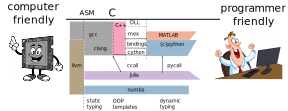

# Introduction to Scientific Programming

!!! note "Loose definition of Scientific Programming"
    [Scientific programming languages](https://en.wikipedia.org/wiki/Scientific_programming_language)
    are designed and optimized for implementing mathematical formulas and for computing with matrices.

Examples of Scientific programming languages include ALGOL, APL, Fortran, J, Julia, Maple, MATLAB and R.

Key requirements for a Scientific programming language:
1. _**Fast**_ execution of the code (complex algorithms).
2. _**Ease**_ of code reuse / code restructuring.

```@raw html
<figure>
  
  <figcaption>
    <a href="https://en.wikipedia.org/wiki/Julia_set">Julia set</a>.
    Stolen from
    <a href="https://juliagraphics.github.io/ColorSchemes.jl/stable/images/">Colorschemes.jl</a>.
  </figcaption>
</figure>
```

In contrast, to general-purpose language Julia has:
- less concern with standalone executable/libraby compilation 
- less concern with Application binary interface (ABI)
- less concern with business models (library + header files)
- less concern with public/private separation

!!! tip "Example of a scientific task"
    In many applications, we encounter the task of optimization a function given by a routine (e.g. engineering, finance, etc.)
    
    ```julia
    using Optim
    
    P(x,y) = x^2 - 3x*y + 5y^2 - 7y + 3   # user defined function
    
    z₀ = [ 0.0
           0.0 ]     # starting point 
    
    optimize(z -> P(z...), z₀, ConjugateGradient())
    optimize(z -> P(z...), z₀, Newton())
    optimize(z -> P(z...), z₀, Newton();autodiff = :forward)
    
    ```

Very simple for a user, very complicated for a programmer. The program should:
 - pick the right optimization method (easy by config-like approach)
 - compute gradient (Hessian) of a *user* function

## Classical approach: create a *fast* library and flexible calling enviroment

Crucial algorithms (sort, least squares...) are relatively small and well defined. Application of these algorithms to real-world problem is typically not well defined and requires more code. Iterative development. 

Think of a problem of repeated execution of similar jobs with different options. Different level 
- binary executable with command-line switches
- binary executable with configuration file
- scripting language/environment (Read-Eval-Print Loop)

It is not a strict boundary, increasing expresivity of the configuration file will create a new scripting language.

Ending up in the *2 language problem*. 

1.  Low-level programming = computer centric
    - close to the hardware
    - allows excellent optimization for fast execution

2. High-level programming = user centric
    - running code with many different modifications as easily as possible
    - allowing high level of abstraction

In scientific programming, the most well known scripting languages are: Python,  Matlab, R

- If you care about standard "configurations" they are just perfect.  (PyTorch, BLAS)
- You hit a problem with more complex experiments, such a modifying the internal algorithms.

The scripting language typically makes decisions (```if```) at runtime. Becomes slow.

### Examples
1. Basic Linear Algebra Subroutines (BLAS)--MKL, OpenBlas---with bindings (Matlab, NumPy)
2. Matlab and Mex (C with pointer arithmetics)
3. Python with transcription to C (Cython)


### Convergence efforts
1. Just-in-time compilation (understands high level and converts to low-level)
2. automatic typing (auto in C++) (extends low-level with high-level concepts)

# Julia approach: fresh thinking



A dance between specialization and abstraction. 

- **Specialization**  allows for custom treatment. The right algorithm for the right circumstance is obtained by *Multiple dispatch*,
- **Abstraction** recognizes what remains the same after differences are stripped away. Abstractions in mathematics are captured as code through *generic programming*.

Why a new language?

## Challenge
Translate high-level thinking with as much abstraction as possible into specific *fast* machine code.

Not so easy!

!!! theorem "Indexing array x in Matlab:"
    ```matlab
    x = [1,2,3]
    y=x(4/2)
    y=x(5/2)
    ```
    In the first case it works, in the second throws an error.
    - type instability 
    - function ```inde(x,n,m)=x(n/m)``` can never be fast.
    - Poor language design choice!

Simple solution
- Solved by different floating and integer division operation ```/,÷```
- Not so simple with complex objects, e.g. triangular matrices


Julia was designed as a high-level language that allows very high level abstract concepts but *propagates* as much information about the specifics as possible to help the compiler to generate as fast code as possible. Taking lessons from the inability to achieve fast code compilation (mostly from python).


- julia is faster than C?

## Julia way
Design principle: abstraction should have *zero* runtime  cost

- flexible type system with strong typing (abstract types)
- multiple dispatch
- single language from high to low levels (as much as possible)
  optimize execution as much as you can during *compile time*
    - functions as symbolic abstraction layers


- AST = Abstract Syntax Tree
- IR = Intermediate Representation


## Teaser example
Function recursion with arbitrary number of arguments:
```julia
fsum(x) = x
fsum(x,p...) = x+fsum(p...)
```
Defines essentially a sum of inputs. Nice generic and abstract concept.

Possible in many languages:
- Matlab via ```nargin, varargin``` using construction
  ```if nargin==1, out=varargin{1}, else out=fsum(varargin{2:end}), end```

Julia solves this ```if``` at compile time. 

The generated code can be inspected by macro ```@code_llvm```?
```
fsum(1,2,3)
@code_llvm fsum(1,2,3)
@code_llvm fsum(1.0,2.0,3.0)
fz()=fsum(1,2,3)
@code_llvm fz()
```

Note that each call of fsum generates a new and different function.

Functions can act either as regular functions or like templates in C++. Compiler decides.

This example is relatively simple, many other JIT languages can optimize such code. Julia allows taking this approach further.


Generality of the code:
```julia
fsum('c',1)
fsum([1,2],[3,4],[5,6])
```

Relies on *multiple dispatch* of the ```+``` function.


More involved example:
```julia
using Zygote

f(x)=3x+1           # user defined function
@code_llvm f'(10)
```

The simplification was not achieved by the compiler alone.
- Julia provides tools for AST and IR code manipulation
- automatic differentiation via IR manipulation is implemented in Zygote.jl
- in a similar way, debugger is implemented in Debugger.jl
- very simple to design *domain specific* language
  ```julia
  using Turing
  using StatsPlots
  
  @model function gdemo(x, y)
      s² ~ InverseGamma(2, 3)
      m ~ Normal(0, sqrt(s²))
      x ~ Normal(m, sqrt(s²))
      y ~ Normal(m, sqrt(s²))
  end
  ```
  

Such tools allow building a very convenient user experience on abstract level, and reaching very efficient code.

## Reproducibile research

Think about a code that was written some time ago. To run it, you often need to be able to have the same version of the language it was written for. 

- **Standard way**
  language freezes syntax and guarantees some back-ward compatibility (Matlab), which prevents future improvements

- **Julia approach**
  allows easy recreation of the *environment* in which the code was developed. Every project (e.g. directory) can have its own environment

!!! tip "Environment"
    Is an independent set of packages that can be local to an individual project or shared and selected by name.

!!! tip "Package" 
    A package is a source tree with a standard layout providing functionality that can be reused by other Julia projects.

This allows  Julia to be a  rapidly evolving ecosystem with frequent changes due to:
- built-in package manager
- switching between multiple versions of packages


### Package manager

- implemented by Pkg.jl
- source tree have their structure defined by a convention
- have its own mode in REPL
- allows adding packages for using (```add```) or development (```dev```)
- supporting functions for creation (```generate```) and activation (```activate```) and many others


## Julia from user's point of view

 1. **compilation** of everything to as specialized as possible
    + very fast code
    - slow interaction (caching...)
    - generating libraries is harder 
        - think of ```fsum```, 
        - everything is ".h"  (Eigen library)
    - debugging is different to matlab/python

 2. **extensibility**, Multiple dispatch = multi-functions
    + allows great extensibility and code composition
    - not (yet) mainstream thinking
    - Julia is not Object-oriented
    - Julia is (not pure) functional language

