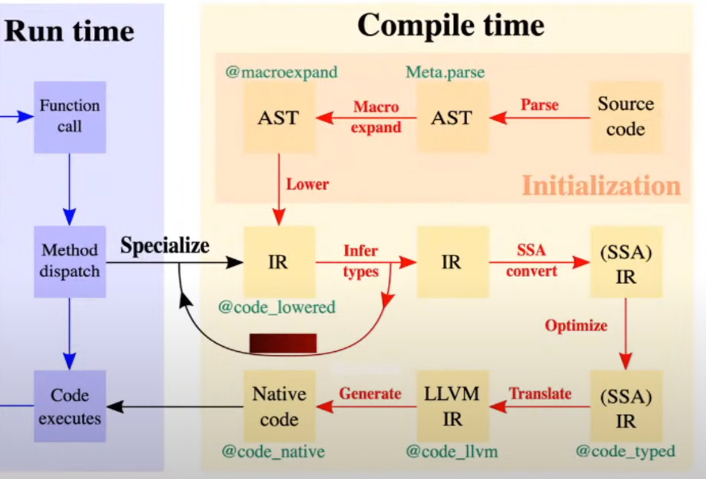

# Introduction to Scientific Programming

Loose def: a scientific programming language is designed and optimized for the use of mathematical formula and matrices [wiki](https://en.wikipedia.org/wiki/Scientific_programming_language)

Examples of Scientific programming languages include ALGOL, APL, Fortran, J, Julia, Maple, MATLAB and R.

Key requirements:
- fast execution of the code (complex algorithms)
- ease of code reuse / restructuring 
- reproducibility of the results

Contrast to general-purpose language:
- less concern with business models (library + header files)
- less concern with ABI 
- less concern with public/private separation

## TODO
Zero cost abstraction - Rackcaucas


### Example
In many applications, we encounter the task of optimization a function given by a routine (e.g. engineering, finance, etc.)

```
using Optim

P(x,y) = x^2 - 3x*y + 5y^2 - 7y + 3   # user defined function

z₀ = [ 0.0
       0.0 ]     # starting point for optimization algorithm

optimize(z -> P(z...), z₀, Newton())
#optimize(z -> P(z...), z₀, Newton();autodiff = :forward)
#optimize(z -> P(z...), z₀, ConjugateGradient())

```

Very simple for a user, very complicated for a programmer. The program should:
 - pick the right optimization method (easy by config-like approach)
 - compute gradient (Hessian) of a *user* function

### Classical thinking: create a library, call it.

Think of an experiment: ```main``` taking a configuration file. The configuration file can be simple: ```input file```, what to do with it, ```output file```.

The more complicated experiments you want to do, the more complex your configuration file becomes. Sooner or later, you will create a new *configuration language*, or *scripting language*.

Ending up in *2 language problem*. 

1.  Low-level programming = computer centric
    - close to the hardware
    - allows excellent optimization for fast execution

2. High-level programming = user centric
    - experimenting = running multiple configurations
    - running code with many different parameters as easily as possible
    - allowing high level of abstraction

In scientific programming, the most well known scipting languages are: Python,  Matlab, R

- If you care about standard "configurations" they are just perfect. 
- You hit a problem with more complex experiments. 

The scripting language typically makes decisions (```if```) at runtime. Becomes slow.


## Other approaches
1. Just in time compilation (HL -> LL)
2. automatic typing (auto in C++) (LL->HL)

## Challenge
Translate high-level thinking with as much abstraction as possible into *fast* machine code.


Indexing array x in Matlab:
```
y=x(4/2)
y=x(5/2)
```
In the first case it works, in the second throws an error.
 - function inde(x,n,m), x(n/m) can never be fast.

## Julia way
- strong but flexible type system
- multiple dispatch
- single language from high to low levels (as much as possible)
- optimize execution as much as you can during *runtime*
    - functions are symbolic abstract layers
    - abstraction should have zero computational cost



## Example:
Function recursion with arbitrary number of arguments:
```
fsum(x) = x
fsum(x,p...) = x+fsum(p[1],p[2:end]...)

fsum(1,2,3)
@code_llvm fsum(1,2,3)
@code_llvm fsum(1.0,2.0,3.0)
fz()=fsum(1,2,3)
@code_llvm fz()
```

More involved example:
```
using Zygote

f(x)=3x+1
@code_llvm f'(10)
```

Fuctions can act eiter as regular functions or like templates in C++.

## Advantages and disadvantages
 1. compilation of everything to 
    + very fast code
    - slow interaction (caching...)
    - generating libraries is harder 
        - think of ```fsum```, 
        - everything is ".h" file
    - debugging will be harder

 2. Multiple dispatch
    + allows great extensibility and code composition
    - not (yet) mainstream thinking

