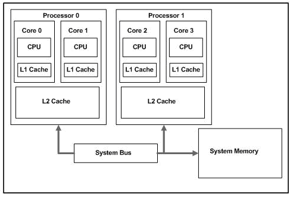

# Course outline

1. type system
   - user: tool for abstraction
   - compiler: tool for memory layout

2. design patterns (mental setup)
    - julia is a type-based language
    - generalizes OOP and FP

3. Packages
    - way how to organize code
    - code reuse (alternative to libraries)
    - experiment reproducibility

4. 

## How to write fast code:

cache misses.

# Syntax

Syntactic Sugar:
Cheat sheet: https://cheatsheets.quantecon.org/

# Typing -> Lecture 2

- static
- dynamic

# 

