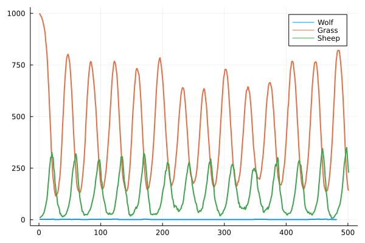

# [Lab 2: Predator-Prey Agents](@id lab02)

In the next labs you will implement your own *predator-prey model*.  The model
will contain wolves, sheep, and - to feed your sheep - some grass.  The final
simulation will be turn-based and the agents will be able to eat each other,
reproduce, and die in every iteration. 
At every iteration of the simulation each agent will step forward in time
via the `agent_step!` function. The steps for the `agent_step!` methods of
animals and plants are written below in pseudocode.
```
# for animals:
agent_step!(animal, world)
    decrement energy by 1
    find & eat food (with probability pf)
    die if no more energy
    reproduce (with probability pr)

# for plants:
agent_step!(plant, world)
    grow if not at maximum size
```

The `world` in which the agents live will be the simplest possible world with
zero dimensions (i.e. a `Dict` of `ID=>Agent`). Running and plotting your final
result could look something like the plot below.



We will start implementing the basic functionality for each `Agent` like
`eat!`ing, `reproduce!`ing, and a very simplistic `World` for your agents to live in.
In the next lab you will refine both the type hierarchy of your `Agent`s, as well
as the design of the `World` in order to leverage the power of Julia's type system
and compiler.

We start with a very basic type hierarchy:
```@example block
abstract type Agent end
abstract type Animal <: Agent end
abstract type Plant <: Agent end
```

We will implement the `World` for our `Agent`s later, but it will essentially be
implemented by a `Dict` which maps unique IDs to an `Agent`. Hence, every agent
will need an ID.


## The `Grass` Agent

Let's start by implementing some `Grass` which will later be able to grow
during each iteration of our simulation.
```@raw html
<div class="admonition is-category-exercise">
<header class="admonition-header">Exercise:</header>
<div class="admonition-body">
```
1. Define a mutable `struct` called `Grass` which is a subtype of `Plant` has the fields
   `id` (the unique identifier of this `Agent` - every agent needs one!),
   `size` (the current size of the `Grass`), and `max_size`. All fields should be integers.
2. Define a constructor for `Grass` which, given only an ID and a maximum size
   $m$, will create an instance of `Grass` that has a randomly initialized size in
   the range $[1,m]$. It should also be possible to create `Grass`, just with an ID
   and a default `max_size` of `10`.
3. Implement `Base.show(io::IO, g::Grass)` to get custom printing of your `Grass` such that
   the `Grass` is displayed with its size in percent of its `max_size`.

*Hint:* You can implement a custom `show` method for a new type `MyType` like this:
```julia
struct MyType
    x::Bool
end
Base.show(io::IO, a::MyType) = print(io, "MyType $(a.x)")
```
```@raw html
</div></div>
<details class = "solution-body">
<summary class = "solution-header">Solution:</summary><p>
```
Since Julia 1.8 we can also declare some fields of `mutable` structs as `const`,
which can be used both to prevent us from mutating immutable fields (such as the ID)
but can also be used by the compiler in certain cases.
```@example block
mutable struct Grass <: Plant
    const id::Int
    size::Int
    const max_size::Int
end

Grass(id,m=10) = Grass(id, rand(1:m), m)

function Base.show(io::IO, g::Grass)
    x = g.size/g.max_size * 100
    # hint: to type the leaf in the julia REPL you can do:
    # \:herb:<tab>
    print(io,"🌿 #$(g.id) $(round(Int,x))% grown")
end
```
```@raw html
</p></details>
```

Creating a few `Grass` agents can then look like this:
```@repl block
Grass(1,5)
g = Grass(2)
g.id = 5
```


## `Sheep` and `Wolf` Agents

Animals are slightly different from plants. They will have an energy $E$, which
will be increase (or decrease) if the agent eats (or reproduces) by a certain
amount $\Delta E$.  Later we will also need a probability to find food $p_f$ and
a probability to reproduce $p_r$.c

```@raw html
<div class="admonition is-category-exercise">
<header class="admonition-header">Exercise:</header>
<div class="admonition-body">
```
1. Define two mutable structs `Sheep` and `Wolf` that are subtypes of `Animal` and have the fields
   `id`, `energy`, `Δenergy`, `reprprob`, and `foodprob`.
2. Define constructors with the following default values:
   - For 🐑: $E=4$, $\Delta E=0.2$, $p_r=0.8$, and $p_f=0.6$.
   - For 🐺: $E=10$, $\Delta E=8$, $p_r=0.1$, and $p_f=0.2$.
3. Overload `Base.show` to get pretty printing for your two new animals.
```@raw html
</div></div>
<details class = "solution-body">
<summary class = "solution-header">Solution:</summary><p>
```
Solution for `Sheep`
```@example block
mutable struct Sheep <: Animal
    const id::Int
    const energy::Float64
    Δenergy::Float64
    const reprprob::Float64
    const foodprob::Float64
end

Sheep(id, e=4.0, Δe=0.2, pr=0.8, pf=0.6) = Sheep(id,e,Δe,pr,pf)

function Base.show(io::IO, s::Sheep)
    e = s.energy
    d = s.Δenergy
    pr = s.reprprob
    pf = s.foodprob
    print(io,"🐑 #$(s.id) E=$e ΔE=$d pr=$pr pf=$pf")
end
```
Solution for `Wolf`:
```@example block
mutable struct Wolf <: Animal
    const id::Int
    energy::Float64
    const Δenergy::Float64
    const reprprob::Float64
    const foodprob::Float64
end

Wolf(id, e=10.0, Δe=8.0, pr=0.1, pf=0.2) = Wolf(id,e,Δe,pr,pf)

function Base.show(io::IO, w::Wolf)
    e = w.energy
    d = w.Δenergy
    pr = w.reprprob
    pf = w.foodprob
    print(io,"🐺 #$(w.id) E=$e ΔE=$d pr=$pr pf=$pf")
end
```
```@raw html
</p></details>
```

```@repl block
Sheep(4)
Wolf(5)
```


## The `World`

Before our agents can eat or reproduce we need to build them a `World`.
The simplest (and as you will later see, somewhat suboptimal) world is essentially
a `Dict` from IDs to agents. Later we will also need the maximum ID, lets define
a world with two fields:
```@example block
mutable struct World{A<:Agent}
    agents::Dict{Int,A}
    max_id::Int
end
```

```@raw html
<div class="admonition is-category-exercise">
<header class="admonition-header">Exercise:</header>
<div class="admonition-body">
```
Implement a constructor for the `World` which accepts a vector of `Agent`s.
```@raw html
</div></div>
<details class = "solution-body">
<summary class = "solution-header">Solution:</summary><p>
```
```@example block
function World(agents::Vector{<:Agent})
    max_id = maximum(a.id for a in agents)
    World(Dict(a.id=>a for a in agents), max_id)
end

# optional: overload Base.show
function Base.show(io::IO, w::World)
    println(io, typeof(w))
    for (_,a) in w.agents
        println(io,"  $a")
    end
end
```
```@raw html
</p></details>
```


## `Sheep` eats `Grass`

We can implement the behaviour of our various agents with respect to each other
by leveraging Julia's multiple dispatch.

```@raw html
<div class="admonition is-category-exercise">
<header class="admonition-header">Exercise</header>
<div class="admonition-body">
```
Implement a function `eat!(::Sheep, ::Grass, ::World)` which increases the sheep's
energy by $\Delta E$ multiplied by the size of the grass.

After the sheep's energy is updated the grass is eaten and its size counter has
to be set to zero.

Note that you do not yet need the world in this function. It is needed later
for the case of wolves eating sheep.
```@raw html
</div></div>
<details class = "solution-body">
<summary class = "solution-header">Solution:</summary><p>
```
```@example block
function eat!(sheep::Sheep, grass::Grass, w::World)
    sheep.energy += grass.size * sheep.Δenergy
    grass.size = 0
end
nothing # hide
```
```@raw html
</p></details>
```
Below you can see how a fully grown grass is eaten by a sheep.  The sheep's
energy changes `size` of the grass is set to zero.
```@repl block
grass = Grass(1)
sheep = Sheep(2)
world = World([grass, sheep])
eat!(sheep,grass,world);
world
```
Note that the order of the arguments has a meaning here. Calling
`eat!(grass,sheep,world)` results in a `MethodError` which is great, because
`Grass` cannot eat `Sheep`.
```@repl block
eat!(grass,sheep,world);
```


## `Wolf` eats `Sheep`

```@raw html
<div class="admonition is-category-exercise">
<header class="admonition-header">Exercise</header>
<div class="admonition-body">
```
The `eat!` method for wolves increases the wolf's energy by `sheep.energy *
wolf.Δenergy` and kills the sheep (i.e.  removes the sheep from the world).
There are other situationsin which agents die , so it makes sense to implement
another function `kill_agent!(::Animal,::World)`.

Hint: You can use `delete!` to remove agents from the dictionary in your world.
```@raw html
</div></div>
<details class = "solution-body">
<summary class = "solution-header">Solution:</summary><p>
```
```@example block
function eat!(wolf::Wolf, sheep::Sheep, w::World)
    wolf.energy += sheep.energy * wolf.Δenergy
    kill_agent!(sheep,w)
end

kill_agent!(a::Agent, w::World) = delete!(w.agents, a.id)
nothing # hide
```
```@raw html
</p></details>
```
With a correct `eat!` method you should get results like this:
```@repl block
grass = Grass(1);
sheep = Sheep(2);
wolf  = Wolf(3);
world = World([grass, sheep, wolf])
eat!(wolf,sheep,world);
world
```
The sheep is removed from the world and the wolf's energy increased by $\Delta E$.


## Reproduction
Currently our animals can only eat. In our simulation we also want them to
reproduce. We will do this by adding a `reproduce!` method to `Animal`.
```@raw html
<div class="admonition is-category-exercise">
<header class="admonition-header">Exercise</header>
<div class="admonition-body">
```
Write a function `reproduce!` that takes an `Animal` and a `World`.
Reproducing will cost an animal half of its energy and then add an almost
identical copy of the given animal to the world.  The only thing that is
different from parent to child is the ID. You can simply increase the `max_id`
of the world by one and use that as the new ID for the child.
```@raw html
</div></div>
<details class = "solution-body">
<summary class = "solution-header">Solution:</summary><p>
```
```julia
function reproduce!(a::Animal, w::World)
    a.energy = a.energy/2
    new_id = w.max_id + 1
    â = deepcopy(a)
    â.id = new_id
    w.agents[â.id] = â
    w.max_id = new_id
end
```
You can avoid mutating the `id` field (which could be considered bad practice)
by reconstructing the child from scratch:
```@example block
function reproduce!(a::A, w::World) where A<:Animal
    a.energy = a.energy/2
    a_vals = [getproperty(a,n) for n in fieldnames(A) if n!=:id]
    new_id = w.max_id + 1
    â = A(new_id, a_vals...)
    w.agents[â.id] = â
    w.max_id = new_id
end
nothing # hide
```
```@raw html
</p></details>
```

```@repl block
s1, s2 = Sheep(1), Sheep(2)
w = World([s1, s2])
reproduce!(s1, w);
w
```
