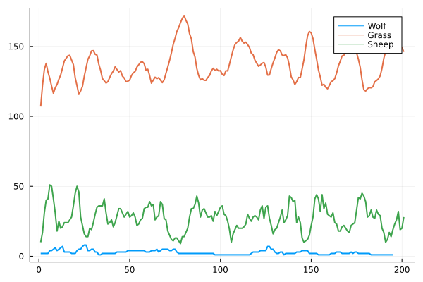

# Lab 02: Predator-Prey Agents

```@setup load_ecosystem
using Scientific_Programming_in_Julia
using Scientific_Programming_in_Julia.Ecosystem: eat!, find_food, count
```

In the next two labs you will implement your own, simplified, agent-based
simulation of a *predator-prey model*.  The model will contain *wolves*,
*sheep*, and - to feed your sheep - some *grass*.  Running and plotting your
final result could look something like the plot below.



As you can see, in this model, the wolves unfortunately died out :(.

To get started we need a type hierarchy. In order to be able to extend this model
in later labs we will structure them like this

```julia
abstract type AbstractAgent end
abstract type AbstractAnimal <: AbstractAgent end
abstract type AbstractPlant <: AbstractAgent end
```

Our `Grass` will be growing over time and it will need a certain amount of time
steps to fully grow such that it can be eaten. This has to be reflected in the
fields of our grass struct:
```julia
mutable struct Grass <: AbstractPlant
    fully_grown::Bool
    regrowth_time::Int
    countdown::Int
end
# constructor for grass with random growth countdown
Grass(t) = Grass(false, t, rand(1:t))
```

Grass cannot grow in a void, hence we need a `World`.  In our simple case this
world will be simply a container for all our agents.

```@raw html
<div class="admonition is-category-exercise">
<header class="admonition-header">Exercise</header>
<div class="admonition-body">
```

Define a `World` struct that will hold all your `AbstractAgents` in a `Vector`.
Try to avoid fields with abstract types. Julia's compiler will not be able to
infer the type for those (which leads to type instabilities and performance
losses; see the [composite types section in the lecture](@ref composite_types)).

```@raw html
</div></div>
<details class = "solution-body">
<summary class = "solution-header">Solution:</summary><p>
```

```julia
struct World{T<:AbstractAgent}
    agents::Vector{T}
end

# if you want you can overload the `show` method to get custom printing of you World
function Base.show(io::IO, w::World)
    println(io, typeof(w))
    map(a->println(io,"  $a"),w.agents)
end
```

```@raw html
</p></details>
```

Now you should be able to create a world and grow some grass!
```@repl load_ecosystem
grass = Grass(5)
world = World([grass])
```

Our simulated `Sheep` will have a certain amount of energy $E$, a reproduction
probability $p_r$, and a probablity to find food $p_f$ in each iteration of our
simulation. Additionally, each sheep with get a certain amout of energy $\Delta
E$ from eating a `Grass`. The corresponding struct then looks like this
```julia
mutable struct Sheep{T<:Real} <: AbstractAnimal
    energy::T
    Δenergy::T
    reproduction_prob::T
    food_prob::T
end
```

```@raw html
<div class="admonition is-category-exercise">
<header class="admonition-header">Exercise</header>
<div class="admonition-body">
```
Implement a function `eat!(::Sheep, ::Grass, ::World)` which increases the sheep's
energy by $\Delta E$ and sets `fully_grown` of the grass to `false`.
```@raw html
</div></div>
<details class = "solution-body">
<summary class = "solution-header">Solution:</summary><p>
```
```julia
function eat!(sheep::Sheep, grass::Grass, w::World)
    if grass.fully_grown
        grass.fully_grown = false
        sheep.energy += sheep.Δenergy
    end
end
```
```@raw html
</p></details>
```
Below you can see how a fully grown grass is eaten by a sheep.  The sheep's
energy changes and the `fully_grown` field of the grass becomes `false`.
```@repl load_ecosystem
grass = Grass(true,5.0,5.0);
sheep = Sheep(10.0,5.0,0.1,0.1);
world = World([grass, sheep])
eat!(sheep,grass,world);
world
```


```@raw html
<div class="admonition is-category-exercise">
<header class="admonition-header">Exercise</header>
<div class="admonition-body">
```
Next, implement a `Wolf` with the same properties as the sheep ($E$, $\Delta
E$, $p_r$, and $p_f$) as well as the correspoding `eat!` method which increases
the wolf's energy and kills the sheep (i.e. removes the sheep from the world).

```@raw html
</div></div>
<details class = "solution-body">
<summary class = "solution-header">Solution:</summary><p>
```

```julia
mutable struct Wolf{T<:Real} <: AbstractAnimal
    energy::T
    Δenergy::T
    reproduction_prob::T
    food_prob::T
end

function eat!(wolf::Wolf, sheep::Sheep, w::World)
    kill_agent!(sheep,w)
    wolf.energy += wolf.Δenergy
end

kill_agent!(a::AbstractAnimal, w::World) = deleteat!(w.agents, findall(x->x==a, w.agents))
```
```@raw html
</p></details>
```
With a correct `eat!` method you should get results like this:
```@repl load_ecosystem
grass = Grass(true,5.0,5.0);
sheep = Sheep(10.0,5.0,0.1,0.1);
wolf  = Wolf(20.0,10.0,0.1,0.1);
world = World([grass, sheep, wolf])
eat!(wolf,sheep,world);
world
```


```@raw html
<div class="admonition is-category-exercise">
<header class="admonition-header">Exercise</header>
<div class="admonition-body">
```
Implement a function `find_food(::Sheep, ::World)` which returns either a
`Grass` (sampled from all `Grass`es with the given food probability $p_f$) or returns `nothing`.

```@raw html
</div></div>
<details class = "solution-body">
<summary class = "solution-header">Solution:</summary><p>
```

```julia
function find_food(a::Sheep, w::World)
    if rand() <= a.food_prob
        as = filter(x->isa(x,Grass), w.agents)
        isempty(as) ? nothing : sample(as)
    end
end
```
```@raw html
</p></details>
```
A sheep with $p_f=1$ will always find some food if there is some in the world,
so you should get a result like below.
```@repl load_ecosystem
grass = Grass(true,5.0,5.0);
sheep = Sheep(10.0,5.0,1.0,1.0);
wolf  = Wolf(20.0,10.0,1.0,1.0);
world = World([grass, sheep, wolf]);

dinner = find_food(sheep,world)
eat!(sheep,dinner,world);
sheep
```


```@raw html
<div class="admonition is-category-exercise">
<header class="admonition-header">Exercise</header>
<div class="admonition-body">
```
Implement a function `find_food(::Wolf, ::World)` which returns either a
`Sheep` (with the given food probability $p_f$) or returns `nothing`.

```@raw html
</div></div>
<details class = "solution-body">
<summary class = "solution-header">Solution:</summary><p>
```

```julia
function find_food(a::Wolf, w::World)
    if rand() <= a.food_prob
        as = filter(x->isa(x,Sheep), w.agents)
        isempty(as) ? nothing : sample(as)
    end
end
```
```@raw html
</p></details>
```


```@raw html
<div class="admonition is-category-exercise">
<header class="admonition-header">Exercise</header>
<div class="admonition-body">
```
Identify the code duplications between `find_food(::Sheep,::World)` and
`find_food(::Wolf,::World)` and generalize the function to
`find_food(::AbstractAnimal, ::World)`

```@raw html
</div></div>
<details class = "solution-body">
<summary class = "solution-header">Solution:</summary><p>
```

```julia
function find_food(a::T, w::World) where T<:AbstractAnimal
    if rand() <= a.food_prob
        as = filter(x->isa(x,eats(T)), w.agents)
        isempty(as) ? nothing : sample(as)
    end
end

eats(::Type{<:Sheep}) = Grass
eats(::Type{<:Wolf}) = Sheep
```
```@raw html
</p></details>
```


```@raw html
<div class="admonition is-category-exercise">
<header class="admonition-header">Exercise</header>
<div class="admonition-body">
```
What happens if you call `eat!(wolf, find_food(wolf,world), world)` and there
are no sheep anymore? Or if the wolf's $p_f<1$?

Write a simple for loop that runs `7` iterations of a simple simulation that
lets a wolf eat one sheep in each iteration with this given world:
```julia
sheep = [Sheep(10.0,5.0,1.0,1.0) for _ in 1:10]
wolf  = Wolf(20.0,10.0,1.0,0.0)
world = World(vcat(sheep, [wolf]))
```
Hint: You can try to overload the `eat!` function appropriately.

```@raw html
</div></div>
<details class = "solution-body">
<summary class = "solution-header">Solution:</summary><p>
```

```julia
# make sure any animal can also eat `nothing`
eat!(a::AbstractAnimal,b::Nothing,w::World) = nothing

for _ in 1:10
    dinner = find_food(wolf,world)
    eat(wolf,dinner,world)
end
```

```@raw html
</p></details>
```


```@raw html
<div class="admonition is-category-exercise">
<header class="admonition-header">Exercise</header>
<div class="admonition-body">
```
Implement a function `count(::Vector{AbstractAgent})` that returns a dictionary
that contains pairs of agent types and the agent count e.g.
```julia
julia> count(world)
Dict(Sheep => 2, Wolf => 1, Grass => 10)
```
Use as much dispatch as you can! ;)

```@raw html
</div></div>
<details class = "solution-body">
<summary class = "solution-header">Solution:</summary><p>
```

```julia
count(g::AbstractPlant) = g.fully_grown ? 1 : 0
count(::AbstractAnimal) = 1

count(as::Vector{<:AbstractAgent}) = map(count,as) |> sum

function count(as::Vector{AbstractAgent})
    Ts = unique(typeof.(as))
    cs = map(Ts) do T
        _as = Vector{T}(filter(x->isa(x,T), as))
        T => count(_as)
    end
    Dict(cs...)
end
```

```@raw html
</p></details>
```


```@raw html
<div class="admonition is-category-exercise">
<header class="admonition-header">Exercise</header>
<div class="admonition-body">
```
Plot the agent count after each iteration of the previous exercise.
```@raw html
</div></div>
<details class = "solution-body">
<summary class = "solution-header">Solution:</summary><p>
```

```@repl load_ecosystem
grass = [Grass(true,5.0,5.0) for _ in 1:2];
sheep = [Sheep(10.0,5.0,1.0,1.0) for _ in 1:5];
wolf  = Wolf(20.0,10.0,1.0,1.0);
world = World(vcat([wolf], sheep, grass));

Ts = unique(typeof.(world.agents))
counts = Dict(T=>[] for T in Ts);
for i in 1:7
    cs = count(world.agents)
    eat!(wolf, find_food(wolf,world), world)
    for (T,c) in cs
        push!(counts[T], c)
    end
end

using Plots
plt = plot();
for T in Ts
    plot!(plt, counts[T], label=T, lw=2, ylims=(0,5))
end
savefig("plot.svg")  # ignore; just for plot in webpage
nothing              # ignore
```


```@raw html
</p></details>
```
