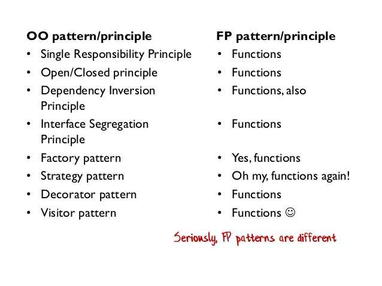

# Design patterns: good practices and structured thinking

Every software developer has a desire to write better code. A desire
to improve system performance. A desire to design software that is easy to maintain, easy to understand and explain.

Design patterns are recommendations and good practices accumulating knowledge of experienced  programmers.

The highest level of experience contains the design guiding principles:
- SOLID: Single Responsibility, Open/Closed, Liskov Substitution, Interface
- Segregation, Dependency Inversion
- DRY: Don't Repeat Yourself
- KISS: Keep It Simple, Stupid!
- POLA: Principle of Least Astonishment
- YAGNI: You Aren't Gonna Need It (overengineering)
- POLP: Principle of Least Privilege 

While these high-level concepts are intuitive, they are too general to give specific answers.

More detailed patterns arise for programming paradigms (declarative, imperative) with specific instances of functional or object-oriented programming.

The concept of design patterns originates in the OOP paradigm. OOP defines a strict way how to write software. Sometimes it is not clear how to squeeze real world problems into those rules.  Cookbook for many practical situations
- Gamma, E., Johnson, R., Helm, R., Johnson, R. E., & Vlissides, J. (1995). Design patterns: elements of reusable object-oriented software. Pearson Deutschland GmbH.

Defining 23 design patterns in three categories. Became extremely popular.


(C) Scott Wlaschin


Is julia OOP or FP? It is different from both, based on:
- types system (polymorphic)
- multiple dispatch (extending single dispatch of OOP)
- functions as first class 
- decoupling of data and functions
- macros

Any guidelines to solve real-world problems?
- Hands-On Design Patterns and Best Practices with Julia Proven solutions to common problems in software design for Julia 1.x Tom Kwong, CFA


Fundamental tradeoff: rules vs. freedom
- freedom: in the C language it is possible to access assembler instructions, use pointer aritmetics:
    - it is possible to write extremely efficient code
    - it is easy to segfault, leak memory, etc.
- rules: in strict languages (strict OOP, strict functional programing) you lose freedom for certain guarantees:
    - e.g. strict functional programing guarantees that the program provably terminates
    - operations that are simple e.g. in pointer arithmetics may become clumsy and inefficient in those strict rules.
    - the compiler can validate the rules and complain if the code does not comply with them. 

Julia is again a dance between freedom and strict rules. It is more inclined to freedom. 
Provides few simple concepts that allow to construct design patterns common in other languages.
- the language does not enforce too many formalisms (via keywords (interface, trait, etc.) but they can be 
    - the compiler cannot check for correctness of these "patterns"
    - the user has a lot of freedom (and responsibility)
- lots of features can be added by Julia packages (with various level of comfort)
    - macros

Read: 


## Design Patterns of OOP from the Julia viewpoint

OOP is currently very popular concept (C++, Java, Python).  It has strenghts and weaknesses. The Julia authors tried to keep the strength and overcome weaknesses. 

Key features of OOP:
- Encapsulation 
- Inheritance 
- Polymorphism 

Classical OOP languages define classes that bind processing functions to the data. Virtual methods are defined only for the attached methods of the classes.

!!! tip "Encapsulation"
    Refers to bundling of data with the methods that operate on that data, or the restricting of direct access to some of an object's components. Encapsulation is used to hide the values or state of a structured data object inside a class, preventing direct access to them by clients in a way that could expose hidden implementation details or violate state invariance maintained by the methods. 

!!! tip "Making Julia to mimic OOP"
    There are many discussions how to make Julia to behave like an OOP. The best implementation to our knowledge is [ObjectOriented](https://github.com/Suzhou-Tongyuan/ObjectOriented.jl)

### Encapsulation Advantage: Consistency and Validity 
With fields of data structure freely accessible, the information may become inconsistent.
```
mutable struct Grass <: Plant
    id::Int
    size::Int
    max_size::Int
end
```

What if I create Grass with larger size than ```max_size```?
```julia
grass = Grass(1,50,5)
```
Freedom over Rules. Maybe I would prefer to introduce some rules.

Some encapsulation may be handy keeping it consistent. Julia has ```inner constructor```.
```julia
mutable struct Grass2 <: Plant
    id::Int
    size::Int
    max_size::Int
    Grass2(id,sz,msz) = sz > msz ? error("size can not be greater that max_size") : new(id,sz,msz)
end
```
When defined, Julia does not provide the default outer constructor. 

But fields are still accessible:
```julia
grass.size = 10000
```
Recall that `grass.size=1000` is a syntax of `setproperty!(grass,:size,1000)`, which can be redefined:
```julia
function Base.setproperty!(obj::Grass, sym::Symbol, val)
    if sym==:size
        @assert val<=obj.max_size "size have to be lower than max_size!"
    end
    setfield!(obj,sym,val)
end
```
Function `setfield!` can not be overloaded.

Julia has *partial encapsulation* via a mechanism for consistency checks. 

!!! warn "Array in unmutable struct can be mutated"
    The mutability applies to the structure and not to encapsulated structures.
    ```julia
    struct Foo
        x::Float64
        y::Vector{Float64}
        z::Dict{Int,Int}
    end
    ```
    In the structure `Foo`, `x` cannot be mutated, but fields of `y` and key-value pairs of `z` can be mutated, because they are mutable containers. But I cannot replace `y` with a different `Vector`.


### Encapsulation Disadvantage: the Expression Problem 

Encapsulation limits the operations I can do with an object. Sometimes too much. Consider a matrix of methods/types(data-structures)

Consider an existing matrix of data and functions:

| data \ methods | find_food | eat! | grow! |  | |
| --- | --- | --- | --- | --- | --- |
| Wolf |  | | | | |
| Sheep | | | | | |
| Grass | | | | | |

You have a good reason not to modify the original source (maintenance).

Imagine we want to extend the world to use new animals and new methods for all animals.

Object-oriented programming 
- classes are primary objects (hierarchy)
- define animals as classes ( inheriting from abstract class)
- adding a new animal is easy
- adding a new method for all animals is hard (without modifying the original code)

Functional programming 
- functions are primary
- define operations ```find_food```, ```eat!```
- adding a new operation is easy
- adding new data structure to existing operations is hard

Solutions:
1. multiple-dispatch = julia
2. open classes (monkey patching) = add methods to classes on the fly
3. visitor pattern = partial fix for OOP [extended visitor pattern using dynamic_cast]

### Morale:
- Julia does not enforces creation getters/setters by default  (setproperty is mapped to setfield)
- it provides tools to enforce access restriction if the user wants it.
- can be used to imitate objects: 
https://stackoverflow.com/questions/39133424/how-to-create-a-single-dispatch-object-oriented-class-in-julia-that-behaves-l/39150509#39150509


## Polymorphism: 

!!! tip "Polymorphism in OOP"
    Polymorphism is the method in an object-oriented programming language that performs different things as per the object’s class, which calls it. With Polymorphism, a message is sent to multiple class objects, and every object responds appropriately according to the properties of the class. 

Example animals of different classes make different sounds. In Python:
```python

class Sheep:
    def __init__(self, energy, Denergy):
        self.energy = energy
        self.Denergy = Denergy

    def make_sound(self):
        print("Baa")

sheep.make_sound()
wolf.make_sound()
```
Will make distinct sounds (baa, Howl). 

Can we achieve this in Julia?
```
make_sound(s::Sheep)=println("Baa")
make_sound(w::Wolf)=println("Howl")
```

!!! tip "Implementation of virtual methods"
    Virtual methods in OOP are typically implemented using Virtual Method Table, one for each class.
    

    Julia has a single method table. Dispatch can be either static or dynamic (slow).

*Freedom* vs. Rules. 
- Duck typing is a type of polymorphism without static types
    - more  programming freedom, less formal guarantees
- julia does not check if ```make_sound``` exists for all animals. May result in `MethodError`. Responsibility of a programmer.
    - define ```make_sound(A::AbstractAnimal)```

So far, the polymorphism coincides for OOP and julia becuase the method had only one argument => single argument dispatch.


Multiple dispatch is an *extension* of the classical first-argument-polymorphism of OOP, to all-argument polymorphism.


!!! tip "Challenge for OOP"
    How to code polymorphic behavior of interaction between two agents, e.g. an agent eating another agent in OOP?

    Complicated.... You need a "design pattern" for it.

```python
class Sheep(Animal):
    energy: float = 4.0
    denergy: float = 0.2
    reprprob: float = 0.5
    foodprob: float = 0.9

    # hard, if not impossible to add behaviour for a new type of food
    def eat(self, a: Agent, w: World):
        if isinstance(a, Grass)
            self.energy += a.size * self.denergy
            a.size = 0
        else:
            raise ValueError(f"Sheep cannot eat {type(a).__name__}.")
```

Consider an extension to:
- Flower : easy
- PoisonousGrass: harder

Simple in Julia:
```
eat!(w1::Sheep, a::Grass, w::World)=
eat!(w1::Sheep, a::Flower, w::World)=
eat!(w1::Sheep, a::PoisonousGrass, w::World)=
```
Boiler-plate code can be automated by macros / meta programming.


## Inheritance

!!! tip "Inheritance"
    Is the mechanism of basing one object or class upon another object (prototype-based inheritance) or class (class-based inheritance), retaining similar implementation. Deriving new classes (sub classes) from existing ones such as super class or base class and then forming them into a hierarchy of classes. In most class-based object-oriented languages, an object created through inheritance, a "child object", acquires all the properties and behaviors of the "parent object" , with the exception of: constructors, destructor, overloaded operators.

Most commonly, the sub-class inherits methods and the data.

For example, in python we can design a sheep with additional field.
Think of a situation that we want to refine the reproduction procedure for sheeps by considering differences for male and female. We do not have information about gender in the original implementation. 

In OOP, we can use *inheritance*.
```python
class Sheep:
    def __init__(self, energy, Denergy):
        self.energy = energy
        self.Denergy = Denergy

    def make_sound(self):
        print("Baa")

class SheepWithGender(Sheep):
    def __init__(self, energy, Denergy,gender):
        super().__init__(energy, Denergy)
        self.gender = gender
    # make_sound is inherited 

# Can you do this in Julia?!
```

Simple answer: NO, not exactly

- Sheep has fields, is a **concrete** type, we cannot extend it.
    - with modification of the original code, we can define AbstractSheep with subtypes Sheep and SheepWithGender.
- But methods for AbstractAnimal works for sheeps! Is this inheritance?


### Inheritance vs. Subtyping
Subtle difference:
- subtyping = equality of interface 
- inheritance = reuse of implementation 

In practice, subtyping reuse methods, *not* data fields.

We have seen this in Julia, using type hierarchy: 
- ```agent_step!(a::Animal, w::World)```
- all animals subtype of ```Animal``` "inherit" this method.

The type hierarchy is only one way of subtyping. Julia allows many variations, e.g. concatenating different parts of hierarchies via the ```Union{}``` type:
```julia
fancy_method(O::Union{Sheep,Grass})=println("Fancy")
```

Is this a good idea? It can be done completely Ad-hoc! Freedom over Rules.

There are very good use-cases:
- Missing values:
```x::AbstractVector{<:Union{<:Number, Missing}}```

!!! theorem "SubTyping issues"
    With parametric types, unions and other construction, subtype resolution may become a complicated problem. Julia can even crash.
    (Jan Vitek's Keynote at JuliaCon 2021)[https://www.youtube.com/watch?v=LT4AP7CUMAw]


### Sharing of data field via composition
Composition is also recommended in OOP: (Composition over ingeritance)[https://en.wikipedia.org/wiki/Composition_over_inheritance]

```julia 
struct ⚥Sheep <: Animal
    sheep::Sheep
    sex::Symbol
end
```

If we want our new ⚥Sheep to behave like the original Sheep, we need to *forward* the corresponding methods.

```julia
eat!(a::⚥Sheep, b::Grass, w::World)=eat!(a.sheep, b, w)
```
and all other methods. Routine work. Boring!  
The whole process can be automated using macros ```@forward``` from Lazy.jl.


Why so complicated? Wasn't the original inheritance tree structure better?

- multiple inheritance:
    - you just compose two different "trees".
    - common example with ArmoredVehicle = Vehicle + Weapon
- Do you think there is only one sensible inheritance tree?

!!! tip "Animal World"

    Think of an inheritance tree of a full scope Animal world.

    Idea #1: Split animals by biological taxonomy
    

    Hold on. 
    - Sharks and dolphins can swim very well!
    - Both bats and birds fly similarly!

    Idea #2: Split by the way they move!

    Idea #3: Split by way of ...

 In fact, we do not have a tree, but more like a matrix/tensor:

| | swims | flies | walks |
| --- | --- |  --- | --- | 
| birds | penguin | eagle | kiwi |
| mammal | dolphin | bat | sheep,wolf|
| insect | backswimmer | fly | beetle|

Single type hierarchy will not work. Other approaches:
 - interfaces
 - parametric types

 Analyze what features of animals are common and *compose* the animal:
```julia
abstract type HeatType end
abstract type MovementType end
abstract type ChildCare end


mutable struct Animal{H<:HeatType,M<:MovementType,C<:ChildCare} 
    id::Int
    ...
end
```

Now, we can define methods dispatching on parameters of the main type.

Composition is simpler in such a general case. Composition over inheritance. 

A simple example of parametric approach will be demonstarted in the lab.

## Interfaces: inheritance/subtyping without a hierarchy tree

In OOP languages such as Java, interfaces have a dedicated keyword such that compiler can check correctes of the interface implementation. 

In Julia, interfaces can be achived by defining ordinary functions.  Not so strict validation by the compiler as in other languages. Freedom...

### Example: Iterators

Many fundamental objects can be iterated: Arrays, Tuples, Data collections...
- They do not have any common "predecessor". They are almost "primitive" types.
- they share just the property of being iterable
- we do not want to modify them in any way

Example: of interface ```Iterators```
defined by "duck typing" via two functions.

|Required methods	|	Brief description|
| --- | --- |
|iterate(iter)		| Returns either a tuple of the first item and initial state or nothing if empty|
|iterate(iter, state)	|	Returns either a tuple of the next item and next state or nothing if no items remain|

Defining these two methods for any object/collection ```C``` will make the following work:
```julia
for o in C
   # do something
end
```

- The compiler will not check if both functions exist.
- If one is missing, it will complain about it when it needs it
- The error message may be less informative than in the case of formal definition

Note:
- even iterators may have different features: they can be finite or infinite
- for finite iterators we can define useful functions (```collect```)
- how to pass this information in an extensible way?

Poor solution: if statements.
```julia
function collect(iter)
 if iter isa Tuple...

end
```
The compiler can do that for us.

## Traits: cherry picking subtyping

Trait mechanism in Julia is build using the existing tools: Type System and Multiple Dispatch.

Traits have a few key parts:

- Trait types: the different traits a type can have.
- Trait function: what traits a type has.
- Trait dispatch: using the traits.

From iterators:
```julia
# trait types:

abstract type IteratorSize end
struct SizeUnknown <: IteratorSize end
struct HasLength <: IteratorSize end
struct IsInfinite <: IteratorSize end

# Trait function: Input is a Type, output is a Type
IteratorSize(::Type{<:Tuple}) = HasLength()
IteratorSize(::Type) = HasLength()  # HasLength is the default

# ...

# Trait dispatch
BitArray(itr) = gen_bitarray(IteratorSize(itr), itr)
gen_bitarray(isz::IteratorSize, itr) = gen_bitarray_from_itr(itr)
gen_bitarray(::IsInfinite, itr) =  throw(ArgumentError("infinite-size iterable used in BitArray constructor"))

```
What is needed to define for a new type that I want to iterate over? 

Do you still miss inheritance in the OOP style?

Many packages automating this with more structure:
- https://github.com/andyferris/Traitor.jl
- https://github.com/mauro3/SimpleTraits.jl
- https://github.com/tk3369/BinaryTraits.jl

## Functional tools: Partial evaluation
It is common to create a new function which "just" specify some parameters.
```
_prod(x) = reduce(*,x)
_sum(x) = reduce(+,x)
``` 

## Functional tools: Closures

!!! tip "Closure (lexical closure, function closure)"
    A technique for implementing lexically scoped name binding in a language with first-class functions. Operationally, a closure is a record storing a function together with an environment.

- originates in functional programming
- now widespread in many common languages, Python, Matlab, etc..
- memory management relies on garbage collector in general (can be optimized by compiler)

### Example

```julia
function adder(x)
    return y->x+y
end
```
creates a function that "closes" the argument ```x```. Try: ```f=adder(5); f(3)```.

```julia
x = 30;
function adder()
    return y->x+y
end
```
creates a function that "closes" variable ```x```.
```julia
f = adder(10)
f(1)
g = adder()
g(1)

```

Such function can be passed as an argument: *together* with the closed data.


### Implementation of closures in julia: documentation

Closure is a record storing a function together with an environment. The environment is a mapping associating each *free* variable of the function (variables that are used locally, but defined in an enclosing scope) with the value or reference to which the name was bound when the closure was created.

```julia
function adder(x)
    return y->x+y
end
```
is lowered to (roughly):

```julia
struct ##1{T}
    x::T
end

(_::##1)(y) = _.x + y

function adder(x)
    return ##1(x)
end
```

Note that the structure ##1 is not directly accessible. Try ```f.x``` and ```g.x```.

### Functor = Function-like structure
Each structure can have a method that is invoked when called as a function.

```
(_::Sheep)()= println("🐑")
```
You can think of it as ```sheep.default_method()```.


### Coding style

From ```Flux.jl```:
```julia
function train!(loss, ps, data, opt; cb = () -> ())
  ps = Params(ps)
  cb = runall(cb)
  @progress for d in data
      gs = gradient(ps) do
        loss(batchmemaybe(d)...)
      end
      update!(opt, ps, gs)
      cb()
  end
end
```
Is this confusing? What can ```cb()``` do and what it can not?

Note that function ```train!``` does not have many local variables. The important ones are arguments, i.e. exist in the scope from which the function was invoked.

```julia
loss(x,y)=mse(model(x),y)
cb() = @info "training" loss(x,y)
train!(loss, ps, data, opt; cb=cb)
```


## Usage

Usage of closures:
- callbacks: the function can also modify the enclosed variable.
- abstraction: partial evaluation 

!!! theorem "Beware: Performance of captured variables"
    Inference of types may be difficult in closures:
    https://github.com/JuliaLang/julia/issues/15276    


## Aditional materials
 * [Functional desighn pattersn](https://www.youtube.com/watch?v=srQt1NAHYC0)
