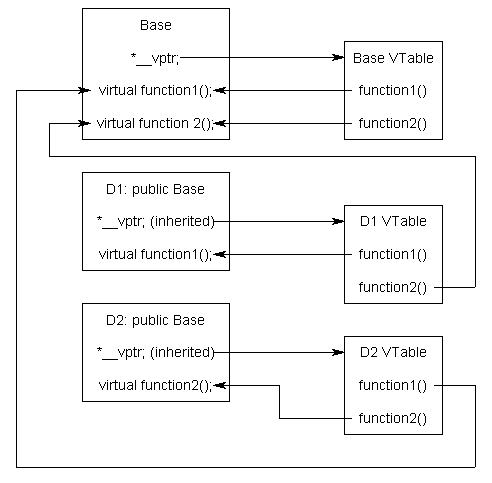

# Design patterns: good practices and structured thinking

Design guiding principles:
- SOLID: Single Responsibility, Open/Closed, Liskov Substitution, Interface
- Segregation, Dependency Inversion
- DRY: Don't Repeat Yourself
- KISS: Keep It Simple, Stupid!
- POLA: Principle of Least Astonishment
- YAGNI: You Aren't Gonna Need It (overengineering)
- POLP: Principle of Least Privilege 

These hig-level concepts are guiding principles for 

Julia does not fit into any methodological classes like *object-oriented* or *functional* programming. The key concept of julia are:
 - *type system* of data structures
 -  *multiple dispatch*, respecting the types,
 - functional programming concepts such as *closures*

These simple concepts allows to construct design patters common in other languages.
- the language does not enforce many formalisms structures (can be limiting as well as advantageous). 
    - the compiler cannot check for correctness of "patterns"
    - the user has a lot of freedom (and responsibility)
- lots of features can be added by Julia packages (with various level of comfort)
    - macros


## Closures

!!! tip "Closure (lexical closure, function closure)"
    A technique for implementing lexically scoped name binding in a language with first-class functions. Operationally, a closure is a record storing a function together with an environment.

- originates in functional programming
- now widespread in many common languages, Python, Matlab, etc..
- memory management relies on garbage collector in general (can be optimized by compiler)

### Example

```julia
function adder(x)
    return y->x+y
end
```
creates a function that "closes" the argument ```x```.

```julia
x = 30;
function adder()
    return y->x+y
end
```
creates a function that "closes" variable ```x```.
```julia
f = adder(10)
f(1)
g = adder()
g(1)

```

Such function can be passed as an argument: *together* with the closed data.


### Implementation of closures in julia: documentation

Closure is a record storing a function together with an environment. The environment is a mapping associating each *free* variable of the function (variables that are used locally, but defined in an enclosing scope) with the value or reference to which the name was bound when the closure was created.

```julia
function adder(x)
    return y->x+y
end
```
is lowered to (roughly):

```julia
struct ##1{T}
    x::T
end

(_::##1)(y) = _.x + y

function adder(x)
    return ##1(x)
end
```

Note that the structure ##1 is not directly accessible. 

### Functor = Function-like structure
Each structure can have a method that is invoked when called as a function.

```
(_::Sheep)()= println("🐑")
```
You can think of it as ```sheep.default_method()```.


### Coding style

From ```Flux.jl```:
```julia
function train!(loss, ps, data, opt; cb = () -> ())
  ps = Params(ps)
  cb = runall(cb)
  @progress for d in data
      gs = gradient(ps) do
        loss(batchmemaybe(d)...)
      end
      update!(opt, ps, gs)
      cb()
  end
end
```
Is this confusing? What can ```cb()``` do?

Note that function ```train!``` does not have many local variables. The important ones are arguments, i.e. exist in the scope from which the function was invoked.

```julia
loss(x,y)=mse(model(x),y)
cb() = @info "training" loss(x,y)
train!(loss, ps, data, opt; cb=cb)
```


## Usage

Usage of closures:
- callbacks: the function can also modify the enclosed variable.
- abstraction: partial evaluation 

!!! theorem "Beware: Performance of captured variables"
    Inference of types may be difficult in closures:
    https://github.com/JuliaLang/julia/issues/15276    


## Design Patterns of OOP from the Julia viewpoint

Key features of OOP:
- Encapsulation 
- Inheritance 
- Polymorphism 

Classical OOP languages define classes that bind processing functions to the data.

!!! tip "Encapsulation"
    Refers to bundling of data with the methods that operate on that data, or the restricting of direct access to some of an object's components. Encapsulation is used to hide the values or state of a structured data object inside a class, preventing direct access to them by clients in a way that could expose hidden implementation details or violate state invariance maintained by the methods. 

### Encapsulation Advantage: Consistency and Validity 
With fields of data structure freely accessible, the information may become inconsistent.
```
mutable struct Grass <: Plant
    id::Int
    size::Int
    max_size::Int
end
```

What if I create Grass with larger size than ```max_size```?
```julia
grass = Grass(1,50,5)
```

Some encapsulation may be handy keeping it consistent. Julia has ```inner constructor```.
```julia
mutable struct Grass <: Plant
    id::Int
    size::Int
    max_size::Int
    Grass(id,sz,msz) = sz > msz ? error("size can not be gerater that max_size") : new(id,sz,msz)
end
```

But fields are still accessible:
```julia
grass.size = 10000
```
Recall that ```grass.size=1000``` is a syntax of ```setproperty!(grass,:size,1000), which can be redefined:
```julia
function Base.setproperty!(obj::Grass, sym::Symbol, val)
    if sym==:size
        @assert val<=obj.max_size "size have to be lower than max_size!"
    end
    setfield!(obj,sym,val)
end
```
Function ```setfield!``` can not be overloaded.

Julia has *partial encapsulation* via a mechanism for consistency checks. 


### Encapsulation Disadvantage: the Expression Problem 
Matrix of methods/types(data-structures)

Consider an existing matrix of data and functions:
| data \ methods | find_food | eat! |  |  | |
| --- | ---- | ---- | --- | ---- | --- |
| Wolf |  | | | | |
| Sheep | | | | | |
| Grass | | | | | |

You have a good reason not to modify the original source (maintenance).

Imagine we want to extend the world to use new animals and new methods for all animals.

Object-oriented programming 
- classes are primary objects (hierarchy)
- define animals as classes ( inheriting from abstract class)
- adding a new animal is easy
- adding a new method for all animals is hard (without modifying the original code)

Functional programming 
- functions are primary
- define operations ```find_food```, ```eat!```
- adding a new operation is easy
- adding new data structure to existing operations is hard

Solutions:
1. multiple-dispatch = julia
2. open classes (monkey patching) = add methods to classes on the fly
3. visitor pattern = partial fix for OOP [extended visitor pattern using dynamic_cast]

### Morale:
- Julia does not enforces creation getters/setters by default  (setproperty is mapped to setfield)
- it provides tools to enforce access restriction if the user wants it.
- can be used to imitate objects: 
https://stackoverflow.com/questions/39133424/how-to-create-a-single-dispatch-object-oriented-class-in-julia-that-behaves-l/39150509#39150509


## Polymorphism: 

!!! tip "Polymorphism in OOP"
    Polymorphism is the method in an object-oriented programming language that performs different things as per the object’s class, which calls it. With Polymorphism, a message is sent to multiple class objects, and every object responds appropriately according to the properties of the class. 

Example animals of different classes make different sounds:
```python
sheep.make_sound()
wolf.make_sound()
```
Will make distinct sounds (baa, bark). 

Can we achieve this in Julia?
```
make_sound(s::Sheep)=println("Baa")
make_sound(w::Wolf)=println("Bark")
```

Multiple dispatch is an extension of classical polymorphism of OOP, which is only single dispatch.

!!! tip "Implementation of virtual methods"
    Virtual methods in OOP are typically implemented using Virtual Method Table, one for each class.
    

NotesDuck typing:
- julia does not check if ```make_sound``` exists for all animals. May result in MethodError. Responsibility of a programmer.
    - define ```make_sound(A::AbstractAnimal)```
- Duck typing is a type of polymorphism without static types
    - more  programming freedom, less formal guarantees


!!! tip "Challenge for OOP"
    How to code polymorphic behavior of meeting two animals in OOP?

    Complicated.... You need a "design pattern" for it.

Simple in Julia:
```
meet(w1::Wolf, w2::Wolf)=
meet(w1::Sheep, w2::Wolf)=
meet(w1::Sheep, w2::Sheep)=
```


## Inheritance

!!! tip "Inheritance"
    Is the mechanism of basing one object or class upon another object (prototype-based inheritance) or class (class-based inheritance), retaining similar implementation. Deriving new classes (sub classes) from existing ones such as super class or base class and then forming them into a hierarchy of classes. In most class-based object-oriented languages, an object created through inheritance, a "child object", acquires all the properties and behaviors of the "parent object" , with the exception of: constructors, destructor, overloaded operators.

Most commonly, the sub-class inherits methods and the data.

For example, in python we can design a sheep with additional field.
Think of a situation that we want to refine the reproduction procedure for sheeps by considering differences for male and female. We do not have information about gender in the original implementation. 

In OOP, we can use *inheritance*.
```python
class Sheep:
    def __init__(self, energy, Denergy):
        self.energy = energy
        self.Denergy = Denergy

    def make_sound(self):
        print("Baa")

class SheepWithGender(Sheep):
    def __init__(self, energy, Denergy,gender):
        super().__init__(energy, Denergy)
        self.gender = gender
    # make_sound is inherited 

# Can you do this in Julia?!
```

Simple answer: NO, not exactly

- Sheep has fields, is a concrete type, we cannot extend it.
    - with modification of the original code, we can define AbstractSheep with subtypes Sheep and AbstractSheep.
- But methods for AbstractAnimal works for sheeps! Is this inheritance?


### Inheritance vs. Subtyping
Subtle difference:
- subtyping = equality of interface 
- inheritance = reuse of implementation 

In practice, subtyping reuse methods, *not* data fields.

We have seen this in Julia, using type hierarchy: 
- ```agent_step!(a::Animal, w::World)```
- all animals subtype of ```Animal``` "inherit" this method.

The type hierarchy is only one way of subtyping. Julia allows many variations, e.g. concatenating different parts of hierarchies via the ```Union{}``` type:
```julia
fancy_method(O::Union{Sheep,Grass})=println("Fancy")
```

Is this a good idea? It can be done completely Ad-hoc!

There are very good usecases:
- Missing values:
```x::AbstractVector{<:Union{<:Number, Missing}}```

!!! theorem "SubTyping issues"
    With parametric types, unions and other construction, subtype resoltion may become a complicated problem. Julia can even crash.
    https://www.youtube.com/watch?v=LT4AP7CUMAw


### Sharing of data field via composition
Composition is also recommended in OOP: https://en.wikipedia.org/wiki/Composition_over_inheritance

```julia
struct ⚥Sheep <: Animal
    sheep::Sheep
    sex::Symbol
end
```

If we want our new ⚥Sheep to behave like the original Sheep, we need to *forward* the corresponding methods.

```julia
eat!(a::⚥Sheep, b::Grass, w::World)=eat!(a.sheep, b, w)
```
and all other methods. Boring!
The whole process can be automated using macros ```@forward``` from Lazy.jl.


Why so complicated? Wasn't original tree structure better?

- multiple inheritance:
    - you just compose two different "trees".
    - common example with ArmoredVehicle = Vehicle + Weapon
- Do you think there is only one sensible inheritance tree?

!!! tip "Animal World"

    Think of an inheritance tree of a full scope Animal world.

    Idea #1: Split animals by biological taxonomy
    

    Hold on. 
    - Sharks and dolphins can swim very well!
    - Both bats and birds fly similarly!

    Idea #2: Split by the way they move!

    Idea #3: Split by way of child care (Feeding, Ignoring, Protecting)

 In fact we do not have a tree, but more like a matrix/tensor:

| | swims | flies | walks |
| --- | --- |  --- | --- | 
| birds | penguin | eagle | kiwi |
| mammal | dolphin | bat | sheep,wolf|

Single type hierarchy will not work. Other approaches:
 - interfaces
 - parametric types

 Julia Solution: Types can be parametric!

 Analyze what features of animals are common and *compose* the animal:
```julia
abstract type HeatType end
abstract type MovementType end
abstract type ChildCare end


mutable struct Animal{H<:HeatType,M<:MovementType,C<:ChildCare} 
    id::Int
    ...
end
```

This approach allows

Now, we can define methods dispatching on parameters.

## Interfaces

Just functions, often informal. Not so strict validation by compiler as in other languages.

Example: of interface ```Iterators```
|Required methods	|	Brief description|
| --- | --- |
|iterate(iter)		| Returns either a tuple of the first item and initial state or nothing if empty|
|iterate(iter, state)	|	Returns either a tuple of the next item and next state or nothing if no items remain|

Definig these two methods for any object/collection ```C``` will make the following work:
```julia
for o in C
   # do something
end
```

## Traits: cherry picking subtyping

When a decision if the Type can or cannot perform certain method is complicated, we can infer this by a function.

Example ```_AsList``` from PyTorch:
```python
def _AsList(x):
    return x if isinstance(x, (list, tuple)) else [x]
```
Hold on, how about ndarray? How to add it? What else to add?

Types can be computed by a function:

```julia
# trait types
struct List end
struct Nonlist end

# trait function: input general Type, return trait Type 
islist(::Type{<:AbstractVector}) = List()
islist(::Type{<:Tuple}) = List()
islist(::Type{<:Number}) = Nonlist()

# Trait dispatch:
function aslist(x::T) where T 
     aslist(islist(T), x) # try to call it again with different function-inferred type
end
aslist(::List, x) = x
aslist(::Nonlist, x) = [x]
```

Many packages:
https://github.com/andyferris/Traitor.jl
https://github.com/mauro3/SimpleTraits.jl
https://github.com/tk3369/BinaryTraits.jl
