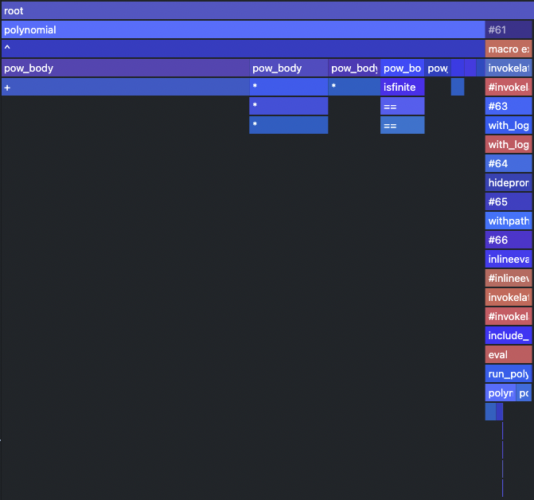
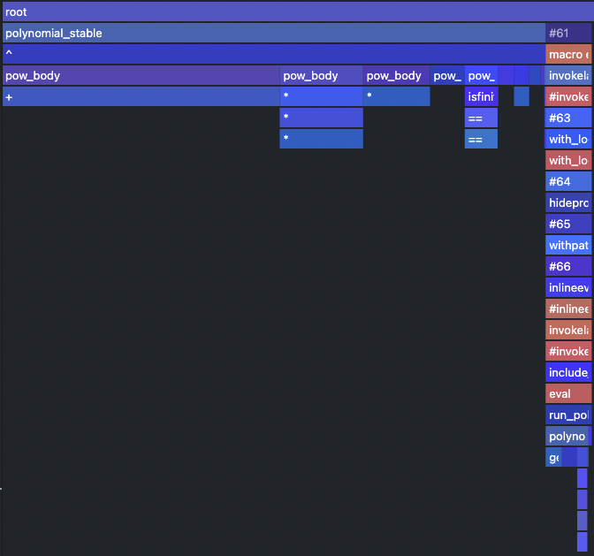
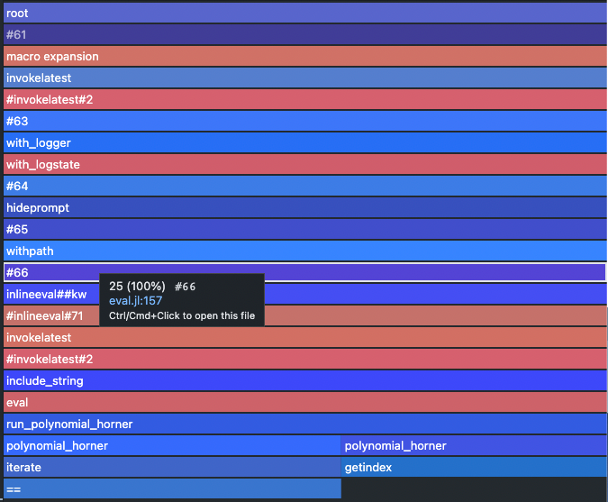
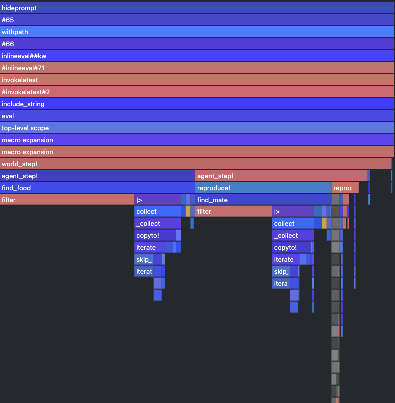
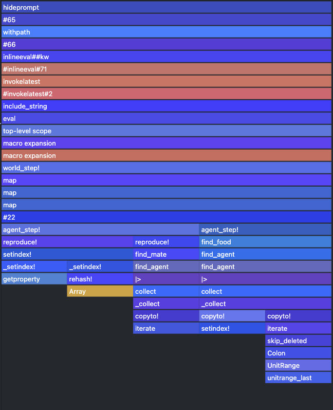

# [Lab 05: Practical performance debugging tools](@id perf_lab)
Performance is crucial in scientific computing. There is a big difference if your experiments run one minute or one hour. We have already developed quite a bit of code, both in and outside packages, on which we are going to present some of the tooling that Julia provides for finding performance bottlenecks. Performance of your code or more precisely the speed of execution is of course relative (preference, expectation, existing code) and it's hard to find the exact threshold when we should start to care about it. When starting out with Julia, we recommend not to get bogged down by the performance side of things straightaway, but just design the code in the way that feels natural to you. As opposed to other languages Julia offers you to write the things "like you are used to" (depending on your background), e.g. for cycles are as fast as in C; vectorization of mathematical operators works the same or even better than in MATLAB, NumPy. 


Once you have tested the functionality, you can start exploring the performance of your code by different means:
- manual code inspection - identifying performance gotchas (tedious, requires skill)
- automatic code inspection - `Jet.jl` (probably not as powerful as in statically typed languages)
- benchmarking - measuring variability in execution time, comparing with some baseline (only a statistic, non-specific)
- profiling - measuring the execution time at "each line of code" (no easy way to handle advanced parallelism, ...)
- allocation tracking - similar to profiling but specifically looking at allocations (one sided statistic)

## Checking type stability
Recall that type stable function is written in a way, that allows Julia's compiler to infer all the types of all the variables and produce an efficient native code implementation without the need of boxing some variables in a structure whose types is known only during runtime. Probably unbeknown to you we have already seen an example of type unstable function (at least in some situations) in the first lab, where we have defined the `polynomial` function:

```@repl lab05_polynomial
function polynomial(a, x)
    accumulator = 0
    for i in length(a):-1:1
        accumulator += x^(i-1) * a[i] # ! 1-based indexing for arrays
    end
    return accumulator
end
```

The exact form of compiled code and also the type stability depends on the arguments of the function. Let's explore the following two examples of calling the function:

- Integer number valued arguments
```@example lab05_polynomial
a = [-19, 7, -4, 6]
x = 3
polynomial(a, x)
```
    
- Float number valued arguments
```@example lab05_polynomial
xf = 3.0
polynomial(a, xf)
```

The result they produce is the "same" numerically, however it differs in the output type. Though you have probably not noticed it, there should be a difference in runtime (assuming that you have run it once more after its compilation). It is probably a surprise to no one, that one of the methods that has been compiled is type unstable. This can be check with the `@code_warntype` macro:
```@repl lab05_polynomial
using InteractiveUtils #hide
@code_warntype polynomial(a, x)  # type stable
@code_warntype polynomial(a, xf) # type unstable
```
We are getting a little ahead of ourselves in this lab, as understanding of these expressions is part of the future lecture. Anyway the output basically shows what the compiler thinks of each variable in the code, albeit for us in less readable form than the original code. The more red the color is of the type info the less sure the inferred type is. Our main focus should be on the return type of the function which is just at the start of the code with the keyword `Body`. In the first case the return type is an `Int64`, whereas in the second example the compiler is unsure whether the type is `Float64` or `Int64`, marked as the `Union` type of the two. Fortunately for us this type instability can be fixed with a single line edit, but we will see later that it is not always the case.

!!! note "Type stability"
    Having a variable represented as `Union` of multiple types in a functions is a lesser evil than having `Any`, as we can at least enumerate statically the available options of functions to which to dynamically dispatch and in some cases there may be a low penalty.

```@raw html
<div class="admonition is-category-exercise">
<header class="admonition-header">Exercise</header>
<div class="admonition-body">
```
Create a new function `polynomial_stable`, which is type stable and measure the difference in evaluation time. 

**HINTS**: 
- Ask for help on the `one` and `zero` keyword, which are often as a shorthand for these kind of functions.
- run the function with the argument once before running `@time` or use `@btime` if you have `BenchmarkTools` readily available in your environment
- To see some measurable difference with this simple function, a longer vector of coefficients may be needed.

```@raw html
</div></div>
<details class = "solution-body">
<summary class = "solution-header">Solution:</summary><p>
```

```@repl lab05_polynomial
function polynomial_stable(a, x)
    accumulator = zero(x)
    for i in length(a):-1:1
        accumulator += x^(i-1) * a[i]
    end
    accumulator
end
```

```@repl lab05_polynomial
@code_warntype polynomial_stable(a, x)  # type stable
@code_warntype polynomial_stable(a, xf) # type stable
```

```@repl lab05_polynomial
polynomial(a, xf) #hide
polynomial_stable(a, xf) #hide
@time polynomial(a, xf)
@time polynomial_stable(a, xf)
```

Only really visible when evaluating multiple times.
```julia
julia> using BenchmarkTools

julia> @btime polynomial($a, $xf)
  31.806 ns (0 allocations: 0 bytes)
128.0

julia> @btime polynomial_stable($a, $xf)
  28.522 ns (0 allocations: 0 bytes)
128.0
```
Difference only a few nanoseconds.


*Note*: Recalling homework from lab 1. Adding `zero` also extends this function to the case of `x` being a matrix, see `?` menu.
```@raw html
</p></details>
```

Code stability issues are something unique to Julia, as its JIT compilation allows it to produce code that contains boxed variables, whose type can be inferred during runtime. This is one of the reasons why interpreted languages are slow to run but fast to type. Julia's way of solving it is based around compiling functions for specific arguments, however in order for this to work without the interpreter, the compiler has to be able to infer the types.

There are other problems (such as unnecessary allocations), that you can learn to spot in your code, however the code stability issues are by far the most commonly encountered problems among beginner users of Julia wanting to squeeze more out of it.

!!! note "Advanced tooling"
    Sometimes `@code_warntype` shows that the function's return type is unstable without any hints to the possible problem, fortunately for such cases a more advanced tools such as [`Cthuhlu.jl`](https://github.com/JuliaDebug/Cthulhu.jl) or [`JET.jl`](https://github.com/aviatesk/JET.jl) have been developed.

## Benchmarking with `BenchmarkTools`
In the last exercise we have encountered the problem of timing of code to see, if we have made any progress in speeding it up. Throughout the course we will advertise the use of the `BenchmarkTools` package, which provides an easy way to test your code multiple times. In this lab we will focus on some advanced usage tips and gotchas that you may encounter while using it. 

There are few concepts to know in order to understand how the pkg works
- evaluation - a single execution of a benchmark expression (default `1`)
- sample - a single time/memory measurement obtained by running multiple evaluations (default `1e5`)
- trial - experiment in which multiple samples are gathered 

The result of a benchmark is a trial in which we collect multiple samples of time/memory measurements, which in turn may be composed of multiple executions of the code in question. This layering of repetition is required to allow for benchmarking code at different runtime magnitudes. Imagine having to benchmark operations which are faster than the act of measuring itself - clock initialization, dispatch of an operation and subsequent time subtraction.

The number of samples/evaluations can be set manually, however most of the time won't need to know about them, due to an existence of a tuning method `tune!`, which tries to run the code once to estimate the correct ration of evaluation/samples. 

The most commonly used interface of `Benchmarkools` is the `@btime` macro, which returns an output similar to the regular `@time` macro however now aggregated over samples by taking their minimum (a robust estimator for the location parameter of the time distribution, should not be considered an outlier - usually the noise from other processes/tasks puts the results to the other tail of the distribution and some miraculous noisy speedups are uncommon. In order to see the underlying sampling better there is also the `@benchmark` macro, which runs in the same way as `@btime`, but prints more detailed statistics which are also returned in the `Trial` type instead of the actual code output.

```
julia> @btime sum($(rand(1000)))
  174.274 ns (0 allocations: 0 bytes)
504.16236531044757

julia> @benchmark sum($(rand(1000)))
BenchmarkTools.Trial: 10000 samples with 723 evaluations.
 Range (min … max):  174.274 ns … 364.856 ns  ┊ GC (min … max): 0.00% … 0.00%
 Time  (median):     174.503 ns               ┊ GC (median):    0.00%
 Time  (mean ± σ):   176.592 ns ±   7.361 ns  ┊ GC (mean ± σ):  0.00% ± 0.00%

  █▃     ▃▃                                                     ▁
  █████████▇█▇█▇▇▇▇▇▆▆▇▆▆▆▆▆▆▅▆▆▅▅▅▆▆▆▆▅▅▅▅▅▅▅▅▆▅▅▅▄▄▅▅▄▄▅▃▅▅▄▅ █
  174 ns        Histogram: log(frequency) by time        206 ns <

 Memory estimate: 0 bytes, allocs estimate: 0.
```

!!! danger "Interpolation ~ `$` in BenchmarkTools"
    In the previous example we have used the interpolation signs `$` to indicate that the code inside should be evaluated once and stored into a local variable. This allows us to focus only on the benchmarking of code itself instead of the input generation. A more subtle way where this is crops up is the case of using previously defined global variable, where instead of data generation we would measure also the type inference at each evaluation, which is usually not what we want. The following list will help you decide when to use interpolation.
    ```julia
    @btime sum($(rand(1000)))   # rand(1000) is stored as local variable, which is used in each evaluation
    @btime sum(rand(1000))      # rand(1000) is called in each evaluation
    A = rand(1000)
    @btime sum($A)              # global variable A is inferred and stored as local, which is used in each evaluation
    @btime sum(A)               # global variable A has to be inferred in each evaluation
    ```

## Profiling
Profiling in Julia is part of the standard library in the `Profile` module. It implements a fairly simple sampling based profiler, which in a nutshell asks at regular intervals, where the code execution is currently at. As a result we get an array of stacktraces (= chain of function calls), which allow us to make sense of where the execution spent the most time. The number of samples, that can be stored and the period in seconds can be checked after loading `Profile` into the session with the `init()` function.

```julia
using Profile
Profile.init()
```

The same function, but with keyword arguments, can be used to change these settings, however these settings are system dependent. For example on Windows, there is a known issue that does not allow to sample faster than at `0.003s` and even on Linux based system this may not do much. There are some further caveat specific to Julia:
- When running profile from REPL, it is usually dominated by the interactive part which spawns the task and waits for it's completion.
- Code has to be run before profiling in order to filter out all the type inference and interpretation stuff. (Unless compilation is what we want to profile.)
- When the execution time is short, the sampling may be insufficient -> run multiple times.

### Polynomial with scalars
Let's look at our favorite `polynomial` function or rather it's type stable variant `polynomial_stable` under the profiling lens.

```julia
# clear the last trace (does not have to be run on fresh start)
Profile.clear()

@profile polynomial_stable(a, xf)

# text based output of the profiler
# not shown here because it is not incredibly informative
Profile.print()
```
Unless the machine that you run the code on is really slow, the resulting output contains nothing or only some internals of Julia's interactive REPL. This is due to the fact that our `polynomial` function take only few nanoseconds to run. When we want to run profiling on something, that takes only a few nanoseconds, we have to repeatedly execute the function.

```julia
function run_polynomial_stable(a, x, n) 
    for _ in 1:n
        polynomial_stable(a, x)
    end
end

a = rand(-10:10, 10) # using longer polynomial

run_polynomial_stable(a, xf, 10) #hide
Profile.clear()
@profile run_polynomial_stable(a, xf, Int(1e5))
Profile.print()
```

In order to get more of a visual feel for profiling, there are packages that allow you to generate interactive plots or graphs. In this lab we will use [`ProfileSVG.jl`](https://github.com/timholy/ProfileSVG.jl), which does not require any fancy IDE or GUI libraries.

```julia
@profview run_polynomial_stable(a, xf, Int(1e5))
```



```@raw html
<div class="admonition is-category-exercise">
<header class="admonition-header">Exercise</header>
<div class="admonition-body">
```
Let's compare this with the type unstable situation.

```@raw html
</div></div>
<details class = "solution-body">
<summary class = "solution-header">Solution:</summary><p>
```

First let's define the function that allows us to run the `polynomial` multiple times.
```@repl lab05_polynomial
function run_polynomial(a, x, n) 
    for _ in 1:n
        polynomial(a, x)
    end
end
```

```julia
@profview run_polynomial(a, xf, Int(1e5)) # clears the profile for us
```



```@raw html
</p></details>
```

Other options for viewing profiler outputs
- [ProfileView](https://github.com/timholy/ProfileView.jl) - close cousin of `ProfileSVG`, spawns GTK window with interactive FlameGraph
- [VSCode](https://www.julia-vscode.org/docs/stable/release-notes/v0_17/#Profile-viewing-support-1) - always imported `@profview` macro, flamegraphs (js extension required), filtering, one click access to source code 
- [PProf](https://github.com/vchuravy/PProf.jl) - serializes the profiler output to protobuffer and loads it in `pprof` web app, graph visualization of stacktraces


## [Applying fixes](@id horner)
We have noticed that no matter if the function is type stable or unstable the majority of the computation falls onto the power function `^` and there is a way to solve this using a clever technique called Horner schema[^1], which uses distributive and associative rules to convert the sum of powers into an incremental multiplication of partial results.


```@raw html
<div class="admonition is-category-exercise">
<header class="admonition-header">Exercise</header>
<div class="admonition-body">
```
Rewrite the `polynomial` function using the Horner schema/method[^1]. Moreover include the type stability fixes from `polynomial_stable` You should get more than 3x speedup when measured against the old implementation (measure `polynomial` against `polynomial_stable`.

**BONUS**: Profile the new method and compare the differences in traces.

[^1]: Explanation of the Horner schema can be found on [https://en.wikipedia.org/wiki/Horner%27s\_method](https://en.wikipedia.org/wiki/Horner%27s_method).

```@raw html
</div></div>
<details class = "solution-body">
<summary class = "solution-header">Solution:</summary><p>
```

```julia
function polynomial(a, x)
    accumulator = a[end] * one(x)
    for i in length(a)-1:-1:1
        accumulator = accumulator * x + a[i]
    end
    accumulator  
end
```

Speed up:
- 49ns -> 8ns ~ 6x on integer valued input 
- 59ns -> 8ns ~ 7x on real valued input

```
julia> @btime polynomial($a, $x)
  8.008 ns (0 allocations: 0 bytes)
97818

julia> @btime polynomial_stable($a, $x)
  49.173 ns (0 allocations: 0 bytes)
97818

julia> @btime polynomial($a, $xf)
  8.008 ns (0 allocations: 0 bytes)
97818.0

julia> @btime polynomial_stable($a, $xf)
  58.773 ns (0 allocations: 0 bytes)
97818.0
```
These numbers will be different on different HW.

**BONUS**: The profile trace does not even contain the calling of mathematical operators and is mainly dominated by the iteration utilities. In this case we had to increase the number of runs to `1e6` to get some meaningful trace.

```julia
@profview run_polynomial(a, xf, Int(1e6))
```


```@raw html
</p></details>
```

---

### Where to find source code?
As most of Julia is written in Julia itself it is sometimes helpful to look inside for some details or inspiration. The code of `Base` and stdlib pkgs is located just next to Julia's installation in the `./share/julia` subdirectory
```bash
./julia-1.6.2/
    ├── bin
    ├── etc
    │   └── julia
    ├── include
    │   └── julia
    │       └── uv
    ├── lib
    │   └── julia
    ├── libexec
    └── share
        ├── appdata
        ├── applications
        ├── doc
        │   └── julia       # offline documentation (https://docs.julialang.org/en/v1/)
        └── julia
            ├── base        # base library
            ├── stdlib      # standard library
            └── test
```
Other packages installed through Pkg interface are located in the `.julia/` directory which is located in your `$HOMEDIR`, i.e. `/home/$(user)/.julia/` on Unix based systems and `/Users/$(user)/.julia/` on Windows.
```bash
~/.julia/
    ├── artifacts
    ├── compiled
    ├── config          # startup.jl lives here
    ├── environments
    ├── logs
    ├── packages        # packages are here
    └── registries
```
If you are using VSCode, the paths visible in the REPL can be clicked through to he actual source code. Moreover in that environment the documentation is usually available upon hovering over code.

### Setting up benchmarks to our liking
In order to control the number of samples/evaluation and the amount of time given to a given benchmark, we can simply append these as keyword arguments to `@btime` or `@benchmark` in the following way
```
julia> @benchmark sum($(rand(1000))) evals=100 samples=10 seconds=1
BenchmarkTools.Trial: 10 samples with 100 evaluations.
 Range (min … max):  174.580 ns … 188.750 ns  ┊ GC (min … max): 0.00% … 0.00%
 Time  (median):     175.420 ns               ┊ GC (median):    0.00%
 Time  (mean ± σ):   176.585 ns ±   4.293 ns  ┊ GC (mean ± σ):  0.00% ± 0.00%

     █                                                          
  █▅▁█▁▅▁▁▁▁▁▁▁▁▁▁▁▁▁▁▁▁▁▁▁▁▁▁▁▁▁▁▁▁▁▁▁▁▁▁▁▁▁▁▁▁▁▁▁▁▁▁▁▁▁▁▁▁▁▁▅ ▁
  175 ns           Histogram: frequency by time          189 ns <

 Memory estimate: 0 bytes, allocs estimate: 0.
```
which runs the code repeatedly for up to `1s`, where each of the `10` samples in the trial is composed of `10` evaluations. Setting up these parameters ourselves creates a more controlled environment in which performance regressions can be more easily identified.

Another axis of customization is needed when we are benchmarking mutable operations such as `sort!`, which sorts an array in-place. One way of achieving a consistent benchmark is by omitting the interpolation such as
```
julia> @benchmark sort!(rand(1000))
BenchmarkTools.Trial: 10000 samples with 1 evaluation.
 Range (min … max):  27.250 μs … 95.958 μs  ┊ GC (min … max): 0.00% … 0.00%
 Time  (median):     29.875 μs              ┊ GC (median):    0.00%
 Time  (mean ± σ):   30.340 μs ±  2.678 μs  ┊ GC (mean ± σ):  0.00% ± 0.00%

         ▃▇█▄▇▄                                               
  ▁▁▁▂▃▆█████████▆▅▃▄▃▃▂▂▂▂▂▁▁▁▁▁▁▁▁▁▁▁▁▁▁▁▁▁▁▁▁▁▁▁▁▁▁▁▁▁▁▁▁▁ ▂
  27.2 μs         Histogram: frequency by time        41.3 μs <

 Memory estimate: 7.94 KiB, allocs estimate: 1.
```
however now we are again measuring the data generation as well. A better way of doing such timing is using the built in `setup` keyword, into which you can put a code that has to be run before each sample and which won't be measured.
```
julia> @benchmark sort!(y) setup=(y=rand(1000))
BenchmarkTools.Trial: 10000 samples with 7 evaluations.
 Range (min … max):  7.411 μs …  25.869 μs  ┊ GC (min … max): 0.00% … 0.00%
 Time  (median):     7.696 μs               ┊ GC (median):    0.00%
 Time  (mean ± σ):   7.729 μs ± 305.383 ns  ┊ GC (mean ± σ):  0.00% ± 0.00%

             ▂▄▅▆█▇▇▆▄▃                                       
  ▁▁▁▁▂▂▃▄▅▆████████████▆▅▃▂▂▂▁▁▁▁▁▁▁▁▁▂▂▁▁▂▁▁▁▁▁▁▁▁▁▁▁▁▁▁▁▁▁ ▃
  7.41 μs         Histogram: frequency by time        8.45 μs <

 Memory estimate: 0 bytes, allocs estimate: 0.
```


## Ecosystem debugging

Let's now apply what we have learned so far on the much bigger codebase of our
`Ecosystem`.

```@example block
include("ecosystems/lab04/Ecosystem.jl")

function make_counter()
    n = 0
    counter() = n += 1
end

function create_world()
    n_grass  = 1_000
    n_sheep  = 40
    n_wolves = 4

    nextid = make_counter()

    World(vcat(
        [Grass(nextid()) for _ in 1:n_grass],
        [Sheep(nextid()) for _ in 1:n_sheep],
        [Wolf(nextid()) for _ in 1:n_wolves],
    ))
end
world = create_world();
nothing # hide
```

```@raw html
<div class="admonition is-category-exercise">
<header class="admonition-header">Exercise:</header>
<div class="admonition-body">
```
Use `@profview` and `@code_warntype` to find the type unstable and slow parts of
our simulation.

Precompile everything by running one step of our simulation and run the profiler
like this:

```julia
world_step!(world)
@profview for i=1:100 world_step!(world) end
```

You should get a flamegraph similar to the one below:



```@raw html
</div></div>
<details class = "solution-body">
<summary class = "solution-header">Solution:</summary><p>
```
Red bars indicate type instabilities. The bars stacked on top of them are high,
narrow and not filling the whole width, indicating that the problem is pretty
serious. In our case the worst offender is the `filter` method inside
`find_food` and `find_mate` functions.
In both cases the bars on top of it are narrow and not the full with, meaning
that not that much time has been really spend working, but instead inferring the
types in the function itself during runtime.

As a reminder, this is the `find_food` function:
```julia
# original
function find_food(a::Animal, w::World)
    as = filter(x -> eats(a,x), w.agents |> values |> collect)
    isempty(as) ? nothing : sample(as)
end
```
Just from looking at that piece of code its not obvious what is the problem,
however the red color indicates that the code may be type unstable. Let's see if
that is the case by evaluation the function with some isolated inputs.

```@example block
using InteractiveUtils # hide
w = Wolf(4000)
find_food(w, world)
@code_warntype find_food(w, world)
```

Indeed we see that the return type is not inferred precisely but ends up being
just the `Union{Nothing, Agent}`, this is better than straight out `Any`, which
is the union of all types but still, julia has to do dynamic dispatch here, which is slow.

The underlying issue here is that we are working array of type `Vector{Agent}`,
where `Agent` is abstract, which does not allow the compiler to specialize the
code for the loop body.
```@raw html
</p></details>
```


## Different `Ecosystem.jl` versions

In order to fix the type instability in the `Vector{Agent}` we somehow have to
rethink our world such that we get a vector of a concrete type. Optimally we would have one
vector for each type of agent that populates our world. Before we completely
redesign how our world works we can try a simple hack that might already improve
things. Instead of letting julia figure our which types of agents we have (which
could be infinitely many), we can tell the compiler at least that we have only
three of them: `Wolf`, `Sheep`, and `Grass`.

We can do this with a tiny change in the constructor of our `World`:

```julia
function World(agents::Vector{<:Agent})
    ids = [a.id for a in agents]
    length(unique(ids)) == length(agents) || error("Not all agents have unique IDs!")

    # construct Dict{Int,Union{Animal{Wolf}, Animal{Sheep}, Plant{Grass}}}
    # instead of Dict{Int,Agent}
    types = unique(typeof.(agents))
    dict = Dict{Int,Union{types...}}(a.id => a for a in agents)

    World(dict, maximum(ids))
end
```

```@raw html
<div class="admonition is-category-exercise">
<header class="admonition-header">Exercise:</header>
<div class="admonition-body">
```
1. Run the benchmark script provided [here](ecosystems/lab04/bench.jl) to get
   timings for `find_food` and `reproduce!` for the original ecosystem.
2. Run the same benchmark with the modified `World` constructor.

Which differences can you observe? Why is one version faster than the other?
```@raw html
</div></div>
<details class = "solution-body">
<summary class = "solution-header">Solution:</summary><p>
```
It turns out that with this simple change we can already gain a little bit of speed:

|                                           | `find_food` | `reproduce!` |
|-------------------------------------------|-------------|--------------|
|`Animal{A}`   & `Dict{Int,Agent}`          | 43.917 μs   | 439.666 μs   |
|`Animal{A}`   & `Dict{Int,Union{...}}`     | 12.208 μs   | 340.041 μs   |

We are gaining performance here because for small `Union`s of types the julia
compiler can precompile the multiple available code branches.  If we have just a
`Dict` of `Agent`s this is not possible.

This however, does not yet fix our type instabilities completely. We are still working with `Union`s of types
which we can see again using `@code_warntype`:
```@setup uniondict
include("ecosystems/animal_S_world_DictUnion/Ecosystem.jl")

function make_counter()
    n = 0
    counter() = n += 1
end

function create_world()
    n_grass  = 1_000
    n_sheep  = 40
    n_wolves = 4

    nextid = make_counter()

    World(vcat(
        [Grass(nextid()) for _ in 1:n_grass],
        [Sheep(nextid()) for _ in 1:n_sheep],
        [Wolf(nextid()) for _ in 1:n_wolves],
    ))
end
world = create_world();
```
```@example uniondict
using InteractiveUtils # hide
w = Wolf(4000)
find_food(w, world)
@code_warntype find_food(w, world)
```
```@raw html
</p></details>
```

--- 

Julia still has to perform runtime dispatch on the small `Union` of `Agent`s that is in our dictionary.
To avoid this we could create a world that - instead of one plain dictionary - works with a tuple of dictionaries
with one entry for each type of agent. Our world would then look like this:
```julia
# pseudocode:
world ≈ (
    :Grass => Dict{Int, Plant{Grass}}(...),
    :Sheep => Dict{Int, Animal{Sheep}}(...),
    :Wolf => Dict{Int, Animal{Wolf}}(...)
)
```
In order to make this work we have to touch our ecosystem code in a number of
places, mostly related to `find_food` and `reproduce!`.  You can find a working
version of the ecosystem with a world based on `NamedTuple`s
[here](ecosystems/animal_S_world_NamedTupleDict/Ecosystem.jl).
With this slightly more involved update we can gain another bit of speed:

|                                           | `find_food` | `reproduce!` |
|-------------------------------------------|-------------|--------------|
|`Animal{A}`   & `Dict{Int,Agent}`          | 43.917 μs   | 439.666 μs   |
|`Animal{A}`   & `Dict{Int,Union{...}}`     | 12.208 μs   | 340.041 μs   |
|`Animal{A}`   & `NamedTuple{Dict,...}`     | 8.639 μs    | 273.103 μs   |

And type stable code!
```@setup namedtuple
include("ecosystems/animal_S_world_NamedTupleDict/Ecosystem.jl")

function make_counter()
    n = 0
    counter() = n += 1
end

function create_world()
    n_grass  = 1_000
    n_sheep  = 40
    n_wolves = 4

    nextid = make_counter()

    World(vcat(
        [Grass(nextid()) for _ in 1:n_grass],
        [Sheep(nextid()) for _ in 1:n_sheep],
        [Wolf(nextid()) for _ in 1:n_wolves],
    ))
end
world = create_world();
```
```@example namedtuple
using InteractiveUtils # hide
w = Wolf(4000)
find_food(w, world)
@code_warntype find_food(w, world)
```

---

The last optimization we can do is to move the `Sex` of our animals from a field
into a parametric type. Our world would then look like below:
```julia
# pseudocode:
world ≈ (
    :Grass => Dict{Int, Plant{Grass}}(...),
    :SheepFemale => Dict{Int, Animal{Sheep,Female}}(...),
    :SheepMale => Dict{Int, Animal{Sheep,Male}}(...),
    :WolfFemale => Dict{Int, Animal{Wolf,Female}}(...)
    :WolfMale => Dict{Int, Animal{Wolf,Male}}(...)
)
```
This should give us a lot of speedup in the `reproduce!` function, because we
will not have to `filter` for the correct sex anymore, but instead can just pick
the `NamedTuple` that is associated with the correct type of mate.
Unfortunately, changing the type signature of `Animal` essentially means that we
have to touch every line of code of our original ecosystem. However, the gain we
get for it is quite significant:

|                                           | `find_food` | `reproduce!` |
|-------------------------------------------|-------------|--------------|
|`Animal{A}`   & `Dict{Int,Agent}`          | 43.917 μs   | 439.666 μs   |
|`Animal{A}`   & `Dict{Int,Union{...}}`     | 12.208 μs   | 340.041 μs   |
|`Animal{A}`   & `NamedTuple{Dict,...}`     | 8.639 μs    | 273.103 μs   |
|`Animal{A,S}` & `NamedTuple{Dict,...}`     | 7.823 μs    | 77.646 ns    |
|`Animal{A,S}` & `Dict{Int,Union{...}}`     | 13.416 μs   | 6.436 ms     |

The implementation of the new version with two parametric types can be found [here](ecosystems/animal_ST_world_NamedTupleDict/Ecosystem.jl). The completely blue (i.e. type stable) `@profview` of this version of the Ecosystem is quite satisfying to see



The same is true for the output of `@code_warntype`

```@example newblock
include("ecosystems/animal_ST_world_NamedTupleDict/Ecosystem.jl")

function make_counter()
    n = 0
    counter() = n += 1
end

function create_world()
    n_grass  = 1_000
    n_sheep  = 40
    n_wolves = 4

    nextid = make_counter()

    World(vcat(
        [Grass(nextid()) for _ in 1:n_grass],
        [Sheep(nextid()) for _ in 1:n_sheep],
        [Wolf(nextid()) for _ in 1:n_wolves],
    ))
end
world = create_world();
nothing # hide
```
```@example newblock
using InteractiveUtils # hide
w = Wolf(4000)
find_food(w, world)
@code_warntype find_food(w, world)
```

## Useful resources
