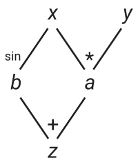

# Lab 08 - Reverse Mode Differentiation

* use simple 2d example with nice visualization
* implement AD through neural network


In the lecture you have seen how to implement *forward-mode* automatic
differentiation (AD). Assume you want to find the derivative $\frac{df}{dx}$ of
the function $f:\mathbb R^2 \rightarrow \mathbb R$
```@example lab08
f(x,y) = x*y + sin(x)
nothing # hide
```
If we have rules for `*`, `+`, and `sin` we could simply *seed* the function with
`Dual(x,one(x))` and read out the derivative $\frac{df}{dx}$ from the `Dual` that is returned
by `f`. If we are also interested in the derivative $\frac{df}{dy}$ we will have
to run `f` again, this time seeding the second argument with `Dual(y,one(y))`.
Hence, we have to evaluate `f` *twice* if we want derivatives w.r.t to both its
arguments which means that forward differentiation scales as $O(N)$ where $N$ is
the number of inputs to `f`.

*Reverse-mode* AD can compute gradients of functions with many inputs and one
output in one go. This great because very often we want to optimize loss
functions which are exactly that: Functions with many input variables and one
loss output.

## Reverse Mode AD

As discussed in the lecture, in order to implement reverse-mode AD we
have to trace and remember all computations during the forward pass such that we can compute
their gradients during the backward pass. The simplest way of doing this is by
dynamically building a computation graph which tracks how each input variable
affects its output variables. The graph below represents the computation
of our function `f`
```julia
z = x*y + sin(x)

# as a Wengert list   # Partial derivatives
a = x*y               # da/dx = y;     da/dy = x
b = sin(x)            # db/dx = cos(x)
z = a + b             # dz/da = 1;     dz/db = 1
```



In the graph you can see that the variable `x` can directly affect `b` and `a`.
Hence, `x` has two children `a` and `b`.  During the forward pass we build the
graph, keeping track of which input affects which output.
Additionally we include the corresponding partial derivatives, which we can already compute.
The backward pass is nothing more than the application of the chainrule. To compute
the derivative of a given output $s$ with respect to some input $u$ we just have
to apply
```math
\frac{\partial s}{\partial u} = \sum^N_i \frac{\partial s}{\partial w_i} \frac{\partial w_i}{\partial u}
```
where we sum for all $N$ child nodes that $s$ is affected by. In the case of computing
the derivative of $z$ w.r.t. $x$ we get
```math
\frac{\partial z}{\partial x} = \frac{\partial z}{\partial a}\frac{\partial a}{\partial x}
                              + \frac{\partial z}{\partial b}\frac{\partial b}{\partial x}.
```
The terms $\frac{\partial a}{\partial x}$ and $\frac{\partial b}{\partial x}$
are the partial derivatives that can be computed during the forward pass.  To
compute the terms $\frac{\partial z}{\partial a}$ and $\frac{\partial
z}{\partial b}$ we recursively apply the chainrule until we arrive at the final
output `z`.  This final output has to be seeded (just like with forward-mode)
with $\frac{\partial z}{\partial z}=1$.

To implement a dynamically built graph we can introduce a new number type
`TrackedReal` which has three fields:
* `data` contains the value of this node in the computation graph as obtained
  in the forward pass.
* `grad` is initialized to `nothing` and will later hold the accumulated gradients $\frac{\partial s}{\partial w_i}$
* `children` is a `Dict` that keeps track which output variables $w_i$ are affected
  by the current node and also stores the corresponding partial derivatives
  $\frac{\partial w_i}{\partial u}$.

```@example lab08
mutable struct TrackedReal{T<:Real}
    data::T
    grad::Union{Nothing,T}
    children::Dict
    # this field is only need for printing the graph. you can safely remove it.
    name::String
end

track(x::Real,name="") = TrackedReal(x,nothing,Dict(),name)

function Base.show(io::IO, x::TrackedReal)
    t = x.name=="" ? "(tracked)" : "(tracked $(x.name))"
    print(io, "$(x.data) $t")
end
```

Lets start by overloading the three functions `+`, `*`, and `sin` that we need
to build our computation graph. First, we have to track the forward computation
and then we *register* the output `z` as a child of its inputs by using `z`
as a key in the dictionary of children. The corresponding value holds the 
derivatives, in the case of multiplication case we simply have
```math
\frac{\partial}{\partial a}(ab)=b, \qquad
\frac{\partial}{\partial b}(ab)=a.
```
```@example lab08
function Base.:*(a::TrackedReal, b::TrackedReal)
    z = track(a.data * b.data, "*")
    a.children[z] = b.data  # dz/da=b
    b.children[z] = a.data  # dz/db=a
    z
end
```
We can create two tracked numbers and add them
```@repl lab08
x = track(2.0)
y = track(3.0)
z = x*y
x.children
y.children
```
The two remaining rules for `+` and `sin` are
```@example lab08
function Base.:+(a::TrackedReal{T}, b::TrackedReal{T}) where T
    z = track(a.data + b.data, "+")
    a.children[z] = one(T)
    b.children[z] = one(T)
    z
end

function Base.sin(x::TrackedReal)
    z = track(sin(x.data), "sin")
    x.children[z] = cos(x.data)
    z
end
```
Now we just need to implement the chainrule to accumulate the gradients of a
given node from its children. We loop over all children, collect the partial
derivatives and recurse.
```@example lab08
function accum!(x::TrackedReal)
    if isnothing(x.grad)
        x.grad = sum(accum!(v)*w for (v,w) in x.children)
    end
    x.grad
end
```

Our first, simple, dynamic graph-based reversdiff can now compute gradients of
expressions like below
```@repl lab08
x = track(2.0);
y = track(3.0);
z = x*y + sin(x);
z.grad = 1.0;  # seed the final output
dx = accum!(x)
isapprox(dx, y.data+cos(x.data))
dy = accum!(y)
isapprox(dy, x.data)
```

To visualize that with reverse-mode AD we really do save computation we can
visualize the computation graph at different stages. We start with the forward
pass
```@example lab08
using AbstractTrees
AbstractTrees.children(v::TrackedReal) = v.children |> keys |> collect
function AbstractTrees.printnode(io::IO,v::TrackedReal)
    print(io,"$(v.name) data: $(round(v.data,digits=2)) grad: $(v.grad)")
end

x = track(2.0,"x")
y = track(3.0,"y")
z = x*y + sin(x)
z.grad = 1.0
nothing # hide
```
Right after the forward pass, no gradients have been computed.
```@repl lab08
print_tree(x)
print_tree(y)
```
If we accumulate the gradients for `x`, the gradients in the subtree connected
to `x` will be evaluated. The part of the tree that are only connected to `y`
stay untouched.
```@repl lab08
accum!(x);
print_tree(x)
print_tree(y)
```
If we now accumulate the gradients over `y` we re-use the gradients that are already
computed.

!!! info
    This also means that we have to re-build the graph for every new set of inputs!


## Naively Vectorized Reverse AD

A naive solution to use our `TrackedReal` number type to differentiate
functions that operate on vectors is to just use `Array{<:TrackedReal}`.
Unfortunately, this means that we have to replace the fast BLAS matrix
operations with our own matrix multipilication methods that know how to deal
with `TrackedReal`s.  This results in large performance hits and your task
during the rest of the lab is to implement a smarter solution to this problem.

```@example lab08
using LinearAlgebra
Base.zero(::TrackedReal{T}) where T = TrackedReal(zero(T))
LinearAlgebra.adjoint(x::TrackedReal) = x
track(x::Array) = track.(x)
accum!(xs::Array{<:TrackedReal}) = accum!.(xs)

function LinearAlgebra.dot(xs::AbstractVector{<:TrackedReal}, ys::AbstractVector{<:TrackedReal})
    mapreduce(*, +, xs, ys)
end
function Base.:*(X::AbstractMatrix{<:TrackedReal}, y::AbstractVector{<:TrackedReal})
    map(x->dot(x,y), eachrow(X))
end
function Base.:*(X::AbstractMatrix{<:TrackedReal}, Y::AbstractMatrix{<:TrackedReal})
    mapreduce(y->X*y, hcat, eachcol(Y))
end
Base.sum(xs::AbstractArray{<:TrackedReal}) = reduce(+,xs)

X = rand(2,3)
Y = rand(3,2)
Xv = track(X)
Yv = track(Y)

z = sum(Xv * Yv)
z.grad = 1.0
accum!(Yv)
```

## Reverse AD with `TrackedArray`s
