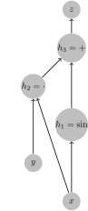
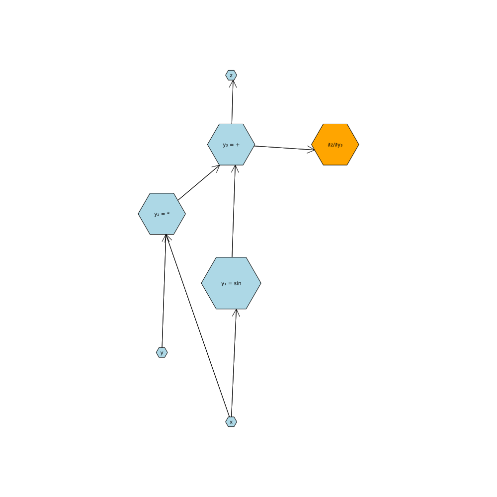
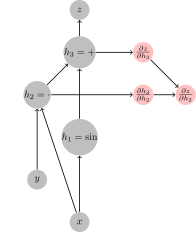
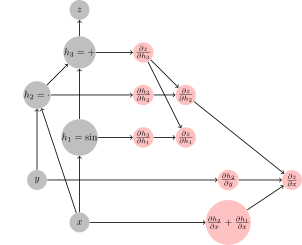

```@setup lec08
using Plots
```
# Automatic Differentiation

## Motivation

- It supports a lot of modern machine learning by allowing quick differentiation of complex mathematical functions. The 1st order optimization methods are ubiquitous in finding parameters of functions (not only in  deep learning).
- AD is interesting to study from the implementation perspective. There are different takes on it with different trade-offs and Julia offers many implementations (some of them are not maintained anymore).
- We (authors of this course) believe that it is good to understand (at least roughly), how the methods work in order to use them effectively in our work.
- Julia is unique in the effort separating definitions of AD rules from AD engines that use those rules to perform the AD. This allows authors of generic libraries to add new rules that would be compatible with many frameworks. See [juliadiff.org](https://juliadiff.org/) for a list.

## Theory

The differentiation is routine process, as most of the time we break complicated functions down into small pieces that we know, how to differentiate and from that to assemble the gradient of the complex function back. Thus, the essential piece is the differentiation of the composed function ``f: \mathbb{R}^n \rightarrow \mathbb{R}^m``


```math
f(x) = f_1(f_2(f_3(\ldots f_n(x)))) = (f_1 \circ f_2 \circ \ldots \circ f_n)(x)
``` 

which is computed by chainrule. Before we dive into the details, let's define the notation, which for the sake of clarity needs to be precise. The gradient of function ``f(x)`` with respect to ``x`` at point ``x_0`` will be denoted as 
``\left.\frac{\partial f}{\partial x}\right|_{x^0}``

For a composed function ``f(x)`` the gradient with respect to ``x`` at point ``x_0`` is equal to
```math
\left.\frac{\partial f}{\partial x}\right|_{x^0} = \left.\frac{f_1}{\partial y_1}\right|_{y_1^0} \times \left.\frac{f_2}{\partial y_2}\right|_{y_2^0} \times \ldots \times \left.\frac{f_n}{\partial y_n}\right|_{y_n^0},
```

where ``y_i`` denotes the input of function ``f_i`` and
```math
\begin{alignat*}{2}
y_i^0 = &\ \left(f_{i+1} \circ \ldots \circ f_n\right) (x^0) \\
y_n^0 = &\ x^0 \\
y_0^0 = &\ f(x^0) \\
\end{alignat*}
```
How ``\left.\frac{f_i}{\partial y_i}\right|_{y_i^0}`` looks like? 
- If ``f_i: \mathbb{R} \rightarrow \mathbb{R}``, then ``\frac{f_i}{\partial y_i} \in \mathbb{R}`` is a real number ``\mathbb{R}`` and we live in a high-school world, where it was sufficient to multiply real numbers.
- If ``f_i: \mathbb{R}^{m_i} \rightarrow \mathbb{R}^{n_i}``, then ``\mathbf{J}_i = \left.\frac{f_i}{\partial y_i}\right|_{y_i^0} \in \mathbb{R}^{n_i,m_i}`` is a matrix with ``m_i`` rows and ``n_i`` columns. 

The computation of gradient ``\frac{\partial f}{\partial x}`` *theoretically* boils down to 
   1. computing Jacobians ``\left\{\mathbf{J}_i\right\}_{i=1}^n`` 
   2. multiplication of Jacobians as it holds that ``\left.\frac{\partial f}{\partial x}\right|_{y_0} = J_1 \times J_2 \times \ldots \times J_n``. 

The complexity of the computation (at least one part of it) is therefore therefore determined by the  Matrix multiplication, which is generally expensive, as theoretically it has complexity at least ``O(n^{2.3728596}),`` but in practice a little bit more as the lower bound hides the devil in the ``O`` notation. The order in which the Jacobians are multiplied has therefore a profound effect on the complexity of the AD engine. While determining the optimal order of multiplication of sequence of matrices is costly, in practice, we recognize two important cases.

1. Jacobians are multiplied from right to left as  ``J_1 \times (J_2 \times ( \ldots \times (J_{n-1} \times J_n) \ldots))`` which has the advantage when the input dimension of ``f: \mathbb{R}^n \rightarrow \mathbb{R}^m`` is smaller than the output dimension, ``n < m``. - referred to as the **FORWARD MODE**
2. Jacobians are multiplied from left to right as ``( \ldots ((J_1 \times J_2) \times J_3) \times \ldots ) \times J_n`` which has the advantage when the input dimension of ``f: \mathbb{R}^n \rightarrow \mathbb{R}^m`` is larger than the output dimension, ``n > m``. - referred to as the **BACKWARD MODE**

The ubiquitous in machine learning to minimization of a scalar (loss) function of a large number of parameters. Also notice that for `f` of certain structures, it pays-off to do a mixed-mode AD, where some parts are done using forward diff and some parts using reverse diff. 

### Example
Let's workout an example
```math
z = xy + sin(x)
```
How it maps to the notation we have used above? Particularly, what are ``f_1, f_2, \ldots, f_n`` and the corresponding ``\{y_i\}_{i=1}^n``, such that ``(f_1 \circ f_2 \circ \ldots \circ f_n)(x,y) = xy + sin(x)`` ?
```math
\begin{alignat*}{6}
f_1:&\mathbb{R}^2 \rightarrow \mathbb{R} \quad&f_1(y_1)& = y_{1,1} + y_{1,2}            \quad & y_0 = & (xy + \sin(x))           \\
f_2:&\mathbb{R}^3 \rightarrow \mathbb{R}^2 \quad&f_2(y_2)& = (y_{2,1}y_{1,2}, y_{2,3}) \quad & y_1 = &  (xy, \sin(x))&\\
f_3:& \mathbb{R}^2 \rightarrow \mathbb{R}^3 \quad&f_3(y_3)& = (y_{3,1}, y_{3,2}, \sin(y_{3,1}))  \quad & y_2 =& (x, y, \sin(x))\\
\end{alignat*}
```
The corresponding jacobians are 
```math
\begin{alignat*}{4}
f_1(y_1) & = y_{1,1} + y_{1,2}             \quad & \mathbf{J}_1& = \begin{bmatrix} 1 \\ 1 \end{bmatrix}  \\
f_2(y_2) & = (y_{2,1}y_{1,2}, y_{2,3})     \quad & \mathbf{J}_2& = \begin{bmatrix} y_{2, 2} & 0 \\ y_{2,1} & 0 \\ 0 & 1 \end{bmatrix}\\
f_3(y_3) & = (y_{3,1}, y_{3,2}, \sin(y_{3,1}))     \quad & \mathbf{J}_3 & = \begin{bmatrix} 1 & 0 & \cos(y_{3,1}) \\ 0 & 1 & 0 \end{bmatrix} \\
\end{alignat*}
```
and for the gradient it holds that
```math
\begin{bmatrix} \frac{\partial f(x, y)}{\partial{x}} \\ \frac{\partial f(x,y)}{\partial{y}} \end{bmatrix} = \mathbf{J}_3 \times \mathbf{J}_2 \times \mathbf{J}_1 =  \begin{bmatrix} 1 & 0 & \cos(x) \\ 0 & 1 & 0 \end{bmatrix} \\  \times \begin{bmatrix} y & 0 \\ x & 0 \\ 0 & 1 \end{bmatrix} \times \begin{bmatrix} 1 \\ 1 \end{bmatrix} = \begin{bmatrix} y & \cos(x) \\ x & 0 \end{bmatrix} \times \begin{bmatrix} 1 \\ 1 \end{bmatrix} = \begin{bmatrix} y + \cos(x) \\ x \end{bmatrix}
```
Note that from theoretical point of view this decomposition of a function is not unique, however as we will see later it usually given by the computational graph in a particular language/environment.

## Calculation of the Forward mode
In theory, we can calculate the gradient using forward mode as follows
Initialize the Jacobian of ``y_n`` with respect to ``x`` to an identity matrix, because as we have stated above ``y^0_n = x``, i.e. ``\frac{\partial y_n}{\partial x} = \mathbb{I}``.
Iterate `i` from `n` down to `1` as
- calculate the next intermediate output as ``y^0_{i-1} = f_i({y^0_i})`` 
- calculate Jacobian ``J_i = \left.\frac{f_i}{\partial y_i}\right|_{y^0_i}``
- *push forward* the gradient as ``\left.\frac{\partial y_{i-1}}{\partial x}\right|_x = J_i \times \left.\frac{\partial y_n}{\partial x}\right|_x``

Notice that 
- on the very end, we are left with ``y = y^0_0`` and with ``\frac{\partial y_0}{\partial x}``, which is the gradient we wanted to calculate;
- if `y` is a scalar, then ``\frac{\partial y_0}{\partial x}`` is a matrix with single row
- the Jacobian and the output of the function is calculated in one sweep.

The above is an idealized computation. The real implementation is a bit different, as we will see later.

### Implementation of the forward mode using Dual numbers

Forward modes need to keep track of the output of the function and of the derivative at each computation step in the computation of the complicated function ``f``. This can be elegantly realized with a [**dual number**](https://en.wikipedia.org/wiki/Dual_number), which are conceptually similar to complex numbers, but instead of the imaginary number ``i`` dual numbers use ``\epsilon`` in its second component:
```math
x = v + \dot v \epsilon,
```
where ``(v,\dot v) \in \mathbb R`` and by definition ``\epsilon^2=0`` (instead
of ``i^2=-1`` in complex numbers). What are the properties of these Dual numbers?
```math
\begin{align}
(v + \dot v \epsilon) + (u + \dot u \epsilon) &= (v + u) + (\dot v + \dot u)\epsilon  \\
(v + \dot v \epsilon)(u + \dot u \epsilon) &= vu + (u\dot v + \dot u v)\epsilon + \dot v \dot u \epsilon^2 = vu + (u\dot v + \dot u v)\epsilon \\
\frac{v + \dot v \epsilon}{u + \dot u \epsilon} &= \frac{v + \dot v \epsilon}{u + \dot u \epsilon} \frac{u - \dot u \epsilon}{u - \dot u \epsilon} = \frac{v}{u} - \frac{(\dot u v - u \dot v)\epsilon}{u^2}
\end{align}
```

#### How are dual numbers related to differentiation?
Let's evaluate the above equations at ``(v, \dot v) = (v, 1)`` and ``(u, \dot u) = (u, 0)``
we obtain 
```math
\begin{align}
(v + \dot v \epsilon) + (u + \dot u \epsilon) &= (v + u) + 1\epsilon  \\
(v + \dot v \epsilon)(u + \dot u \epsilon) &= vu + u\epsilon\\
\frac{v + \dot v \epsilon}{u + \dot u \epsilon} &= \frac{v}{u}  + \frac{1}{u} \epsilon
\end{align}
```
and notice that terms ``(1, u, \frac{1}{u})`` corresponds to gradient of functions ``(u+v, uv, \frac{v}{u})`` with respect to ``v``. We can repeat it with changed values of ``\epsilon`` as ``(v, \dot v) = (v, 0)`` and ``(u, \dot u) = (u, 1)``
and we obtain
```math
\begin{align}
(v + \dot v \epsilon) + (u + \dot u \epsilon) &= (v + u) + 1\epsilon  \\
(v + \dot v \epsilon)(u + \dot u \epsilon) &= vu + v\epsilon\\
\frac{v + \dot v \epsilon}{u + \dot u \epsilon} &= \frac{v}{u}  - \frac{v}{u^2} \epsilon
\end{align}
```
meaning that at this moment we have obtained gradients with respect to ``u``.

All above functions ``(u+v, uv, \frac{u}{v})`` are of ``\mathbb{R}^2 \rightarrow \mathbb{R}``, therefore we had to repeat the calculations twice to get gradients with respect to both inputs. This is inline with the above theory, where we have said that if input dimension is larger then output dimension, the backward mode is better. But consider a case, where we have a function 
```math
f(v) = (v + 5, 5*v, 5 / v) 
```
which is ``\mathbb{R} \rightarrow \mathbb{R}^3``. In this case, we obtain the Jacobian ``[1, 5, -\frac{5}{v^2}]`` in a single forward pass (whereas the reverse would require three passes over the backward calculation, as will be seen later).

#### Does dual numbers work universally?
Let's first work out polynomial. Let's assume the polynomial
```math
p(v) = \sum_{i=1}^n p_iv^i
```
and compute its value at ``v + \dot v \epsilon`` (note that we know how to do addition and multiplication)
```math
\begin{split}
p(v) &= 
    \sum_{i=0}^n p_i(v + \dot{v} \epsilon )^i = 
    \sum_{i=0}^n \left[p_i \sum_{j=0}^{n}\binom{i}{j}v^{i-j}(\dot v \epsilon)^{i}\right] = 
    p_0 + \sum_{i=1}^n \left[p_i \sum_{j=0}^{1}\binom{i}{j}v^{i-j}(\dot v \epsilon)^{j}\right] = \\
    &= p_0 + \sum_{i=1}^n p_i(v^i + i v^{i-1} \dot v \epsilon ) 
    = p(v) + \left(\sum_{i=1}^n ip_i v^{i-1}\right) \dot v \epsilon
\end{split}
```
where in the multiplier of ``\dot{v} \epsilon``: ``\sum_{i=1}^n ip_i v^{i - 1}``, we recognize the derivative of ``p(v)`` with respect to ``v``. This proves that Dual numbers can be used to calculate the gradient of polynomials.

Let's now consider a general function ``f:\mathbb{R} \rightarrow \mathbb{R}``. Its value at point ``v + \dot v \epsilon`` can be approximated using Taylor expansion at function at point ``v`` as
```math
f(v+\dot v \epsilon) = \sum_{i=0}^\infty \frac{f^i(v)\dot v^i\epsilon^n}{i!}
  = f(v) + f'(v)\dot v\epsilon,
```
where all higher order terms can be dropped because ``\epsilon^i=0`` for ``i>1``. This shows that we can calculate the gradient of ``f`` at point ``v`` by calculating its value at ``f(v + \epsilon)`` and taking the multiplier of ``\epsilon``.

#### Implementing Dual number with Julia
To demonstrate the simplicity of Dual numbers, consider following definition of Dual numbers, where we define a new number type and overload functions `+`, `-`, `*`, and `/`.  In Julia, this reads:
```@example lec08
struct Dual{T<:Number} <: Number
    x::T
    d::T
end

Base.:+(a::Dual, b::Dual)   = Dual(a.x+b.x, a.d+b.d)
Base.:-(a::Dual, b::Dual)   = Dual(a.x-b.x, a.d-b.d)
Base.:/(a::Dual, b::Dual)   = Dual(a.x/b.x, (a.d*b.x - a.x*b.d)/b.x^2) # recall  (a/b) =  a/b + (a'b - ab')/b^2 ϵ
Base.:*(a::Dual, b::Dual)   = Dual(a.x*b.x, a.d*b.x + a.x*b.d)

# Let's define some promotion rules
Dual(x::S, d::T) where {S<:Number, T<:Number} = Dual{promote_type(S, T)}(x, d)
Dual(x::Number) = Dual(x, zero(typeof(x)))
Dual{T}(x::Number) where {T} = Dual(T(x), zero(T))
Base.promote_rule(::Type{Dual{T}}, ::Type{S}) where {T<:Number,S<:Number} = Dual{promote_type(T,S)}
Base.promote_rule(::Type{Dual{T}}, ::Type{Dual{S}}) where {T<:Number,S<:Number} = Dual{promote_type(T,S)}

# and define api for forward differentionation
forward_diff(f::Function, x::Real) = _dual(f(Dual(x,1.0)))
_dual(x::Dual) = x.d
_dual(x::Vector) = _dual.(x)
```

And let's test the **_Babylonian Square Root_** (an algorithm to compute $\sqrt x$):
```@repl lec08
babysqrt(x, t=(1+x)/2, n=10) = n==0 ? t : babysqrt(x, (t+x/t)/2, n-1)

forward_diff(babysqrt, 2) 
forward_diff(x -> [1 + x, 5x, 5/x], 2) 
forward_diff(babysqrt, 2) ≈ 1/(2sqrt(2))
```

We now compare the analytic solution to values computed by the `forward_diff` and byt he finite differencing
```math
f(x) = \sqrt{x} \qquad f'(x) = \frac{1}{2\sqrt{x}}
```
```@repl lec08
using FiniteDifferences
forward_dsqrt(x) = forward_diff(babysqrt,x)
analytc_dsqrt(x) = 1/(2babysqrt(x))
forward_dsqrt(2.0)
analytc_dsqrt(2.0)
central_fdm(5, 1)(babysqrt, 2.0)
```
```@example lec08
plot(0.0:0.01:2, babysqrt, label="f(x) = babysqrt(x)", lw=3)
plot!(0.1:0.01:2, analytc_dsqrt, label="Analytic f'", ls=:dot, lw=3)
plot!(0.1:0.01:2, forward_dsqrt, label="Dual Forward Mode f'", lw=3, ls=:dash)
```

---
### Takeaways
1. Forward mode $f'$ is obtained simply by pushing a `Dual` through `babysqrt`
2. To make the forward diff work in Julia, we only need to **_overload_** a few **_operators_** for forward mode AD to
   work on **_any function_**
3. For vector valued function we can use [**_Hyperduals_**](http://adl.stanford.edu/hyperdual/)
5. Forward diff can differentiation through the `setindex!` (called each time an element is assigned to a place in array, e.g. `x = [1,2,3]; x[2] = 1`)
6. ForwardDiff is implemented in [`ForwardDiff.jl`](https://github.com/JuliaDiff/ForwardDiff.jl), which might appear to be neglected, but the truth is that it is very stable and general implementation.
7. ForwardDiff does not have to be implemented through Dual numbers. It can be implemented similarly to ReverseDiff through multiplication of Jacobians, which is what is the community work on now (in [`Diffractor`](https://github.com/JuliaDiff/Diffractor.jl), [`Zygote`](https://github.com/FluxML/Zygote.jl) with rules defined in [`ChainRules`](https://github.com/JuliaDiff/ChainRules.jl)).
---

## Reverse mode
In reverse mode, the computation of the gradient follow the opposite order. 
We initialize the computation by setting ``\mathbf{J}_0 = \frac{\partial y}{\partial y_0},`` which is again an identity matrix. Then we compute Jacobians and multiplications in the opposite order. The problem is that to calculate ``J_i`` we need to know the value of ``y_i^0``, which cannot be calculated in the reverse pass. The backward pass therefore needs to be preceded by the forward pass, where  ``\{y_i^0\}_{i=1}^n`` are calculated.

The complete reverse mode algorithm therefore proceeds as 
1. Forward pass: iterate `i` from `n` down to `1` as
    - calculate the next intermediate output as ``y^0_{i-1} = f_i(y^0_i)`` 
2. Backward pass: iterate `i` from `1` down to `n` as
    - calculate Jacobian ``J_i = \left.\frac{f_i}{\partial y_i}\right|_{y_i^0} `` at point ``y_i^0``
    - *pull back* the gradient as ``\left.\frac{\partial f(x)}{\partial y_{i}}\right|_{y^0_i} = \left.\frac{\partial y_0}{\partial y_{i-1}}\right|_{y^0_{i-1}} \times J_i``


The need to store intermediate outs has a huge impact on memory requirements, which particularly on GPU is a big deal. Recall few lectures ago we have been discussing how excessive memory allocations can be damaging for performance, here we are given an algorithm where the excessive allocation is by design.

### Tricks to decrease memory consumptions
- Define **custom rules** over large functional blocks. For example while we can auto-grad (in theory) matrix product, it is much more efficient to define make a matrix multiplication as one large function, for which we define Jacobians (note that by doing so, we can dispatch on Blas). e.g
```math
\begin{alignat*}{2}
  \mathbf{C} &= \mathbf{A} * \mathbf{B} \\
  \frac{\partial{\mathbf{C}}}{\partial \mathbf{A}} &= \mathbf{B} \\
  \frac{\partial{\mathbf{C}}}{\partial \mathbf{B}} &= \mathbf{A}^{\mathrm{T}} \\
\end{alignat*}
```
- When differentiating **Invertible functions**, calculate intermediate outputs from the output. This can lead to huge performance gain, as all data needed for computations are in caches.  
- **Checkpointing** does not store intermediate ouputs after larger sequence of operations. When they are needed for forward pass, they are recalculated on demand.

Most reverse mode AD engines does not support mutating values of arrays (`setindex!` in julia). This is related to the memory consumption, where after every `setindex!` you need in theory save the full matrix. [`Enzyme`](https://github.com/wsmoses/Enzyme.jl) differentiating directly LLVM code supports this, since in LLVM every variable is assigned just once. ForwardDiff methods does not suffer this problem, as the gradient is computed at the time of the values.

!!! info
    Reverse mode AD was first published in 1976 by Seppo Linnainmaa[^1], a finnish computer scientist. It was popularized in the end of 80s when applied to training multi-layer perceptrons, which gave rise to the famous **backpropagation** algorithm[^2], which is a special case of reverse mode AD.
    
    [^1]: Linnainmaa, S. (1976). Taylor expansion of the accumulated rounding error. *BIT Numerical Mathematics*, 16(2), 146-160.
    [^2]: Rumelhart, D. E., Hinton, G. E., and Williams, R. J. (1986). Learning representations by back-propagating errors. *Nature*, 323, 533--536.

!!! info
    The terminology in automatic differentiation is everything but fixed. The community around `ChainRules.jl` went a great length to use something reasonable. They use **pullback** for a function realizing vector-Jacobian product in the reverse-diff reminding that the gradient is pulled back to the origin of the computation. The use **pushforward** to denote the same operation in the ForwardDiff, as the gradient is push forward through the computation.

## Implementation details of reverse AD
### Graph-based AD
In Graph-based approach, we start with a complete knowledge of the computation graph (which is known in many cases like classical neural networks) and augment it with nodes representing the computation of the computation of the gradient (backward path). We need to be careful to add all edges representing the flow of information needed to calculate the gradient. Once the computation graph is augmented, we can find the subgraph needed to compute the desired node(s). 

Recall the example from the beginning of the lecture ``f(x, y) = \sin(x) + xy``, let's observe, how the extension of the computational graph will look like. The computation graph of function ``f`` looks like



where arrows ``\rightarrow`` denote the flow of operations and we have denoted the output of function ``f`` as ``z`` and outputs of intermediate nodes as ``h_i`` standing for *hidden*.

We start from the top and add a node calculating ``\frac{\partial z}{\partial h_3}`` which is an identity, needed to jump-start the differentiation. 



We connect it with the output of ``h_3``, even though technically in this case it is not needed, as the ``z = h_3``.
We then add a node calculating ``\frac{\partial h_3}{\partial h_2}`` for which we only need information about ``h_2`` and mark it in the graph (again, this edge can be theoretically dropped due to being equal to one regardless the inputs). Following the chain rule, we need to combine ``\frac{\partial h_3}{\partial h_2}`` with ``\frac{\partial z}{\partial h_3}`` to compute ``\frac{\partial z}{\partial h_2}`` which we note in the graph.



We continue with the same process with ``\frac{\partial h_3}{\partial h_1}``, which we again combine with ``\frac{\partial z}{\partial h_1}`` to obtain ``\frac{\partial z}{\partial h_1}``. Continuing the reverse diff we obtain the final graph


 

containing the desired nodes ``\frac{\partial z}{\partial x}`` and ``\frac{\partial z}{\partial y}``. This computational graph can be passed to the compiler to compute desired values.

This approach to AD has been taken for example by [Theano](https://github.com/Theano/Theano) and by [TensorFlow](https://www.tensorflow.org/). In Tensorflow when you use functions like `tf.mul( a, b )` or `tf.add(a,b)`, you are not performing the computation in Python, but you are building the computational graph shown as above. You can then compute the values using `tf.run` with a desired inputs, but you are in fact computing the values in a different interpreter / compiler then in python.

Advantages:
- Knowing the computational graph in advance is great, as you can do expensive optimization steps to simplify the graph. 
- The computational graph have a simple semantics (limited support for loops, branches, no objects), and the compiler is therefore simpler than the compiler of full languages.
- Since the computation of gradient augments the graph, you can run the process again to obtain higher order gradients. 
- TensorFlow allows you to specialize on sizes of Tensors, which means that it knows precisely how much memory you will need and where, which decreases the number of allocations. This is quite important in GPU.

Disadvantages:
- You are restricted to fixed computation graph. It is generally difficult to implement `if` or `while`, and hence to change the computation according to values computed during the forward pass.
- Development and debugging can be difficult, since you are not developing the computation graph in the host language.
- Exploiting within computation graph parallelism might be difficult.

### Tracking-based AD
Alternative to static-graph based methods are methods, which builds the graph during invocation of functions and then use this dynamically built graph to know, how to compute the gradient. The dynamically built graph is frequently called *tape*. This approach is used by popular libraries like [**_PyTorch_**](https://pytorch.org/), [**_AutoGrad_**](https://github.com/HIPS/autograd), and [**_Chainer_**](https://chainer.org/) in Python ecosystem, or by [**_Tracker.jl_**](https://github.com/FluxML/Tracker.jl) (`Flux.jl`'s former AD backend), [**_ReverseDiff.jl_**](https://github.com/JuliaDiff/ReverseDiff.jl), and [**_AutoGrad.jl_**](https://github.com/denizyuret/AutoGrad.jl) (`Knet.jl`'s AD backend) in Julia. This type of AD systems is also called *operator overloading*, since in order to record the operations performed on the arguments we need to replace/wrap the original implementation.

How do we build the tracing? Let's take a look what `ReverseDiff.jl` is doing. It defines `TrackedArray` (it also defines `TrackedReal`, but `TrackedArray` is more interesting) as
```julia
struct TrackedArray{T,N,V<:AbstractArray{T,N}} <: AbstractArray{T,N}
    value::V
    deriv::Union{Nothing,V}
    tape::Vector{Any}
    string_tape::String
end
```
where in
- `value` it stores the value of the array
- `deriv` will hold the gradient of the tracked array
- `tape` of will log operations performed with the tracked array, such that we can calculate the gradient as a sum of operations performed over the tape.

What do we need to store on the tape? Let's denote as ``a`` the current `TrackedArray`. The gradient with respect to some output ``z`` is equal to ``\frac{\partial z}{\partial a} = \sum_{g_i} \frac{\partial z}{\partial g_i} \times \frac{\partial g_i}{\partial a}`` where  ``g_i`` is the output of any function (in the computational graph) where ``a`` was a direct input. The `InstructionTape` will therefore contain a reference to ``g_i`` (which has to be of `TrackedArray` and where we know ``\frac{\partial z}{\partial g_i}`` will be stored in `deriv` field) and we also need to a method calculating ``\frac{\partial g_i}{\partial a}``, which can be stored as an anonymous function will accepting the grad as an argument.

```julia
TrackedArray(a::AbstractArray, string_tape::String = "") = TrackedArray(a, similar(a) .= 0, [], string_tape)
TrackedMatrix{T,V} = TrackedArray{T,2,V} where {T,V<:AbstractMatrix{T}}
TrackedVector{T,V} = TrackedArray{T,1,V} where {T,V<:AbstractVector{T}}
Base.show(io::IO, ::MIME"text/plain", a::TrackedArray) = show(io, a)
Base.show(io::IO, a::TrackedArray) = print(io, "TrackedArray($(size(a.value)))")
value(A::TrackedArray) = A.value
value(A) = A
track(A, string_tape = "") = TrackedArray(A, string_tape)
track(a::Number, string_tape) = TrackedArray(reshape([a], 1, 1), string_tape)

import Base: +, *
function *(A::TrackedMatrix, B::TrackedMatrix)
    a, b = value.((A, B))
    C = TrackedArray(a * b, "($(A.string_tape) * $(B.string_tape))")
    push!(A.tape, (C, Δ -> Δ * b'))
    push!(B.tape, (C, Δ -> a' * Δ))
    C
end

function +(A::TrackedMatrix, B::TrackedMatrix)
    C = TrackedArray(value(A) + value(B), "($(A.string_tape) + $(B.string_tape))")
    push!(A.tape, (C, Δ -> Δ))
    push!(B.tape, (C, Δ -> Δ))
    C
end

function msin(A::TrackedMatrix)
    a = value(A)
    C = TrackedArray(sin.(a), "sin($(A.string_tape))")
    push!(A.tape, (C, Δ -> cos.(a) .* Δ))
    C
end
```

Let's observe that the operations are recorded on the tape as they should
```julia
a = rand()
b = rand()
A = track(a, "A")
B = track(b, "B")
# R = A * B + msin(A)
C = A * B 
A.tape
B.tape
C.string_tape
R = C + msin(A)
A.tape
B.tape
R.string_tape
```

Let's now implement a function that will recursively calculate the gradient of a term of interest. It goes over its childs, if they not have calculated the gradients, calculate it, otherwise it adds it to its own after  if not, ask them to calculate the gradient and otherwise 
```julia
function accum!(A::TrackedArray)
    isempty(A.tape) && return(A.deriv)
    A.deriv .= sum(g(accum!(r)) for (r, g) in A.tape)
    empty!(A.tape)
    A.deriv
end
```
We can calculate the gradient by initializing the gradient of the result to vector of ones simulating the `sum` function
```julia
using Zygote
R.deriv .= 1
accum!(A)[1]
gradient(a -> a*b + sin(a), a)[1]
accum!(B)[1]
gradient(b -> a*b + sin(a), b)[1]
```
The api function for computing the grad might look like
```julia
function grad(f, args...)
    args = track.(args)
    o = f(args...)
    fill!(o.deriv, 1)
    map(accum!, args)
end
```
where we should assert that the output dimension is 1. In our implementation we dirtily expect the output of f to be summed to a scalar.

Let's compare the results to those computed by Zygote
```julia
A = rand(4,4)
B = rand(4,4)
grad(A -> A * B + msin(A), A)[1]
gradient(A -> sum(A * B + sin.(A)), A)[1]
grad(A -> A * B + msin(A), B)[1]
gradient(A -> sum(A * B + sin.(A)), B)[1]
```

To make the above AD system really useful, we would need to 
1. Add support for `TrackedReal`, which is straightforward (we might skip the anonymous function, as the derivative of a scalar function is always a number).
2. We would need to add a lot of rules, how to work with basic values. This is why the the approach is called **operator overloading** since you need to overload a lot of functions (or methods or operators).

For example to add all combinations for `+` and `*`, we would need to add following rules.
```julia
function *(A::TrackedMatrix, B::AbstractMatrix)
   C = TrackedArray(value(A) * B, "($(A.string_tape) * B)")
   push!(A.tape, (C, Δ -> Δ * B'))
   C
end

function *(A::AbstractMatrix, B::TrackedMatrix)
   C = TrackedArray(value(A) * value(B), "($(A.string_tape) * $(B.string_tape))")
   push!(B.tape, (C, Δ -> A' * Δ))
   C
end

function +(A::TrackedMatrix, B::TrackedMatrix)
   C = TrackedArray(value(A) + value(B), "($(A.string_tape) + $(B.string_tape))")
   push!(A.tape, (C, Δ -> Δ ))
   push!(B.tape, (C, Δ -> Δ))
   C
end

function +(A::AbstractMatrix, B::TrackedMatrix)
   C = TrackedArray(A * value(B), "(A + $(B.string_tape))")
   push!(B.tape, (C, Δ -> Δ))
   C
end
```

Advantages:
- Debugging and development is nicer, as AD is implemented in the same language.
- The computation graph, tape, is dynamic, which makes it simpler to take the gradient in the presence of `if` and `while`.

Disadvantages:
- The computation graph is created and differentiated during every computation, which might be costly. In most deep learning applications, this overhead is negligible in comparison to time of needed to perform the operations itself (`ReverseDiff.jl` allows to compile the tape).
- Since computation graph is dynamic, it cannot be optimized as the static graph, the same holds for the memory allocations. 

!!! info
    The difference between tracking and graph-based AD systems is conceptually similar to interpreted and compiled programming languages. Tracking AD systems interpret the time while computing the gradient, while graph-based AD systems compile the computation of the gradient.


## ChainRules
From our discussions about AD systems so far we see that while the basic, *engine*, part is relatively straightforward, it devil is in writing the rules prescribing the computation of gradients. These rules are needed for every system whether it is graph based, tracking, or Wengert list based. ForwardDiff also needs a rule system, but rules are a bit different (as they are pushing the gradient forward rather than pulling it back). It is obviously a waste of effort for each AD system to have its own set of rules. Therefore the community (initiated by Lyndon White backed by [Invenia](https://github.com/invenia)) have started to work on a unified system to express differentiation rules, such that they can be shared between systems. So far, they are supported by `Zygote.jl`, `Nabla.jl`, `ReverseDiff.jl` and `Diffractor.jl`, suggesting that the unification approach is working.

The definition of reverse diff rules follows the idea we have nailed above (we refer readers interested in forward diff rules [to official documentation](https://juliadiff.org/ChainRulesCore.jl)).

`ChainRules` defines the reverse rules for function `foo` in a function `rrule` with the following signature
```julia
function rrule(::typeof(foo), args...; kwargs...)
    ...
    return y, pullback
end
```
where
- the first argument `::typeof(foo)` allows to dispatch on the function for which the rules is written
- the output of function `foo(args...)` is returned as the first argument
- `pullback(Δy)` takes the gradient of upstream functions with respect to the output of `foo(args)` and returns it multiplied by the jacobian of the output of `foo(args)` with respect to parameters of the function itself (recall the function can have paramters, as it can be a closure or a functor), and with respect to the arguments.
```julia
function pullback(Δy)
    ...
    return ∂self, ∂args...
end
```
Notice that key-word arguments are not differentiated. This is a design decision with the explanation that parametrize the function, but most of the time, they are not differentiable.

`ChainRules.jl` provides support for lazy (delayed) computation using `Thunk`. Its argument is a function, which is not evaluated until `unthunk` is called. There is also a support to signal that gradient is zero using `ZeroTangent` (which can save valuable memory) or to signal that the gradient does not exist using `NoTangent`. 

How can we use ChainRules to define rules for our AD system?
Let's first observe the output
```julia
using ChainRulesCore, ChainRules
r, g = rrule(*, rand(2,2), rand(2,2))
g(r)
```

With that, we can extend our AD system as follows
```julia
import Base: *, +, -
for f in [:*, :+, :-]
    @eval function $(f)(A::TrackedMatrix, B::AbstractMatrix)
       C, pullback = rrule($(f), value(A), B)
       C = track(C)
       push!(A.tape, (C, Δ -> pullback(Δ)[2]))
       C
    end

    @eval function $(f)(A::AbstractMatrix, B::TrackedMatrix)
       C, pullback = rrule($(f), A, value(B))
       C = track(C)
       push!(B.tape, (C, Δ -> pullback(Δ)[3]))
       C
    end

    @eval function $(f)(A::TrackedMatrix, B::TrackedMatrix)
       C, pullback = rrule($(f), value(A), value(B))
       C = track(C)
       push!(A.tape, (C, Δ -> pullback(Δ)[2]))
       push!(B.tape, (C, Δ -> pullback(Δ)[3]))
       C
    end
end
```
and we need to modify our `accum!` code to `unthunk` if needed
```julia
function accum!(A::TrackedArray)
    isempty(A.tape) && return(A.deriv)
    A.deriv .= sum(unthunk(g(accum!(r))) for (r, g) in A.tape)
end
```

```julia
A = rand(4,4)
B = rand(4,4)
grad(A -> (A * B + msin(A))*B, A)[1]
gradient(A -> sum(A * B + sin.(A)), A)[1]
grad(A -> A * B + msin(A), B)[1]
gradient(A -> sum(A * B + sin.(A)), B)[1]
```

## Source-to-source AD using Wengert 
Recall the compile stages of julia and look, how the lowered code for
```julia
f(x,y) = x*y + sin(x)
```
looks like
```julia
julia> @code_lowered f(1.0, 1.0)
CodeInfo(
1 ─ %1 = x * y
│   %2 = Main.sin(x)
│   %3 = %1 + %2
└──      return %3
)
```
This form is particularly nice for automatic differentiation, as we have on the left hand side always a single variable, which means the compiler has provided us with a form, on which we know, how to apply AD rules.

What if we somehow be able to talk to the compiler and get this form from him?

* [simplest viable implementation](https://juliadiff.org/ChainRulesCore.jl/dev/autodiff/operator_overloading.html#ReverseDiffZero)

## ChainRules
From our discussions about AD systems so far we see that while the basic, *engine*, part is relatively straightforward, it devil is in writing the rules prescribing the computation of gradients. These rules are needed for every system whether it is graph based, tracking, or wengert list based. ForwardDiff also needs a rule system, but rules are a bit different (as they are pushing the gradient forward rather than pulling it back). It is obviously a waste of effort for each AD system to have its own set of rules. Hence the community (initiated by Lyndon White and hence probably funded mainly by Invenia) have started to work on a unified system to express differentiation rules, such that they can be shared between systems. So far, they are supported by `Zygote.jl`, `Nabla.jl`, `ReverseDiff.jl` and `Diffractor.jl`, hence the approach seems to work.

The definition of reverse diff rules follows the idea we have nailed above (we refer readers interested in forward diff rules [to official documentation](https://juliadiff.org/ChainRulesCore.jl)).

`ChainRules` defines the reverse rules for function `foo` in a function `rrule` with the following signature
```julia
function rrule(::typeof(foo), args...; kwargs...)
    ...
    return y, pullback
end
```
where
- the first argument `::typeof(foo)` allows to dispatch on the function for which the rules is written
- the output of function `foo(args...)` is returned as the first argument
- `pullback(Δy)` takes the gradient of upstream functions with respect to the output of `foo(args)` and returns it multiplied by the jacobian of the output of `foo(args)` with respect to parameters of the function itself (recall the function can have paramters, as it can be a closure or a functor), and with respect to the arguments.
```julia
function pullback(Δy)
    ...
    return ∂self, ∂args...
end
```
Notice that key-word arguments are not differentiated. This is a design decision with the explanation that parametrize the function, but most of the time, they are not differentiable.

`ChainRules.jl` provides support for lazy (delayed) computation using `Thunk`. Its argument is a function, which is not evaluated until `unthunk` is called. There is also a support to signal that gradient is zero using `ZeroTangent` (which can save valuable memory) or to signal that the gradient does not exist using `NoTangent`. 

How can we use ChainRules to define rules for our AD system?
Let's first observe the output
```julia
using ChainRulesCore, ChainRules
r, g = rrule(*, rand(2,2), rand(2,2))
g(r)
```

With that, we can extend our AD system as follows
```julia
import Base: *, +, -
for f in [:*, :+, :-]
    @eval function $(f)(A::TrackedMatrix, B::AbstractMatrix)
       C, pullback = rrule($(f), value(A), B)
       C = track(C)
       push!(A.tape, (C, Δ -> pullback(Δ)[2]))
       C
    end

    @eval function $(f)(A::AbstractMatrix, B::TrackedMatrix)
       C, pullback = rrule($(f), A, value(B))
       C = track(C)
       push!(B.tape, (C, Δ -> pullback(Δ)[3]))
       C
    end

    @eval function $(f)(A::TrackedMatrix, B::TrackedMatrix)
       C, pullback = rrule($(f), value(A), value(B))
       C = track(C)
       push!(A.tape, (C, Δ -> pullback(Δ)[2]))
       push!(B.tape, (C, Δ -> pullback(Δ)[3]))
       C
    end
end
```
and we need to modify our `accum!` code to `unthunk` if needed
```julia
function accum!(A::TrackedArray)
    isempty(A.tape) && return(A.deriv)
    A.deriv .= sum(unthunk(g(accum!(r))) for (r, g) in A.tape)
end
```

```
A = track(rand(4,4))
B = rand(4,1)
C = rand(4,1)
R = A * B + C
R.deriv .= 1
accum!(A)
```

### Sources for this lecture
* Mike Innes' [diff-zoo](https://github.com/MikeInnes/diff-zoo)
* [Write Your Own StS in One Day](https://blog.rogerluo.me/2019/07/27/yassad/)
* [Zygote.jl Paper](https://arxiv.org/pdf/1810.07951.pdf)
  and [Zygote.jl Internals](https://fluxml.ai/Zygote.jl/dev/internals/)
* Keno's [Talk](https://www.youtube.com/watch?v=mQnSRfseu0c&feature=youtu.be)
* Chris' [Lecture](https://mitmath.github.io/18337/lecture11/adjoints)
* [Automatic-Differentiation-Based-on-Computation-Graph](https://liebing.org.cn/2019/07/22/Automatic-Differentiation-Based-on-Computation-Graph/)
