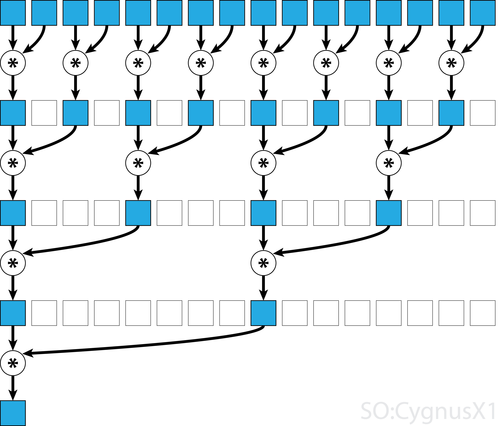

# GPU programming
## How GPU differs from CPU
### Hardware perspective
**CPU** was originally created for maximal throughput of a single threadded program. Therefore the modern CPU has many parts which are not devoted to the actual computation, but to maximize the utilization of a computing resource (ALU), which now occupies relatively small part of the die. Below is the picture of a processor of Intel's Core architecture (one of the earliest in the series).


It contains blocks allowing to execute instructions in parallel, out of order, speculatively just to maximally utilize all computational units.
Notable functionalities / blocks are
* **superscalar execution** is an ability to execute more than one instruction at the given time (see multiple ports to different units).

* **Reorder buffer** reorders \instructions in queue such that two non-interfering instructions can be executed simultaneously.

* **Register renaming** renames registers, such that two non-interfering instructions operating over the same register can be executed together.

* **Branch prediction** predicts which branch will be taken and execute instructions in that branch. Misses are costly, as the processor needs to roll back emptying the instruction pipeline. The processor state is nor fully restored, which leads to side-channel attacks.

* **speculative prefetching** load instruction / data from memory to caches in the branch that is expected to be taken advance in the hope they will be executed (depends on branch predictions)

* **Memory management unit** is not shown but takes care of translation of virtual addresses to physical, checking the security bits of pages, etc.

* **Caches** (three levels) thrive to provide instuctions with data from cache, such that it does not have to wait for the load. Caches are transparent to the user, he does not control, what will stay in cache.

* **L1 Cache synchronization** If the processor contains many cores, their L1 cache is atomically synchronized.

* **Buffers** are used to cache for example mapping of virtual to physical addresses, partial computations to allow rollbacks.

* **Interrupt management** CPU can interrupt its execution and transfer the execution to a different location, changing security levels.

**GPU** was from the very beginning designed for maximal throughput achieved by parallelism. The reason for this is simple. Imagine that you need to render a 4K image (resolution 3840 × 2160 = 8 294 400 pixels) with refresh rate 60fps in the first person shooter game. This means that you need to compute intensities of 0.5G pixels per second. But, the program computing the intensity of a pixel is the same, as what you do is a something like
```julia
for (i,j) in Itertors.Product(1:2160, 1:3840)
	image[i,j] = compute_insity(i, j)
end
```
and the computation of intensities `compute_insity(i, j)` does not contain many branches. Therefore the GPU goes for massive parallelism while simplifying each Core the the bare minimum leaving all difficulties up to the programmer / compiler. Below we see a high-level view on Nvidia's GPU.


1. The chip contains many streaming multi-processors (SM). Normally, each streamming processor would be called core, as it is an indivisible unit, but NVidia decided to call "a core" something which in normal CPU would be called arithmetic unit (which certainly helps the marketting).
2. Each streaming multi-processor contains (possibly multiple blocks of) 32-way (32-wide) SIMT units (Nvidia calls that *CUDA Core*), shared memory (managed cache) and register file (16k registers, but shared between all threads). Therefore a pascal P-100 can have up to 64×4×32 = 8192 cores, which certainly sounds cool in comparison to for example 24 cores of normal processors, but.
3. Each streaming multi-processors (SM) has one instruction fetch and decode unit, which means that *all* CUDA cores of that SM *has to* execute the same instruction at a given cycle. This simplifies the design. The execution model therefore roughly corresponds to vector (SIMD) registers in normal CPU, but CUDA cores are not as restricted as SIMD registers. NVidia therefore calls this computation model single instruction mulptiple threads (SIMT). Main differences:
    1. SIMD requires the memory to be continuous while SIMT does not. 
    2. SIMT is explicitly scalar while SIMD is explicitly vector. 
32 CUDA cores each operating over 32 bit registers would be equal to 1024 long vector (SIMD) registers. Modern Intel XEON processors has 256 / 512 long registers, which seems similar, as said above in order to use them the data has to be aligned in memory and sometimes they has to be on a particular offset, which might be difficult to achieve in practice (but to be fair, if the data are not aligned in GPU, the loading of data is very inefficcient).
4. 16k registers per SM might seem like a lot, but they are shared between all threads. In modern GPUs, each SM supports up to 2048 threads, which means there might be just 4 32-bit registers per thread.
5. GPUs do not have virtual memory, interrupts, and cannot address external devices like keyboard and mouse.
6. GPUs can switch execution contexts of "set of threads" at no cost. In comparison the context switch in CPU is relatively expensive (we need to at least save the content of registers, which is usually sped by having two sets of registers). This helps to hide latencies, as when a set of threads is stalled, other set of threads are available.
7. The programmer deal with "raw" storage hierarchy. This means that the programmer has to manage what will be and what will not be in cache by itself, on GPU, they are exposed and you decide what will be loaded into the cache. 
8. Caches are synchronized only within a single SM, this is unlike in CPU, where L1 caches are synchronized across cores, according to some leading in bottleneck in having more cores.
9. SM has relatively low frequency clocks, which helps to deal with thermal problems.
10. The memory in SM is divided into 16 banks, write operations to a bank is sequential. If two threads are writing to the same bank, they can be stalled.


### Programming / Execution model
The GPU works in an asynchronous mode. If we want to execute something on GPU, we need to 
1. Upload the data to GPU memory (if they are not already there)
2. Compile the *kernel* --- a code to be executed on GPU (if not already compiled)
3. Upload the kernel code to GPU
4. Request the computation of the kernel (more on this below). GPU will put the request for the computation to its queue of works to be performed and once resources are free, it will do the compuation.
5. The control is immediately returned, which means that CPU can continue doing its job. 
6. CPU can issue a blocking wait till the computation is done, for example fetching the results.

Let's now look at point 4. in more detail.
Recall that GPU is designed for processing data in parallel, something we can abstract as 
```julia
for i in 1:N
	kernel!(i)
end
``` 
where `kernel!(i)` means compute the `i`-th item of the data using function `kernel!`, which is modifying as it does not have a return value, but has to put all results to the preallocated array. `i`-th part of the data usually corresponds to one float number (usually `Float32`). Here, we can see that SIMT has a scalar notation, we refer to individual numbers inside arrays.

Each item, `kernel!(i)`, is executed on a single *thread*. GPU *always* execute 32 threads at once on a single SM. This group of 32 threads is called **warp**. These 32 threads within warp can very effectively communicate with each other using atomic instructions. A user has to group threads into **group**. Each group is executed on a single SM, which means that all threads within this group has access to fast SM local memory. All blocks of single job are called **grid**.
* From the above we can already see that the number of threads has to be multiple of 32 (given by the requirement on warps).
* Each block can have up to 2048 threads, which are executed on a single SM. Large number of threads in a single block is good if 
    * those threads needs to access the same memory (for example in Stencil operations), which can be put to the local cache and 
    * each thread reads data from memory (which are no co-allesced) and the SM can run different thread while other is stalling (mostly due to waiting for finishing loading data from memory). 
On the other hand large number of threads per group might stall due to insufficient number of registers and / or other threads being busy.
* The total number of issued threads  has to be multiple of 32 and of the number of threads per block, hence *there will always be threads that does not do anything*.
* The division of a total number of items to be processed `N` into blocks is therefore part of the problem and it can be specific to a version of GPU.
* For some operations (e.g. reduction seen below) to get the highest performance, you need to write the same algorithm for three levels of sets of threads  --- warp, groups, and grid. This is the price paid for exposed cache levels (we will se an example below on reduction).

As has been mentioned above, all CUDA cores in one SM are processing the same instruction. therefore if the processed kernel contains conditional statements `if / else` blocks, both blocks will be processed in sequential order as illustrated below,


which can significantly decrease the throughput.

**Latency hiding** 
A thread can stall, because the instruction it depends on has not finished yet, for example due to loading data from memory, which can be very time consuming (recall that unlike SIMD, SIMT can read data from non-coallesced memory location at the price of increased latency). Instead of waiting, SM will switch to execute different set of threads, which can be executed. This context switch is does not incur any overhead, hence it can occur at single instruction granularity. It keeps SM busy effective hiding latency of expensive operations.

[image taken from](https://iq.opengenus.org/key-ideas-that-makes-graphics-processing-unit-gpu-so-fast/)

## using GPU without writing kernels
Julia, as many other languages, allows to perform certain operations on GPU as you would do on CPU. Thanks to Julia's multiple dispatch, this is almost invisible and it is sufficient to convert the `Array` to `CuArray` to notify the system that array is in GPU's memory.

For many widely used operations, we have available kernels, for example below, we use multiplication.
```julia
using CUDA
using BenchmarkTools

x = randn(Float32, 1000, 1000)
y = randn(Float32, 1000, 1000)
x * y 
cx = CuArray(x)
cy = CuArray(y)
cx * cy
x * y ≈ Matrix(cx * cy)
julia> @btime x * y;
  5.737 ms (2 allocations: 3.81 MiB)

julia> @btime cx * cy;
  18.690 μs (32 allocations: 624 bytes)

julia> @btime CUDA.@sync cx * cy;
  173.704 μs (32 allocations: 624 bytes)
```
The matrix multiplication on GPU is about 33x faster, which is likely caused by being optimized by directly NVidia, as `cx * cy` calls `CuBlas` library.

How much does it cost to send the matrix to GPU's memory? Let's measure the time of the roundtrip
```julia
julia> @btime Matrix(CuMatrix(x));
  1.059 ms (9 allocations: 3.81 MiB)
```

Since Julia is JAoT compiled, the set of operations you can do using Julia's kernels is relatively large. `CUDA.jl` implements generic `map` and `reduce` (albeit as we will se later, performant `reduce` operation is very difficult), which allows you to pass your function greatly extending the functionality.
```julia
sin.(cx).^2 .+ cos.(cx).^2
map(x -> sin(x)^2 + cos(x)^2, cx)
reduce(max, cx)
reduce(max, cx, dims = 1)
```
Notice that in case, the function in `map` is essentially a custom kernel. As such, the code within has to still obey (not precisely specified) rules on what can be executed as kernel. Also needless to say, that the generic `map` over `CuArray` will try to find good launch configuration (number of threads and number of blocks), which might not be an ideal for your application.

Let's now try to use CUDA on computation of Julia set, which should benefit a lot from CUDA's paralelization, as we can dispatch each pixel to each thread --- something GPUs were originally designed for. 

We slightly modify the kernel we have used in our lecture on multi-threadding, mainly to force all types to be 32-bit wide
```julia
using CUDA
using BenchmarkTools

function juliaset_pixel(i, j, n)
	c = ComplexF32(-0.79f0, 0.15f0);
    z = ComplexF32(-2f0 + (j-1)*4f0/(n-1), -2f0 + (i-1)*4f0/(n-1))
	for i in UnitRange{Int32}(0:255)
        abs2(z)> 4.0 && return(i%UInt8)
        z = z*z + c
	end
    return(i%UInt8)
end

n = Int32(1000);
is = collect(Int32, 1:n)';
js = collect(Int32, 1:n);
img = juliaset_pixel.(is, js, n);

cis = CuArray(is);
cjs = CuArray(js);
img = juliaset_pixel.(cis, cjs, n);
@btime CUDA.@sync juliaset_pixel.(cis, cjs, n);
```
We see that CPU version is slightly faster then the GPU one. Why is that? My suspect is that the kernel needs to execute all 255 iterations of the while for each pixel, which is very wasteful, especially considering that many / most pixels require one iteration. Hence, we see the effect of thread divergence in practice (recall that all threads within the block has to execute all instructions, even though some of them are masked.)

!!! info 
	### Profiler
    Cuda offers a two sampling profilers: NVIDIA Nsight Systems and  NVIDIA Nsight Compute. The first is good to optimize the overall execution of your application, observing when the kernel is launched, delays in kernel launch, utilization of CPU and GPU, etc. The second is good for optimizing the single kernel. Profilers are not shippend with `CUDA.jl` and you need to download them from NVidia's resources for developers after you create an account for free.

    To use the profiler, we need to launch julia within the profiler as for example `/opt/nvidia/nsight-systems/2021.5.1/bin/nsys launch --trace=cuda /home/pevnak/julia-1.7.1/bin/julia  --color=yes`.
    and then, we can profile the code using the usual `@profile` macro this time sourced from `CUDA` as
    ```julia
    CUDA.@profile CUDA.@sync juliaset_pixel.(cis, cjs, n);
    ```
    the report is saved to `report???.???` (nvidia likes to change the suffix) and it can be inspected by `nsys-ui` interactive tool. **Do not forget to run the profiler twice to get rid of compilation artifacts.**
    You can further anotate parts of your code as 
    ```
    CUDA.@profile CUDA.@sync begin 
	    NVTX.@range "julia set" juliaset_pixel.(cis, cjs, n);
    end
    ```
    for better orientation in the code.

In the output of the profiler we see that there is a lot of overhead caused by launching the kernel itself and then, the execution is relatively fast. 

While Julia's JAoT greatly enhances the power of prepared kernels, you might quickly run into a case, when you are able to perform the operation on GPU, but it is very slow. Sometimes, it might be just faster to move the array to CPU, perform the operation there and move it back to GPU. Although this sounds like a pretty bad idea, it actually works very well see below.
```julia
using Mill
using Random
using CUDA
using BenchmarkTools
n = vcat(rand(1:10,1000), rand(11:100, 100), rand(101:1000,10))
x = randn(Float32, 128, sum(n))
z = zeros(Float32, 128, 1)
bags = Mill.length2bags(n)

builtin(x, bags, z) = Mill.segmented_sum_forw(x, vec(z), bags, nothing)

function naive(x, bags, z)
	o = similar(x, size(x,1), length(bags))
	foreach(enumerate(bags)) do (i,b)
		if isempty(b)
			o[:,i] .= z
		else
			@inbounds o[:,i] = sum(@view(x[:,b]), dims = 2)
		end
	end
	o
end

builtin(x, bags, z) ≈ naive(x, bags, z)
@btime builtin(x, bags, z);
@btime naive(x, bags, z);

cx = CuArray(x);
cz = CuArray(z);
naive(cx, bags, cz);
@btime CUDA.@sync naive(cx, bags, cz);
@btime CUDA.@sync CuArray(builtin(Array(cx), bags, Array(cz)));
```

## Writing own CUDA kernels
Before diving into details, let's recall some basic from the above HW section:
* In CUDA programming model, you usually write *kernels*, which is the *body* of the loop.
* `N` iterations of the loop is divided into *block*s and each block into *warp*s. Single warp consists of 32 threads and these threads are executed simultaneously. All threads in the block are executed in the same SM, having access to the share memory.
* Each thread executes the kernel for one iteration of the for loop. This means that inside the kernel, you need to determine the index of the iteration. Therefore you will see in kernels statements like 
```julia
 i = threadIdx().x + (blockIdx().x - 1) * blockDim().x
```
where `threadIdx().x` is the index of the thread within the block, `blockDim().x` is the total number of threads in the block, and `blockIdx().x` is the index of the block within the grid. `x` property suggest that you can partition the execution along three-dimensional cube (three nested for loops), which might be sometimes useful.

The most trivial example of a kernel is addition as 
```julia
function vadd(c, a, b, n)
    i = threadIdx().x + (blockIdx().x - 1) * blockDim().x
    if i <= n
	    c[i] = a[i] + b[i]
    end
    return
end

a = CuArray(1:10000)
b = CuArray(2:2:20000)
c = similar(a)
@cuda threads=1024 blocks=cld(length(a), 1024) vadd(c, a, b, length(a))
c
```
where
* we have defined a kernel function `vadd` which looks more or less like normal Julia function, except it returns nothing and it contains identification of an item within loop `i = threadIdx().x + (blockIdx().x - 1) * blockDim().x`.
* we have pre-allocated space to store results for `vadd` in `c`
* `@cuda` is the launch macro, where we have to specify the number of threads per block (the `threads` keyword) and the number of blocks `blocks`. The macro returns an execution context, not the actual value, which is stored in `c`. You can think about the `@cuda` as moral equivalent of parallel loop.
* If `N` is not divisible by `blockDim`, then there will be **always** threads not doing anything, therefore we need to have the `if` statement that we are within bounds.
* The `blockDim` has to be divisible by 32, which is the size of the warp.

While the `vadd` example is nice, it is trivial and can be achieved by `map` as shown above. A simple operation that is everything but trivial to impement is *reduction*, since it ends up in a single operation. It also allows to demonstrate, why efficient kernels needs to be written at three levels: warp, block, and grid. The exposition below is based on [JuliaCon tutorial on GPU programming](https://github.com/maleadt/juliacon21-gpu_workshop/blob/main/deep_dive/CUDA.ipynb).

The first naive implementation might looks like
```julia
function reduce_singlethread(op, a, b)
    for i in 1:length(a)
        b[] = op(b[], a[i])
    end
    return
end

x = rand(Float32, 1024, 1024)
cx = CuArray(x)
cb = CUDA.zeros(1)
@cuda threads=1 reduce_singlethread(+, cx, cb)
CUDA.@allowscalar cb[]
sum(x)
```
and it is pretty terrible, because all the hard work is done by a single thread. The result of the kernel is different from that of `sum` operation. Why is that? This discrepancy is caused by the order of the arithmetic operations, which can be verified by computing the sum as in the kernel as
```julia 
foldl((a,b) -> a + b, x, init=0f0)
```
For the sake of completness, we benchmark the speed of the kernel for comparison later on
```julia
@benchmark CUDA.@sync @cuda threads=1 reduce_singlethread(+, $(CUDA.rand(1024,1024)), $(CUDA.zeros(1)))
```

We can use **atomic** operations to mark that the reduction operation has to be performed exclusively. This have the advantage that we can do some operation while fetching the data, but it is still a very bad idea.
```julia
function reduce_atomic(op, a, b)
    i = threadIdx().x + (blockIdx().x - 1) * blockDim().x
    if i <= length(a)
	    CUDA.@atomic b[] = op(b[], a[i])
    end
    return
end

x = rand(Float32, 1024, 1024)
cx = CuArray(x)
cb = CUDA.zeros(1)
@cuda threads=1024 blocks = cld(length(cx), 1024) reduce_atomic(+, cx, cb)
CUDA.@allowscalar cb[]
sum(x)

@benchmark CUDA.@sync @cuda threads=1024 blocks=1024 reduce_atomic(+, $(CUDA.rand(1024,1024)), $(CUDA.zeros(1)))
```
This solution is better then the single-threadded version, but still very poor.

Let's take the problem seriously. If we want to use paralelism in reduction, we need to perform parallel reduction as shown in the figure below


The parallel reduction is tricky. **Let's assume that we are allowed to overwrite the first argument a**. This is relatively safe assumption, since we can always create a copy of `a` before launching the kernel.

```julia
function reduce_block(op, a, b)
    elements = 2* blockDim().x
    thread = threadIdx().x

    # parallel reduction of values in a block
    d = 1
    while d < elements
        sync_threads()
        index = 2 * d * (thread-1) + 1
        @inbounds if index <= elements && index+d <= length(a)
            @cuprintln "thread $thread: a[$index] + a[$(index+d)] = $(a[index]) + $(a[index+d]) = $(op(a[index], a[index+d]))"
            a[index] = op(a[index], a[index+d])
        end
        d *= 2
        thread == 1 && @cuprintln()
    end
    
    if thread == 1
        b[] = a[1]
    end
    
    return
end

a = CuArray(1:16);
b = CuArray([0]);
@cuda threads=cld(length(a),2) reduce_block(+, a, b);
CUDA.@allowscalar b[]
```
* The while loop iterates over the levels of the reduction, performing $$2^{\log(\textrm{blockDim}) - d + 1})$$ reductions.
* We need to sychronize threads by `sync_threads`, such that all reductions on the level below are finished
* The output of the reduction will be stored in `a[1]`
* We use `@cuprintln` which allows us to print what is happening inside the thread execution.
* Notice how the number of threads doing some work decreases, which unfortunately inevitable consequence of `reduce` operation.

To extend the above for multiple blocks, we need to add reduction over blocks. The idea would be to execute the above loop for each block independently, and then, on the end, the first thread would do the reduction over blocks, as 
```julia
function reduce_grid_atomic(op, a, b)
    elements = 2*blockDim().x
    offset = 2*(blockIdx().x - 1) * blockDim().x
    thread = threadIdx().x

    # parallel reduction of values within the single block
    d = 1
    while d < elements
        sync_threads()
        index = 2 * d * (thread-1) + 1
        @inbounds if index <= elements && index+d+offset <= length(a)
        	index += offset
            a[index] = op(a[index], a[index+d])
        end
        d *= 2
    end
    
    # atomic reduction of this block's value
    if thread == 1
        CUDA.@atomic b[] = op(b[], a[offset + 1])
    end

    return
end

x = rand(Float32, 1024, 1024)
cx = CuArray(x)
cb = CUDA.zeros(1)
@cuda threads=1024 blocks=cld(length(cx), 2*1024)  reduce_grid_atomic(+, cx, cb)
CUDA.@allowscalar cb[]
sum(x)
```

Recall that each block is executed on a separate SM, each equipped with the local memory. So far, we have been doing all computations in the global memory, which is slow. So how about to copy everything to the local memory and then perform the reduction. This would also have the benefit of not modifying the original arrays. 
```julia
function reduce_grid_localmem(op, a::AbstractArray{T}, b) where {T}
    elements = 2*blockDim().x
    offset = 2*(blockIdx().x - 1) * blockDim().x
    thread = threadIdx().x

    shared = @cuStaticSharedMem(T, (2048,))
    @inbounds shared[thread] = a[offset+thread]
    @inbounds shared[thread+blockDim().x] = a[offset+thread+blockDim().x]

    # parallel reduction of values within the single block
    d = 1
    while d < elements
        sync_threads()
        index = 2 * d * (thread-1) + 1
        @inbounds if index <= elements && index+d+offset <= length(a)
        	index += offset
            a[index] = op(a[index], a[index+d])
        end
        d *= 2
    end
    
    # atomic reduction of this block's value to the global accumulator
    if thread == 1
        CUDA.@atomic b[] = op(b[], a[offset + 1])
    end
    return
end

x = rand(Float32, 1024, 1024)
cx = CuArray(x)
cb = CUDA.zeros(1)
@cuda threads=1024 blocks=cld(length(cx), 2*1024)  reduce_grid_localmem(+, cx, cb)
CUDA.@allowscalar cb[]
sum(x)

@benchmark CUDA.@sync @cuda threads=1024 blocks=512 reduce_grid_localmem(+, $(CUDA.rand(1024,1024)), $(CUDA.zeros(1)))
```
The performance improvement is negligible, but that's because we have a relatively new GPU with lots of global memory bandwith. On older or lower-end GPUs, using shared memory would be valuable. But at least, we are not modifying the original array. 

If we inspect the above kernel in profiler, we can read that it uses 32 registers per thread. But if the SM has 16384 registers, then block of size 1024 will have to share registers, which might lead to poor utilization. Changing the blocksize to 512 improves the throughput a bit as can be seen from below
```julia
@benchmark CUDA.@sync @cuda threads=512 blocks=1024 reduce_grid_localmem(+, $(CUDA.rand(1024,1024)), $(CUDA.zeros(1)))
```

The above optimizations are not by any means specific to CUDA, they can be applied for all GPU-type accelerators, one AMD cards with `AMDGPU.jl` and others (Intel) with `oneAPI.jl`, or you can try to write a backed agnostic kernel using `KernelAbstrations.jl`. 

The performant versions of reduction described above always performs the reduction on two levels: at the block level and on the grid level. The block level takes advantage of the all threads being executed on the single SM, which means we can synchronize threads and we have access to local mem. The reduction on the grid level of results of blocks is little sloppy, as we rely on atomic addition. This might not be a bad decision, since blocks are unlikely to finish at the same time.

* Within a *Warp*, we can use atomic instructions which allows to access values in other thread registers. https://developer.nvidia.com/blog/using-cuda-warp-level-primitives/

But as we have said above, a group of 32 threads executed under a single warp have fast access to each other registers of threads. To exploit this, we would need to write reduction on the level of warp, block, and grid. The following code is adapted from `CUDA.jl` and it uses a trick of having a `neutral` element for the reduction operator, which is zero for addition, one for multiplication, minus infinity for maximum, etc. This neutral element simplifies "padding", as we simply replace it with a neutral item.

The rational behind the code is following. Each thread will load a value to be reduced from a memory to a register --- a variable called `val` below. This means that unlike above, the number of threads is equal to the number of elements to reduce. 

First, groups of 32 threads perform their reduction in function `demo_reduce_warp`, where the function `shfl_down_sync` copy a value from register holding a variable name `val` from a thread at `offset` distance. The first argument `0xffffffff` is a mask indicating which threds contain valid values. Since we load to `val` `neutral` element, all threads participating the computation is valid. As above, we perform five iterations until all 32 values are reduced and stored in the `val` of the first thread of the warp.

Second, on the block level, first thread of each warp store the reduced value `val` to local memory and from that each thread of the first warp of that block loads this reduced value to `val`. If there will be fewer number of warps in the block, we load `neutral`. After this, the first warp contains results of reduction of each warp in the block, and we can call reduction on the first warp to reduce the data, effectively reducing the block. 

Third, values across block are reduced using `@atomic` approach as before.

```julia
@inline function demo_reduce_warp(op, val)
	# assume(warpsize() == 32)
    offset = 0x00000001
    while offset < warpsize()
        val = op(val, shfl_down_sync(0xffffffff, val, offset))
        offset <<= 1
    end
    return val
end

@inline function demo_reduce_block(op, val::T, neutral) where T
    # shared mem for partial sums
    # assume(warpsize() == 32)
    shared = CuStaticSharedArray(T, 32)

    wid, lane = fldmod1(threadIdx().x, warpsize())

    # each warp performs partial reduction
    val = demo_reduce_warp(op, val)

    # write reduced value to shared memory
    if lane == 1
        @inbounds shared[wid] = val
    end

    # wait for all partial reductions
    sync_threads()

    # read from shared memory only if that warp existed
    val = if threadIdx().x <= fld1(blockDim().x, warpsize())
         @inbounds shared[lane]
    else
        neutral
    end

    # final reduce within first warp
    if wid == 1
         val = demo_reduce_warp(op, val)
    end
    return val
end

function reduce_warp(op, a, b, neutral)
	index = (blockIdx().x - 1) * blockDim().x + threadIdx().x
	val = index <= length(a) ? a[index] : neutral

	val = demo_reduce_block(op, val, neutral)

	if threadIdx().x == 1 
		CUDA.@atomic b[] += val
	end

	return
end

x = rand(Float32, 1024, 1024)
cx = CuArray(x)
cb = CUDA.zeros(1)
CUDA.@sync @cuda threads=512 blocks=2048 reduce_warp(+, cx, cb, 0f0)
CUDA.@allowscalar cb[] 
sum(x)

@benchmark CUDA.@sync @cuda threads=1024 blocks=1024 reduce_warp(+, $(CUDA.rand(1024,1024)), $(CUDA.zeros(1)), 0f0)
```
This approach improves the our previous best by 21%, which is not bad at all


Let's now compare different versions and tabulate the results
```julia
@benchmark CUDA.@sync @cuda threads=1 reduce_singlethread(+, $(CUDA.rand(1024,1024)), $(CUDA.zeros(1)))
@benchmark CUDA.@sync @cuda threads=1024 blocks=1024 reduce_atomic(+, $(CUDA.rand(1024,1024)), $(CUDA.zeros(1)))
@benchmark CUDA.@sync @cuda threads=1024 blocks=512 reduce_grid_atomic(+, $(CUDA.rand(1024,1024)), $(CUDA.zeros(1)))
@benchmark CUDA.@sync @cuda threads=1024 blocks=512 reduce_grid_localmem(+, $(CUDA.rand(1024,1024)), $(CUDA.zeros(1)))
@benchmark CUDA.@sync @cuda threads=512 blocks=2048 reduce_warp(+, $(CUDA.rand(1024,1024)), $(CUDA.zeros(1)), 0f0)
@benchmark sum($(CUDA.rand(1024,1024)))
@benchmark sum($(rand(Float32, 1024,1024)))
```

| kernel version                                       |    min time |
|:-----------------------------------------------------|:-----------:|
| single thread                                        |   56.399 ms |
| multiple threads with atomic reduction               |    1.772 ms |
| parallel reduction                                   |   33.381 μs |
| parallel reduction with local mem                    |   34.261 μs |
| parallel reduction with warps                        |   26.890 μs |
| default sum on GPU                                   |   31.960 μs |
| default sum on CPU                                   |   82.391 μs |


What we have missed to optimize:
* tune the launch configuration (for `reduce_warp` 128 threads seems mildly better with 25.790 μs)
* avoid shared memory bank conflicts
* analyse the access pattern to ensure all memory accesses are coalesced

The card we use  GeForce RTX 2080 Ti which has a peak memory bandwidth of  `616.0 GB/s`. If we take our best launch configuration with 128 threads, our throughput is `32*2^20 / (25 * 10^-6) ≈ 1.342 TB/s` which seems like we are like twice over the theoretical memory limit, which is weird

## How Julia compiles CUDA kernels
`CudaNative.jl` (predecessor of `CUDA.jl`)[^bessard18] was a seminal work as it was the first demonstrating Julia producing a native code for a different platform (backend) than that of the main processor. Specifically, while Julia is producing code for x86 (or Arm), `CUDA.jl` makes her to compile for PTX ISA of NVidia GPUs. `CudaNative.jl` has created a flexible toolchain, which was later generalized for backends, namely for AMD and Intel accelerators, and also for Berkeley packet filter[^bpf]. 

An important but rarely approaciated fact is that `CUDA.jl` makes the development of kernels interactive, which speeds up the development a lot.

The following notes are based on [^bessard18] and on inspection of `CUDA.jl` version 3.6.2. The birds eye view on the toolchain is as follows:


When we wish to launch kernel using `@cuda (config...) function(args...)`, the julia (roughly) performs following steps.
1. If the kernel is already compiled to PTX, go to step 4
2. Use Julia's compiler to produce LLVM code for a given kernel using `@code_llvm`. This is the **front-end** part and its result is LLVM code in textual form (Julia's interface with its runtime part is textual).
3. Take the LLVM code, perform optimization passes and adjustments, and compile the code of the kernel for CUDA backend. This is the **back-end** part.
4. Use a runtime library provided by NVidia's CUDA to launch the compiled kernel. 

### Caveats of the front-end part
* Authors state that for the integration, they require access to AST, lowered IR code, and to LLVM IR. 
* For seamless integration, the above is not sufficient, as the generated LLVM code will contain calls to Julia runtime, such as exception handling, garbage collection, and dynamic allocation of memory. Authors have introduced of configuration parameters and hooks to type inference and codegeneration in Julia v0.6, which allows to lower code without these calls (other considered option was to remove these calls in post-processing would lead to messy, fragile, and error-prone implementation.)
* The above hooks allow to reuse most of Julia's code generation. There is a lot of functionality you got for free, like parsing, macro-expansion, optimization passes.

### Caveats of the back-end part
* `@cuda (config...) function(args...)` is the main gateway to launch cuda kernels. It compiles the kernel `function` if needed and lauch it on GPU device with `config`.
* The LLVM code produced in the front-end part is compiled using LLVM NVPTX compiler, which is accessed through a wrapper `LLVM.jl`. Funny enough, `LLVM.jl` just exposes C-functions of LLVM compiler shipped with Julia.
* The fact that LLVM can generate PTX code avoid shipping of another compiler.
* Before LLVM code is passed to the LLVM compiler, certain optimizations are performed. For example immutable parameters are always passed by value instead of the reference. 

## Sources
* [SIMD < SIMT < SMT: parallelism in NVIDIA GPUs](http://yosefk.com/blog/simd-simt-smt-parallelism-in-nvidia-gpus.html)
* [Blog by Mike Innes on GPU programming and gradients for free](http://mikeinnes.github.io/2017/08/24/cudanative.html)
* [Tutorial on GPU programming at JuliaCon 2021](https://www.youtube.com/watch?v=Hz9IMJuW5hU)
* [Materials for tutorial on GPU programming at JuliaCon 2021](https://github.com/maleadt/juliacon21-gpu_workshop/blob/main/deep_dive/CUDA.ipynb)
* [Using CUDA Warp-Level Primitives](https://developer.nvidia.com/blog/using-cuda-warp-level-primitives/)
* https://juliagpu.org/post/2020-11-05-oneapi_0.1/
* https://www.youtube.com/watch?v=aKRv-W9Eg8g

[^bpf] https://ebpf.io/

[^bessard18] Besard, Tim, Christophe Foket, and Bjorn De Sutter. "Effective extensible programming: unleashing Julia on GPUs." IEEE Transactions on Parallel and Distributed Systems 30.4 (2018): 827-841.