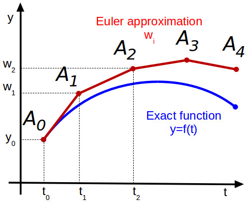
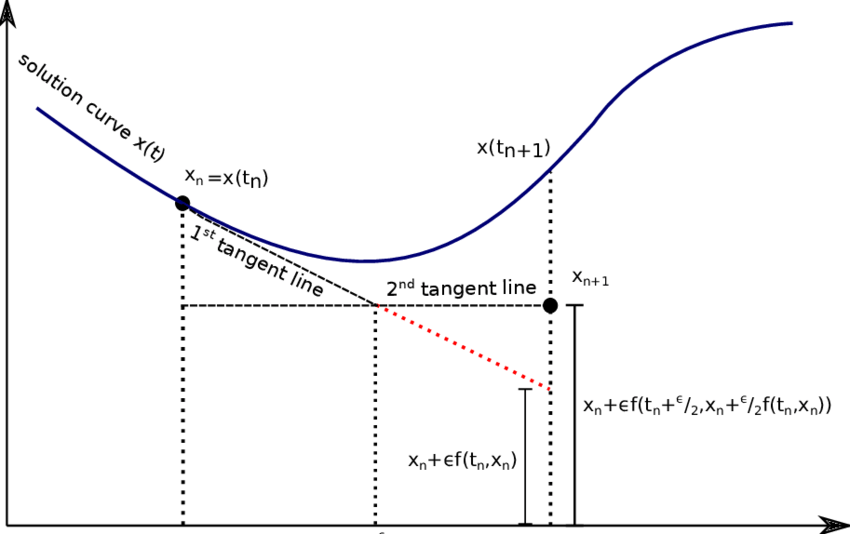

# Lab 12 - Differential Equations

In this lab you will implement a simple solver for *ordinary differential
equations* (ODE) as well as the two different methods for uncertainty
propagation that were introduced in the lecture.

## Euler ODE Solver

In this first part you will implement your own, simple, ODE framwork (feel free
to make it a package;) in which you can easily specify different ODE solvers.
The API is heavily inspired by [`DifferentialEquations.jl`](https://diffeq.sciml.ai/stable/),
so if you ever need to use it, you will already have a feeling for how it works.

Like in the lecture, we want to be able to specify an ODE like below.
```@example lab
function lotkavolterra(x,θ)
    α, β, γ, δ = θ
    x₁, x₂ = x

    dx₁ = α*x₁ - β*x₁*x₂
    dx₂ = δ*x₁*x₂ - γ*x₂

    [dx₁, dx₂]
end
nothing # hide
```
In the lecture we then solved it with a `solve` function that received all necessary
arguments to fully specify how the ODE should be solved. The number of parameters
there can quickly become very large, so we will introduce a new API for `solve`
which will always take only two arguments: `solve(::ODEProblem, ::ODESolver)`.
The `solve` function will only do some book-keeping and call the solver until
the ODE is solved for the full `tspan`.

The `ODEProblem` will contain all necessary parameters to fully specify the ODE
that should be solved. In our case that is the ODE `f` itself, initial
conditions `u0`, ODE parameters `θ`, and the time domain of the ODE `tspan`:
```@example lab
struct ODEProblem{F,T,U,P}
    f::F
    tspan::T
    u0::U
    θ::P
end
```

The solvers will all be subtyping the abstract type `ODESolver`. The `Euler` solver
from the lecture will need one field `dt` which specifies its time step:
```@example lab
abstract type ODESolver end

struct Euler{T} <: ODESolver
    dt::T
end
```

```@raw html
<div class="admonition is-category-exercise">
<header class="admonition-header">Exercise</header>
<div class="admonition-body">
```
Overload the call-method of `Euler` such that calling the solver with an `ODEProblem`
will perform one step of the Euler solver and returns updated ODE varialbes
`u1` and the corresponding timestep `t1`.
```@raw html
</div></div>
<details class = "solution-body">
<summary class = "solution-header">Solution:</summary><p>
```
```@example lab
function (solver::Euler)(prob::ODEProblem, u, t)
    f, θ, dt  = prob.f, prob.θ, solver.dt
    (u + dt*f(u,θ), t+dt)
end
```
```@raw html
</p></details>
```
```@example lab
# define ODEProblem
θ = [0.1,0.2,0.3,0.2]
u0 = [1.0,1.0]
tspan = (0.,100.)
prob = ODEProblem(lotkavolterra,tspan,u0,θ)

# run one solver step
solver = Euler(0.2)
(u1,t1) = solver(prob,u0,0.)
```

```@raw html
<div class="admonition is-category-exercise">
<header class="admonition-header">Exercise</header>
<div class="admonition-body">
```
Implement the function `solve(::ODEProblem,::ODESolver)` which calls the solver
as many times as are necessary to solve the ODE for the full time domain.
`solve` should return a vector of timesteps and a corresponding matrix of
variables.
```@raw html
</div></div>
<details class = "solution-body">
<summary class = "solution-header">Solution:</summary><p>
```
```@example lab
function solve(prob::ODEProblem, solver::ODESolver)
    t = prob.tspan[1]; u = prob.u0
    us = [u]; ts = [t]
    while t < prob.tspan[2]
        (u,t) = solver(prob, u, t)
        push!(us,u)
        push!(ts,t)
    end
    ts, reduce(hcat,us)
end
nothing # hide
```
```@raw html
</p></details>
```

You can load the true solution and compare it in a plot like below.  The file
that contains the correct solution is located here:
[`lotkadata.jld2`](https://github.com/JuliaTeachingCTU/Scientific-Programming-in-Julia/blob/master/docs/src/lecture_12/lotkadata.jld2).
```@example lab
using JLD2
using Plots

true_data = load("lotkadata.jld2")

p1 = plot(true_data["t"], true_data["u"][1,:], lw=4, ls=:dash, alpha=0.7, color=:gray, label="x Truth")
plot!(p1, true_data["t"], true_data["u"][2,:], lw=4, ls=:dash, alpha=0.7, color=:gray, label="y Truth")

(t,X) = solve(prob, Euler(0.2))

plot!(p1,t,X[1,:], color=1, lw=3, alpha=0.8, label="x Euler")
plot!(p1,t,X[2,:], color=2, lw=3, alpha=0.8, label="y Euler")
```

## Runge-Kutta ODE Solver

As you can see in the plot above, the Euler method quickly becomes quite
inaccurate because we make a step in the direction of the tangent which inevitably
leads us away from the perfect solution as shown in the plot below.


There exist many different ODE solvers. To demonstrate how we can
get significantly better results with a simple tweak, we will now implement the
second order Runge-Kutta method `RK2`:
```math
\begin{align*}
\tilde x_{n+1} &= x_n + hf(x_n, t_n)\\
       x_{n+1} &= x_n + \frac{h}{2}(f(x_n,t_n)+f(\tilde x_{n+1},t_{n+1}))
\end{align*}
```
`RK2` is a 2nd order method. It uses not only $f$ (the slope at a given point),
but also $f'$ (the derivative of the slope). With some clever manipulations you
can arrive at the equations above with make use of $f'$ without needing an
explicit expression for it (if you want to know how, see
[here](https://web.mit.edu/10.001/Web/Course_Notes/Differential_Equations_Notes/node5.html)).
Essentially, `RK2` computes an initial guess $\tilde x_{n+1}$ to then average
the slopes at the current point $x_n$ and at the guess $\tilde x_{n+1}$ which
is illustarted below.


```@raw html
<div class="admonition is-category-exercise">
<header class="admonition-header">Exercise</header>
<div class="admonition-body">
```
Implement the `RK2` solver according to the equations given above.
```@raw html
</div></div>
<details class = "solution-body">
<summary class = "solution-header">Solution:</summary><p>
```
```@example lab
struct RK2{T} <: ODESolver
    dt::T
end
function (solver::RK2)(prob::ODEProblem, u, t)
    f, θ, dt  = prob.f, prob.θ, solver.dt
    du = f(u,θ)
    uh = u + du*dt
    u + dt/2*(du + f(uh,θ)), t+dt
end
```
```@raw html
</p></details>
```

You should be able to use it exactly like our `Euler` solver before:
```@example lab
p1 = plot(true_data["t"], true_data["u"][1,:], lw=4, ls=:dash, alpha=0.7, color=:gray, label="x Truth")
plot!(p1, true_data["t"], true_data["u"][2,:], lw=4, ls=:dash, alpha=0.7, color=:gray, label="y Truth")

(t,X) = solve(prob, RK2(0.2))

plot!(p1,t,X[1,:], color=1, lw=3, alpha=0.8, label="x Euler")
plot!(p1,t,X[2,:], color=2, lw=3, alpha=0.8, label="y Euler")
```


## Automating `GaussNum`s

Next you will implement your own uncertainty propagation. In the lecture you
have already seed the new number type that we need for this:
```@example lab
struct GaussNum{T<:Real} <: Real
    μ::T
    σ::T
end
```
Recall, that for a function $f(\bm x)$ with $N$ inputs, the uncertainty $\sigma_f$
is defined by
```math
\sigma_f = \sqrt{\sum_{i=1}^N \left( \frac{df}{dx_i}\sigma_i \right)^2}
```
The naive approach to make `GaussNum`s work for arithmetic operations would be
to manually implement all desired functions as we started doing in the lecture.
With the autodiff package `Zygote` we can automate the generation of these
functions. In the next two exercises you will implement a macro `@register`
that takes a function and defines the corresponding uncertainty propagation
rule according to the equation above.

```@raw html
<div class="admonition is-category-exercise">
<header class="admonition-header">Exercise</header>
<div class="admonition-body">
```
Implement a helper function `_uncertain(f, args::GaussNum...)` which takes a
function `f` and its `args` and returns the resulting `GaussNum` with an
uncertainty defined by the equation above.

**Hint**:
You can compute the gradient of a function with Zygote, for example:
```@repl lab
using Zygote;
f(x,y) = x*y;
Zygote.gradient(f, 2., 3.)
```
```@raw html
</div></div>
<details class = "solution-body">
<summary class = "solution-header">Solution:</summary><p>
```
```@example lab
function _uncertain(f, args::GaussNum...)
    μs  = [x.μ for x in args]
    dfs = Zygote.gradient(f,μs...)
    σ   = map(zip(dfs,args)) do (df,x)
        (df * x.σ)^2
    end |> sum |> sqrt
    GaussNum(f(μs...), σ)
end
nothing # hide
```
```@raw html
</p></details>
```
Now you can propagate uncertainties through any function like this:
```@repl lab
x1 = GaussNum(2.0,2.0)
x2 = GaussNum(2.0,2.0)
_uncertain(*, x1, x2)
```
You can verify the correctness of your implementation by comparing to the manual
implementation from the lecture.
```@raw html
<div class="admonition is-category-exercise">
<header class="admonition-header">Exercise</header>
<div class="admonition-body">
```
For convenience, implement the macro `@register` which will define the
uncertainty propagation rule for a given function. E.g. for the function `*`
the macro should generate code like below
```julia
Base.:*(args::GaussNum...) = _uncertain(*, args...)
```
**Hint**:
If you run into trouble with module names of functions you can make use of
```@repl lab
getmodule(f) = first(methods(f)).module
getmodule(*)
```
```@raw html
</div></div>
<details class = "solution-body">
<summary class = "solution-header">Solution:</summary><p>
```
```@example lab
function _register(func)
    mod = getmodule(eval(func))
    :($(mod).$(func)(args::GaussNum...) = _uncertain($func, args...))
end

macro register(func)
    _register(func) |> eval
end
nothing # hide
```
```@raw html
</p></details>
```
Lets register some arithmetic functions and see if they work
```@repl lab
@register *
@register +
x1 * x2
x1 + x2
```

To finalize the definition of our new `GaussNum` we can define conversion and
promotion rules such that we do not have to define things like
```julia
+(x::GaussNum, y::Real) = ...
+(x::Real, y::GaussNum) = ...
```
```@raw html
<div class="admonition is-category-exercise">
<header class="admonition-header">Exercise</header>
<div class="admonition-body">
```
Define `convert` and `promote_rule`s such that you can perform arithmetic operations
on `GaussNum`s and other `Real`s.

**Hint**:
When converting a normal number to a `GaussNum` you can set the standard deviation
to zero.
```@raw html
</div></div>
<details class = "solution-body">
<summary class = "solution-header">Solution:</summary><p>
```
```@example lab
Base.convert(::Type{T}, x::T) where T<:GaussNum = x
Base.convert(::Type{GaussNum{T}}, x::Number) where T = GaussNum(x,zero(T))
Base.promote_rule(::Type{GaussNum{T}}, ::Type{T}) where T = GaussNum{T}
Base.promote_rule(::Type{GaussNum{T}}, ::Type{GaussNum{T}}) where T = GaussNum{T}
```
```@raw html
</p></details>
```
You can test if everything works by adding/multiplying floats to `GuassNum`s.
```@repl lab
g = GaussNum(1.0,1.0)
g + 2.0
```

### Propagating Uncertainties through ODEs

```@raw html
<div class="admonition is-category-exercise">
<header class="admonition-header">Exercise</header>
<div class="admonition-body">
```
With our newly defined `GaussNum` we can easily propagate uncertainties through
our ODE solvers without changing a single line of their code. Try it!
```@raw html
</div></div>
<details class = "solution-body">
<summary class = "solution-header">Solution:</summary><p>
```
```@example lab
@register *
@register +
@register -

θ = [0.1,0.2,0.3,0.2]
u0 = [GaussNum(1.0,0.1),GaussNum(1.0,0.1)]
tspan = (0.,100.)
dt = 0.1
prob = ODEProblem(lotkavolterra,tspan,u0,θ)

t,X=solve(prob, RK2(0.2))
nothing # hide
```
```@raw html
</p></details>
```

To make plotting `GaussNum`s more pleasant we can make use of the `@recipe`
macro from `Plots.jl`. It allows to define plot recipes for custom types
(without having to depend on Plots.jl). Additionally, it makes it easiert to
support all the different ways of creating plots (e.g. via `plot` or `plot!`,
and with support for all keyword args) without having to overload tons of
functions manually. If you want to read more about plot recipies in the docs
of [`RecipesBase.jl`](http://juliaplots.org/RecipesBase.jl/stable/).
An example of a recipe for vectors of `GaussNum`s could look like this:
```@example lab
@recipe function plot(ts::AbstractVector, xs::AbstractVector{<:GaussNum})
    # you can set a default value for an attribute with `-->`
    # and force an argument with `:=`
    μs = [x.μ for x in xs]
    σs = [x.σ for x in xs]
    @series begin
        :seriestype := :path
        # ignore series in legend and color cycling
        primary := false
        linecolor := nothing
        fillcolor := :lightgray
        fillalpha := 0.5
        fillrange := μs .- σs
        # ensure no markers are shown for the error band
        markershape := :none
        # return series data
        ts, μs .+ σs
    end
    ts, μs
end

p1 = plot(t, X[1,:], label="x", lw=3)
plot!(p1, t, X[2,:], label="y", lw=3)
```

# References

* [MIT18-330S12: Chapter 5](https://ocw.mit.edu/courses/mathematics/18-330-introduction-to-numerical-analysis-spring-2012/lecture-notes/MIT18_330S12_Chapter5.pdf)
* [RK2 derivation](https://web.mit.edu/10.001/Web/Course_Notes/Differential_Equations_Notes/node5.html)
