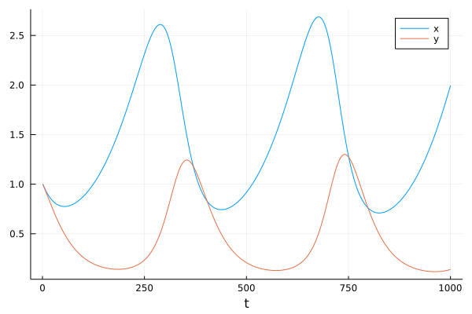
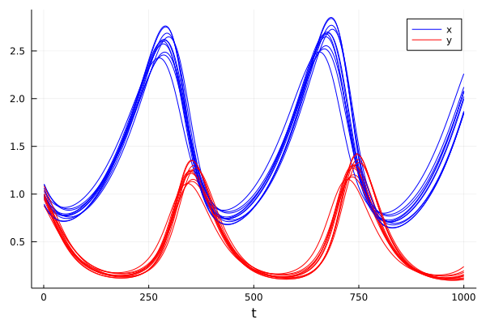
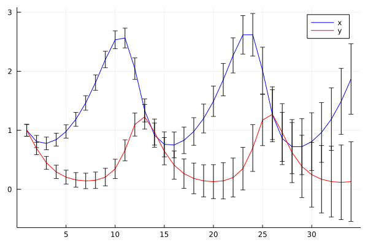
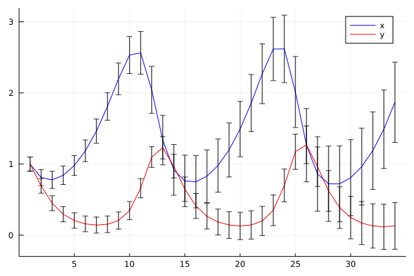
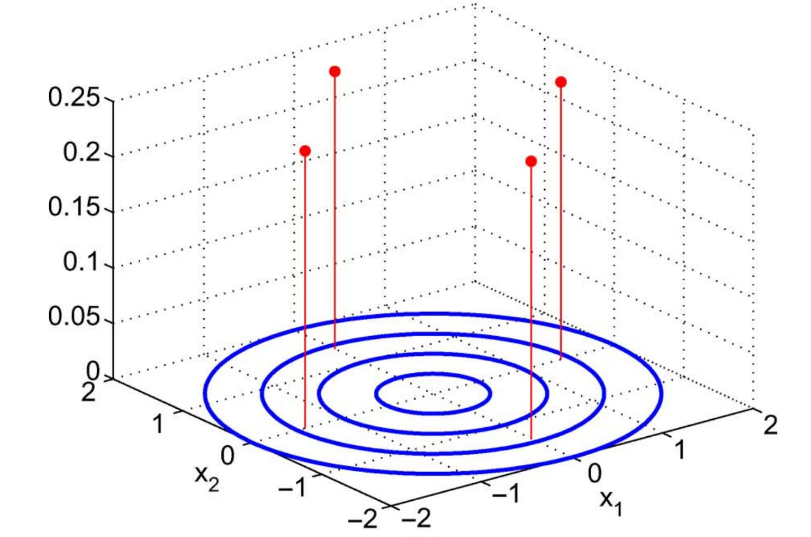
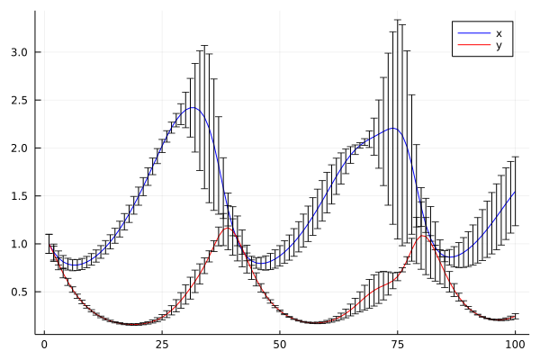

# Uncertainty Propagation in Ordinary Differential Equations

Differential equations are commonly used in science to describe many aspects of the physical world, ranging from dynamical systems and curves in space to complex multi-physics phenomena. 

As an example, consider a simple non-linear ordinary differential equation:

```math
\begin{align}
\dot{x}&=\alpha x-\beta xy,\\\dot{y}&=-\delta y+\gamma xy, 
\end{align}
```

Which describes behavior of a predator-pray models in continuous times:
 - x is the population of prey (sheep),
 - y is the population of predator (wolfes)
 - derivatives represent instantaneous growth rates of the populations
 - ``t`` is the time and ``\alpha, \beta, \gamma, \delta`` are parameters.

Can be written in vector arguments ``\mathbf{x}=[x,y]``:
```math
\frac{d\mathbf{x}}{dt}=f(\mathbf{x},\theta)
```
with arbitrary function ``f`` with vector of parameters ``\theta``.


The first steps we may want to do with an ODE is to see it's evolution in time. The most simple approach is to discretize the time axis into steps:
``t = [t_1, t_2, t_3, \ldots t_T]``
and evaluate solution at these points.

Replacing derivatives by differences:
```math
\dot x \leftarrow \frac{x_t-x_{t-1}}{\Delta t}
```
we can derive a general  scheme (Euler solution):
```math
\mathbf{x}_t = \mathbf{x}_{t-1} + \Delta{}t f(\mathbf{x}_t,\theta)
```
which can be written genericaly in julia :
```julia

function f(x,θ)
  α,β,γ,δ = θ
  x1,x2=x
   dx1 = α*x1 - β*x1*x2
   dx2 = δ*x1*x2 - γ*x2
  [dx1,dx2]
end

function solve(f,x0::AbstractVector,θ,dt,N)
  X = hcat([zero(x0) for i=1:N]...)
  X[:,1]=x0
  for t=1:N-1
     X[:,t+1]=X[:,t]+dt*f(X[:,t],θ)
  end
  X
end
```


Is simple and working (with sufficienty small ``dt``):



ODE of this kind is an example of a "complex" simulation code that we may want to use, interact with, modify or incorporate into a more complex scheme.
- we will test how to re-define the elemnetary oeprations using custom types, automatic differnetiation and automatic code generation
- we will redefine the plotting operation to display the new type correctly
- we will use composition to incorporate the ODE into a more complex solver


## Uncertainty propagation

Prediction of the ODE model is valid only if all parameters and all initial conditions are accurate. This is almost never the case. While the number of sheep can be known, the number of wolfes in a forest is more uncertain. The same model holds for predator-prey in insects where the number of individuals can be only estimated.

Uncertain initial conditions:
- number of predators and prey given by a probability distribution 
-  interval ``[0.8,1.2]`` corresponds to uniform distribution ``U(0.8,1.2)``
- gaussian ``N(\mu,\sigma)``, with mean ``\mu`` and standard deviation ``\sigma`` e.g. ``N(1,0.1)``
-  more complicated distributions are more realistic (the number of animals is not negative!)

### Ensemble approach

The most simple approach is to represent distribution by an empirical density = discrete samples.
```math
p(\mathbf{x})\approx \frac{1}{K}\sum_{k=1}^{K} \delta(\mathbf{x}-\mathbf{x}^{(k)})
```

In the case of a Gaussian, we just sample:
```julia
K = 10
X0 = [x0 .+ 0.1*randn(2) for _=1:K]         # samples of initial conditions
Xens=[X=solve(f,X0[i],θ0,dt,N) for i=1:K]   # solve multiple times
```
(can be implemented more elegantly using multiple dispatch on Vector{Vector})



While it is very simple and universal, it may become hard to interpret. 
- What is the probability that it will higher than ``x_{max}``?
- Improving accuracy with higher number of samples (expensive!)

### Propagating a Gaussian

Propagation of uncertainty has been studied in many areas of science. Relation between accuracy and computational speed is always a tradeoff.

A common appoach to propagation of uncertainty is linearized Gaussian:
- variable ``x`` is represented by gaussian ``N(\mu,\sigma)``
- transformation of addition: ``x+a\sim N(\mu+a,\sigma)``
- transformation of multiplication: ``a*x\sim N(a*\mu,a*\sigma)``
- general transformation approximated:
```math
g(x)\sim N(g(\mu),g'(\mu)*\sigma)
```

This can be efficienty implemented in Julia:
```julia
struct GNum{T} where T<:Real
  μ::T
  σ::T
end
import Base: +, *
+(x::GaussNum{T},a::T) where T =GaussNum(x.μ+a,x.σ)
+(a::T,x::GaussNum{T}) where T =GaussNum(x.μ+a,x.σ)
*(x::GaussNum{T},a::T) where T =GaussNum(x.μ*a,a*x.σ)
*(a::T,x::GaussNum{T}) where T =GaussNum(x.μ*a,a*x.σ)
```

For the ODE we need multiplication of two Gaussians. Using Taylor expansion and neglecting covariances:
```math
g(x_1,x_2)=N\left(g(\mu_1,\mu_2), \sqrt{\left(\frac{dg}{dx_1}(\mu_1,\mu_2)\sigma_1\right)^2 + \left(\frac{dg}{dx_1}(\mu_1,\mu_2)\sigma_1\right)^2}\right)
```
which trivially applies to sum: ``x_1+x_2=N(\mu_1+\mu_2, \sqrt{\sigma_1^2 + \sigma_1^2})``

```julia
+(x1::GaussNum{T},x2::GaussNum{T}) where T =GaussNum(x1.μ+x2.μ,sqrt(x1.σ.^2 + x2.σ.^2))
*(x1::GaussNum{T},x2::GaussNum{T}) where T =GaussNum(x1.μ*x2.μ, sqrt(x2.μ*x1.σ.^2 + x1.μ*x2.σ.^2))

```

Following the principle of defining the necessary functions on the type, we can make it pass through the ODE:
- it is necessary to define new initialization (functions `zero`)
- define nice-looking constructor (``±``)
  ```julia
  ±(a::T,b::T) where T:<Real =GaussNum(a,b)
  ```

```julia
GX=solve(f,[1.0±0.1,1.0±0.1],[0.1,0.2,0.3,0.2],0.1,1000)
```



- function overloading follows a deterministic procedure => can be automated (macro, generated functions)


### Flexibility

The great advantage of the former model was the ability to run an arbitrary code with uncertainty at an arbitrary number.

For example, we may know the initial conditions, but do not know the parameter value.

```julia
GX=solve(f,[1.0±0.1,1.0±0.1],[0.1±0.1,0.2,0.3,0.2],0.1,1000)
```



### Disadvantage

The result does not correspond to the ensemble version above.
- we have ignored the covariances
- extension to version with covariances is possible by keeping track of the correlations (`Measurements.jl`), where other variables are stored in a dictionary:
  - correlations found by language manipulations
  - very flexible and easy-to-use
  - discovering the covariances requires to build the covariance from `ids`. (Expensive if done too often).


## Vector uncertainty
The previous simple approach ignores the covariances between variables. Even if we tract covariances linearnly in the same fashion (``Measurements.jl``), the approach will suffer from a loss of precision under non-linearity. 


- The linearization-based approach propogates through the non-linearity only the mean and models its neighborhood by a plane.
- Propagating all samples is too expensive
- Methods based on quadrature or cubature rules are a compromise


The cubature approach is based on moment matching:
```math
\mu_g = \int g(x) p(x) dx
```
for which is ``g(\mu)`` poor approximation, corresponding to:
```math
\mu_g = g(\mu) = \int g(x) \delta(x-\mu) dx
```
For Gaussian distribution, we can use a smarter integration rule, called the Gauss-Hermite quadrature:
```math
\mu_g = \int g(x) p(x) dx \approx \sum_{j=1}^J w_j g(x_j)
```
where ``x_j`` are prescribed quadrature points (see e.g. )

In multivariate setting, the same problem is typically solved with the aim to reduce the computational cost to linear complexity with dimension. Most often aimimg at ``O(2d)`` complexity where ``d`` is the  dimension of vector ``x``.


One of the most popular approaches today is based on cubature rules approximating the Gaussian in radial-spherical coordinates.

### Cubature rules

Consider Gaussian distribution with mean ``\mu`` and covariance matrix ``\Sigma`` that is positive definite with square root ``\sqrt\Sigma``, such that ``\sqrt\Sigma \sqrt\Sigma^T=\Sigma``. The quadrature pints are:
```math
x_i = \mu + \sqrt\Sigma q_i
```
```math
\begin{align}
q_{1}&=\sqrt{d}\begin{bmatrix}1\\
0\\
\vdots
\end{bmatrix}
&
q_{2}&=\sqrt{d}\begin{bmatrix}0\\
1\\
\vdots
\end{bmatrix} \ldots 
&
q_{d+1}&=\sqrt{d}\begin{bmatrix}-1\\
0\\
\vdots
\end{bmatrix}
q_{d+2}&=\sqrt{d}\begin{bmatrix}0\\
-1\\
\vdots
\end{bmatrix} \ldots
\end{align}
```
that can be composed into a matrix ``Q=[q_1,\ldots q_{2d}]`` that is constant:
```math
Q = \sqrt{d} [ I_d, -I_d]
```



Those quadrature points are in integration weighted by:
```math
w_i = \frac{1}{2d}, i=1,\ldots,2d
```
where ``d`` is dimension of the vectors.

The quadrature points are propogated through the non-linearity in parallel (``x_i'=g(x_i)``) and the resulting Gaussian distribution is:
```math
\begin{align}
x' & \sim N(\mu',\Sigma')\\
\mu' & = \frac{1}{2d}\sum_{j=1}^{2d} x'_i\\
\Sigma &= \frac{1}{2d}\sum_{j=1}^{2d} (x'_i-\mu')^T (x'_i-\mu')
\end{align}
```

It is easy to check that if the sigma-points are propagated through an identity, they preserve the mean and variance. 
```math
\begin{align}
\mu' & = \frac{1}{2d}\sum_{j=1}^{2d} (\mu + \sqrt{\Sigma}q_i)\\
 & = \frac{1}{2d}(2d\mu + \sqrt{\Sigma} \sum_{j=1}^{2d} (q_i)
 & = \mu
\end{align}

```


For our example:



- only 4 trajectories propagated deterministically
- can not be implemented using a single number type
  - the number of points to store is proportional to the dimension
  - manipulation requires operations from linear algebra
- moving to representations in vector form
  - simple for initial conditions,
  - how to extend to operate also on parameters?

### Smarter implementation
Easiest solution is to put the corresponding parts of the problem together:
- ode function ``f``, 
- its state ``x0``,
- and parameters ``θ``
can be wrapped into an ODEProblem

```julia
struct ODEProblem{F,T,X<:AbstractVector,P<:AbstractVector}
    f::F
    tspan::T
    x0::X
    θ::P
end
```
- the solver can operate on the ODEProbelm type

### Unceratinty propagation in vectors

Example: consider uncertainty in state ``[x_1,x_2]`` and the first parameter ``\theta_1``. 

Quick and dirty: 
```julia
getuncertainty(o::ODEProblem) = [o.u0[1:2];o.θ[1]]
setuncertainty!(o::ODEProblem,x::AbstractVector) = o.u0[1:2]=x[1:2],o.θ[1]=x[3]
```
and write a general Cubature solver using multiple dispatch.

Practical issues:
- how to check bounds? (Asserts)
- what if we provide an incompatible ODEProblem
- define a type that specifies the type of uncertainty? 
```julia
struct GaussODEProblem
  mean::ODEProblem
  unc_in_u # any indexing type accepted by to_index()
  unc_in_θ
  sqΣ0
end
```

We can dispatch the cubature solver on GaussODEProblem and the ordinary ``solve`` on GaussODEProblem.OP internally.

```julia
getmean(gop::GaussODEProblem) =[ gop.mean.x0[gop.unc_in_u];gop.mean.θ[gop.unc_in_θ]]
setmean!(gop::GaussODEProblem,x::AbstractVector) = begin 
  gop.mean.x0[gop.unc_in_u]=x[1:length(gop.unc_in_u)]
  gop.mean.θ[gop.unc_in_θ]=x[length(gop.unc_in_u).+[1:length(gop.unc_in_θ)]] 
end
```

Constructor accepts an ODEProblem with uncertain numbers and converts it to GaussODEProblem:
- goes through ODEProblem ``x0`` and ``θ`` fields and checks their types
- replaces GaussNums in ODEProblem  by ordinary numbers
- remembers indices of GaussNum in ``x0`` and ``θ``
- copies standard deviations in GaussNum to ``sqΣ0``