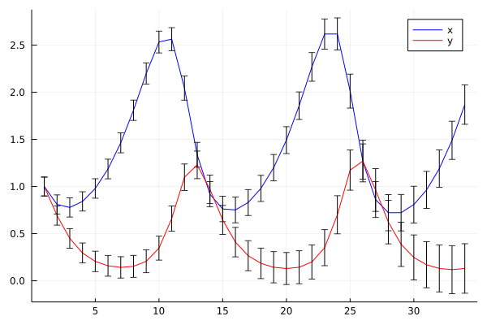

Ordinary Differencial equation

Differential equations are commonly used in science to describe many aspects of the physical world, ranging from dynamical systems, curves in space, to a complex multi-physics phenomena. 

As an example, consider a simple non-linear ordinary differential equation:

```math
\begin{align}
\dot{x}&=\alpha x-\beta xy,\\\dot{y}&=-\delta y+\gamma xy, 
\end{align}
```

Which describes behavior of a predator-pray models in continuous times:
 - x is the population of prey (sheep),
 - y is the population of predator (wolfes)
 - derivatives represent instantaneous growth rates of the populations
 - ``t`` is the time and ``\alpha, \beta, \gamma, \delta`` are parameters.

Can be written in vector arguments ``\mathbf{x}=[x,y]``:
```math
\frac{d\mathbf{x}}{dt}=f(\mathbf{x},\theta)
```
with arbitrary function ``f`` with vector of parameters ``\theta``.


The first steps we may want to do with an ODE is to see it's evolution in time. The most simple approach is to discretize the time axis into steps:
``t = [t_1, t_2, t_3, \ldots t_T]``
and evaluate solution at these points.

Replacing derivatives by differences:
```math
\dot x \leftarrow \frac{x_t-x_{t-1}}{\Delta t}
```
we can derive a general  scheme (Euler solution):
```math
\mathbf{x}_t = \mathbf{x}_{t-1} + \Delta{}t f(\mathbf{x}_t,\theta)
```
which can be written genericaly in julia :
```julia

function f(x,θ)
  α,β,γ,δ = θ
  x1,x2=x
   dx1 = α*x1 - β*x1*x2
   dx2 = δ*x1*x2 - γ*x2
  [dx1,dx2]
end

function solve(f,x0::AbstractVector,θ,dt,N)
  X = hcat([zero(x0) for i=1:N]...)
  X[:,1]=x0
  for t=1:N-1
     X[:,t+1]=X[:,t]+dt*f(X[:,t],θ)
  end
  X
end
```


Is trivial but works:


## Uncertainty propagation

Prediction of the ODE model is valid only if all parameters and all initial conditions are accurate. This is almost never the case. While the number of sheep can be known, the number of wolfes in a forest is more uncertain. The same model holds for predator-prey in insects where the number of individuals can be only estimated.

Uncertain initial conditions:
- number given by a probability distribution 
-  interval ``[0.8,1.2]`` corresponds to uniform distribution ``U(0.8,1.2)``
- gaussian ``N(\mu,\sigma)``, with mean ``\mu`` and standard deviation ``\sigma`` e.g. ``N(1,0.1)``
-  more complicated distributins are more realistic (the number of animals is not negative!)

### Ensemble approach

The most simple approach is to represent distribution by an empirical density = discrete samples.
```math
p(x)\approx \frac{1}{K}\sum_{k=1}^{K} \delta(x-x^{(k)})
```

In the case of a Gaussian, we just sample:
```julia
K = 10
X0 = [x0 .+ 0.1*randn(2) for _=1:K]
Xens=[X=solve(f,X0[i],θ0,dt,N) for i=1:K]
```
(can be implemented more elegantly using multiple dispatch on Vector{Vector})


While it is very simple and universal, it may become hard to intepret. 
- What is the probability that it will higher than ``x_{max}``?
- Improving accuracy with higher number of samples (expensive!)

### Propagating a Gaussian

Propagation of uncertainty has been studied in many areas of science. Relation between accuracy and computational speed is always a tradeoff.

A common appoach to propagation of uncertainty is linearized Gaussian:
- variable ``x`` is represented by gaussian ``N(\mu,\sigma)``
- transformation of addition: ``x+a\sim N(\mu+a,\sigma)``
- transformation of multiplication: ``a*x\sim N(a*\mu,a*\sigma)``
- general transformation approximated:
```math
g(x)\sim N(g(\mu),g'(x)*\sigma)
```

This can be efficienty implemneted in Julia:
```julia
struct GNum{T} where T<:Real
  μ::T
  σ::T
end
import Base: +, *
+(x::GaussNum{T},a::T) where T =GaussNum(x.μ+a,x.σ)
+(a::T,x::GaussNum{T}) where T =GaussNum(x.μ+a,x.σ)
*(x::GaussNum{T},a::T) where T =GaussNum(x.μ*a,a*x.σ)
*(a::T,x::GaussNum{T}) where T =GaussNum(x.μ*a,a*x.σ)
```

For the ODE we need multiplication of two Gaussians. Using Taylor expansion and neglecting covariances:
```math
g(x_1,x_2)=N(g(\mu_1,\mu_2), \sqrt{(\frac{dg}{dx_1}(\mu_1,\mu_2)\sigma_1)^2 + (\frac{dg}{dx_1}(\mu_1,\mu_2)\sigma_1)^2})
```
which trivially applies to sum: ``x_1+x_2=N(\mu_1+\mu_2, \sqrt{\sigma_1^2 + \sigma_1^2})``

```julia
+(x1::GaussNum{T},x2::GaussNum{T}) where T =GaussNum(x1.μ+x2.μ,sqrt(x1.σ.^2 + x2.σ.^2))
*(x1::GaussNum{T},x2::GaussNum{T}) where T =GaussNum(x1.μ*x2.μ, sqrt(x1.σ.^2 + x2.σ.^2))

```

- it is necessary to define new initialization (functions `zero`)
- function overloading can be automated (macro, generated functions)



The result does not correspond to the ensemble version above.
- we have ignored the covariances
- extension to version with covariances is possible by keeping track of the correlations (`Measurements.jl`), where other variables are stored in a dictionary:
  - correlations found by language manipulations
  - very flexible and easy-to-use
  - discovering the covariances requires to build the covariance from `ids`. (Expensive if done too often).


## Vector uncertainty
To represent the uncertainty 
The approach above competely ignores the covariances between variables. While it is possible to do it linearnly in the same fashion, the approach suffer from a loss of precision under non-linearity.

A more sophisticated approach is based on moment matching:
```math
\mu_g = \int g(x) p(x) dx
```
for which is ``g(\mu)`` poor approximation, corresponding to:
```math
\mu_g = g(\mu) = \int g(x) \delta(x-\mu) dx
```
For Gaussian distribution, we can use a smarter integration rule, called the Gauss-Hermite quadrature:
```math
\mu_g = \int g(x) p(x) dx \approx \sum_{j=1}^J w_j g(x_j)
```
where ``x_j`` are prescribed quadrature points (see e.g. )

In multivariate setting, the same problem is typically solved with the aim to reduce the computational cost to linear complexity with dimension. Most often aimimg at ``O(2dim(d))`` complexity.

One of the most popular approaches today is based on cubature rules approximating the Gaussian in radial-spherical coordinates.

decomposition of the covariance matrix 
```math

```

# Manipulating ODEs

So far, we have considered first-order ODEs. Many ODEs are defined in higher order form, e.g. 


- check Chris Raucausacc latest blog
  https://julialang.org/blog/2021/10/DEQ/
