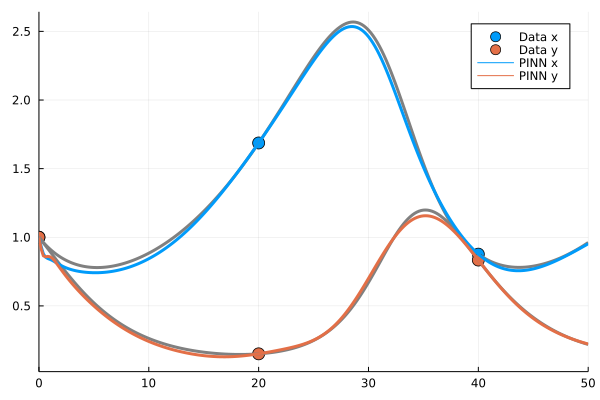

# Lab 13 - Data-driven Differential Equations

In this lab you will implement your own _*Physics Informed Neural Network*_ (PINN)
(discussed in [lecture 13](@ref lec13) and an improved uncertainty propagation
based on the cubature rules from [lecture 12](@ref lec13).

_*Before your start*_: Please, install the necessary packages for this lab and
let them precompile while you familiarize yourself with the PINN implementation.
```julia
(@1.6) pkg> add Flux ForwardDiff Optim GalacticOptim Plots
```

## Physics Informed Neural Networks

You have already seen in the lecture that PINNs are implemented with a loss
function that contains two terms: the physics loss $\mathcal L_P$ and the data
loss $\mathcal L_D$ (which can also be used to define boundary conditions).
In this part of the lab we will implement both these loss terms step by step,
starting with the definition of the underlying neural network itself.

You have already seen the implementation of the so-called `FastLayer`s which
work with explicitly passed in parameters. The code below is adapted from the
package [`DiffEqFlux.jl`](https://github.com/SciML/DiffEqFlux.jl/blob/master/src/fast_layers.jl)
which you can use instead of precompiling `DiffEqFlux.jl` if you like.

```@example lab
using Flux

abstract type FastLayer <: Function end

struct FastDense{F,P} <: FastLayer
    in::Int
    out::Int
    σ::F
    initial_params::P
    function FastDense(in::Integer, out::Integer, σ=identity;
                       initW=Flux.glorot_uniform, initb=Flux.zeros32)
        initial_params() = vcat(vec(initW(out,in)), initb(out))
        new{typeof(σ),typeof(initial_params)}(in,out,σ,initial_params)
    end
end

initial_params(f::FastDense) = f.initial_params()
paramlength(f::FastDense) = f.out*(f.in+1)

function (f::FastDense)(x,θ)
    W = reshape(θ[1:(f.out*f.in)], f.out, f.in)
    b = θ[(f.out*f.in+1):end]
    f.σ.(W*x .+ b)
end

struct FastChain{T<:Tuple} <: FastLayer
    layers::T
end
FastChain(ls...) = FastChain(ls)

paramlength(c::FastChain) = sum(paramlength(x) for x in c.layers)
initial_params(c::FastChain) = vcat(initial_params.(c.layers)...)

(c::FastChain)(x,p) = applychain(c.layers, x, p)
applychain(::Tuple{}, x, p) = x
function applychain(fs::Tuple, x, p)
    x_ = first(fs)(x,p[1:paramlength(first(fs))])
    applychain(Base.tail(fs), x_, p[(paramlength(first(fs))+1):end])
end
nothing # hide
```
The `FastLayer`s can be used just like their implicitly parameterized relatives.
```@repl lab
hdim = 10;
u = FastChain(
    FastDense(1,hdim,tanh),
    FastDense(hdim,hdim,tanh),
    FastDense(hdim,2));
θ = initial_params(u);
u(rand(1,5),θ)
```

### The Physics Loss $\mathcal L_P$

PINNs can be used to solve differential equations (DE) by satisfying a
two-component loss function. The *physics loss* encourages the underlying
neural network to satisfy the given differential equation $F$
```math
\mathcal L_P = \sum_{i=1}^N ||\text{LHS}(\hat x_i, \hat y_i, t_i) - \text{RHS}(\hat x_i, \hat y_i, t_i)||_2,
```
where LHS and RHS are left-hand sides and right-hand sides of a DE, for
example, the Lotka-Volterra equations
```math
\begin{align*}
  \dot x &= \alpha x - \beta xy,\\
  \dot y &= -\delta y + \gamma xy.
\end{align*}
```
The symbols $\hat x$ and $\hat y$ denote the approximate solution of the DE
that comes from the neural network $u: \mathbb R \rightarrow \mathbb R^2$
which has one input (time $t$) and two outputs (DE variables $\hat x$ and $\hat
y$).

Note that already inside $\mathcal L_P$ we have to compute a derivative of $u$
w.r.t to its input $t$. Hence, in order to perform gradient descent on the NN
parameters we will need higher-order derivatives. This is currently not possible
with `Zygote.jl` (but will be possible soon with `Diffractor.jl`), so we will
resort to `ForwardDiff.jl`. This will unfortunately cost us a little performance
because we have to iterate over batches of NN inputs, but for our small problem
this is ok.

```@raw html
<div class="admonition is-category-exercise">
<header class="admonition-header">Exercise</header>
<div class="admonition-body">
```
Define a function to compute the derivative of a neural network `u` w.r.t to
one of its inputs, e.g. the second element of the input `x`
```julia
forward_derivative(u::FastLayer,x::AbstractArray,v::Int,θ)
```
You can compute derivatives of a many-to-many function by first computing
the Jacobian and then multiplying with a onehot vector that chooses the desired
row of the Jacobian. The function should accept both vector and batches of vectors
(i.e. matrices) as inputs `x`.

_*Hints*_:
- You can use `ForwardDiff.jacobian` to compute the Jacobian.
- You can use `Flux.onehot` for the onehot encoded vector.
- For derivatives of batches you can `map` over the columns of your input matrix.
```@raw html
</div></div>
<details class = "solution-body">
<summary class = "solution-header">Solution:</summary><p>
```
```@example lab
using ForwardDiff

function forward_derivative(u::FastLayer,x::AbstractVector,ε::AbstractVector,θ)
    J = ForwardDiff.jacobian(i->u(i,θ),x)
    J * ε
end
function forward_derivative(u::FastLayer,xs::AbstractMatrix,ε::AbstractVector,θ)
    mapreduce(x->forward_derivative(u,x,ε,θ), hcat, eachcol(xs))
end
function forward_derivative(u::FastLayer,x::AbstractArray,v::Int,θ)
    ε = Flux.onehot(v,1:size(x,1))
    forward_derivative(u,x,ε,θ)
end
nothing # hide
```
```@raw html
</p></details>
```
```@repl lab
u = FastDense(2,3);
x = rand(2,5);
forward_derivative(u,x,2,initial_params(u))
```

Now we can define a new struct which will hold the network $u$, the LHS, and
the RHS of the PINN.
```@example lab
struct PINN{U<:FastLayer,L<:Function,R<:Function}
    u::U
    lhs::L
    rhs::R
end
```
The fields `lhs` and `rhs` are functions which are called like `lhs(u::FastLayer,x,θ)`.
The `lhs` function is simply the forward derivative of `u` w.r.t the first (and only)
input that represents the time:
```@example lab
lhs(u,x,θ) = forward_derivative(u,x,1,θ)
nothing # hide
```
The `rhs` calls the defined DE with the outputs of `u`. For simplicity we will
assume that the parameters of the Lotka-Volterra system are known, but they can
easily be incorporated in the vector of learned parameters `θ`.
Note that `lotkavolterra` is a vectorized version of the definition you know
from [lab 12](@ref lab12).
```@setup lab
function lotkavolterra(u::AbstractMatrix,θ)
    α, β, γ, δ = θ
    u₁, u₂ = u[1,:], u[2,:]

    du₁ = α.*u₁ - β.*u₁.*u₂
    du₂ = δ.*u₁.*u₂ - γ.*u₂

    [du₁ du₂]'
end
```
```@example lab
function lotkavolterra(u::AbstractMatrix,θ)
    # vectorized version of the lotkavolterra function from lab 12
end

lotka_params = [0.1f0, 0.2f0, 0.3f0, 0.2f0]
rhs(u,x,θ) = lotkavolterra(u(x,θ), lotka_params)
nothing # hide
```
With `lhs` and `rhs` in place we can construct the full PINN model:
```@example lab
hdim = 10
u = FastChain(FastDense(1,hdim,tanh), FastDense(hdim,hdim,tanh), FastDense(hdim,2))
θ = initial_params(u)
pinn = PINN(u,lhs,rhs)
nothing # hide
```
```@raw html
<div class="admonition is-category-exercise">
<header class="admonition-header">Exercise</header>
<div class="admonition-body">
```
1. Define a function `physics_loss(m::PINN, x::AbstractArray, θ::AbstractVector)`
   which implements $\mathcal L_P$. The input `x` can either be a vector of input
   coordinates (in our case there is only time, so the input would be e.g. `[1.0]` for
   a single example), or the input can be a batch of coordinates (i.e. a matrix).
2. Implement the vectorized version of the `lotkavolterra` function.
```@raw html
</div></div>
<details class = "solution-body">
<summary class = "solution-header">Solution:</summary><p>
```
```@example lab
using StatsBase

function physics_loss(m::PINN, x::AbstractArray, θ::AbstractVector)
    u = m.u
    mean(abs2, m.lhs(u,x,θ) - m.rhs(u,x,θ))
end

function lotkavolterra(u::AbstractMatrix,θ)
    α, β, γ, δ = θ
    u₁, u₂ = u[1,:], u[2,:]

    du₁ = α.*u₁ - β.*u₁.*u₂
    du₂ = δ.*u₁.*u₂ - γ.*u₂

    [du₁ du₂]'
end
nothing # hide
```
```@raw html
</p></details>
```
You test that your physics loss works by computing a gradient for some random
inputs
```@repl lab
testloss(θ) = physics_loss(pinn, rand(1,10), θ)
testloss(θ)
ForwardDiff.gradient(testloss,θ)
```


### The Data Loss $\mathcal L_D$

To fully specify a DE we have to specify its boundary conditions.  In PINNs, a
boundary condition is conceptually the same as incorporating data, so we will
implement any potential boundary condition by defining a data loss $\mathcal L_D$
```math
\mathcal L_D = \sum_{i=1}^M ||\hat u(x_i) - y_i||_2,
```
where $x_i$ are input coordinates and $y_i$ corresponding labels.

```@raw html
<div class="admonition is-category-exercise">
<header class="admonition-header">Exercise</header>
<div class="admonition-body">
```
Define a function which implements the data loss $\mathcal L_D$ from the equation
above.
```julia
data_loss(m::PINN, x::AbstractArray, y::AbstractArray, θ::AbstractVector)
```
```@raw html
</div></div>
<details class = "solution-body">
<summary class = "solution-header">Solution:</summary><p>
```
```@example lab
function data_loss(m::PINN, x::AbstractArray, y::AbstractArray, θ::AbstractVector)
    mean(abs2, m.u(x,θ) - y)
end
```
```@raw html
</p></details>
```


### PINN Training

To use our PINN we now just need to load some data (or define boundary
conditions) and define a training grid for the physics loss.
To make the training reasonably short we will fit one bump of the Lotka-Volterra
system which corresponds to a `tspan = (0,50)`, so we can define a time grid
with
```@repl lab
xs_grid = reshape(collect(0f0:2f0:50f0), 1, :);
physics_loss(pinn,xs_grid,θ)
```
Note that we are using `Float32` to take advantage of faster training of our
`Float32` model.

To show how little data a PINN needs we can pick only three data points from
our `loktadata.jld2`
```@repl lab
using JLD2
data = load("../lecture_12/lotkadata.jld2");
xs = Float32.(data["t"][1:100:201]);
xs = reshape(xs, 1, :)
ys = Float32.(data["u"][:,1:100:201])
data_loss(pinn,xs,ys,θ)
```

```@raw html
<div class="admonition is-category-exercise">
<header class="admonition-header">Exercise</header>
<div class="admonition-body">
```
Implement a closure `plotprogress(θ)` which closes over the global variables
`pinn`, `xs`, `ys`, and `data`, and plots the correct solution
(obtained from `data`), the data that is used for training (`xs` and `ys`), and
the current solution of the PINN (based on `θ`).
```@raw html
</div></div>
<details class = "solution-body">
<summary class = "solution-header">Solution:</summary><p>
```
```@example lab
using Plots

function plotprogress(θ)
    t = vec(xs)
    p1 = scatter(t, ys[1,:], label="Data x", ms=7)
    scatter!(p1, t, ys[2,:], label="Data y", ms=7)
    t = data["t"]
    plot!(p1, t, data["u"][1,:], label=false, lw=3, c=:gray)
    plot!(p1, t, data["u"][2,:], label=false, lw=3, c=:gray)

    us = pinn.u(reshape(t,1,:),θ)
    plot!(p1, t, us[1,:], label="PINN x", lw=3, c=1)
    plot!(p1, t, us[2,:], label="PINN y", lw=3, c=2)
    plot!(p1, xlim=(xs_grid[1],xs_grid[end]))
end
nothing # hide
```
```@raw html
</p></details>
```
Your plot can (but does not have to) look like this
```@example lab
plotprogress(θ)
```

```@raw html
<div class="admonition is-category-exercise">
<header class="admonition-header">Exercise</header>
<div class="admonition-body">
```
To optimize our PINN we will use `GalacticOptim.solve`, which expects a loss
function with the API `loss(θ,p=nothing)` which returns a tuple `(l, ls)` with
the final loss value `l` and a tuple `ls` that contains optional diagnostic
values. We will stick our individual data/physics loss values in there.

Additionally, we can define a `callback(l,ls,θ)` which prints/plots our
training progress. `l` is the final loss, `ls` the diagnostics, and `θ` our
optimization parameters. The callback should always return `false` (this can
be used for early stopping).

1. Define the final PINN `loss(θ,p=nothing)` function.
2. Define a `callback(l,ls,θ)` function.
```@raw html
</div></div>
<details class = "solution-body">
<summary class = "solution-header">Solution:</summary><p>
```
```@example lab
function loss(θ,p=nothing)
    l1 = internal_loss(pinn, xs_grid, θ)
    l2 = data_loss(pinn, xs, ys, θ)
    l1+l2, (l1,l2)
end

function callback(θ,l,ls)
    (internal, dataloss) = ls
    plotprogress(pinn,θ,xs,ys) |> display
    @info l internal dataloss
    false
end
nothing # hide
```
```@raw html
</p></details>
```

To start training with `GalacticOptim.jl` we just need to define which AD backend
to use and pass in our constructed loss
```julia
func = OptimizationFunction(loss, GalacticOptim.AutoForwardDiff())
prob = OptimizationProblem(func, θ)
opt  = LBFGS()
solve(prob, opt, maxiters=10_000, cb=Flux.throttle(callback,1))
```



## Data Assimilation in Uncertain ODEs


---

changes to last labs code:
* no `reduce(hcat,us)` in `solve`
* need an `AbstractODEProblem`...

# assimilation

* project mean to measurement at `(t,y)`


# second part of lab

* learn ODE params from data
* how to optimize through `solve`???
* how are PINNs doing  higher order AD
