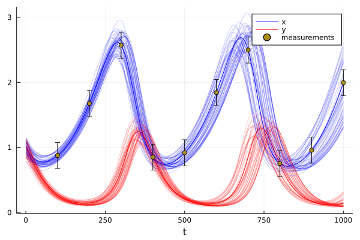
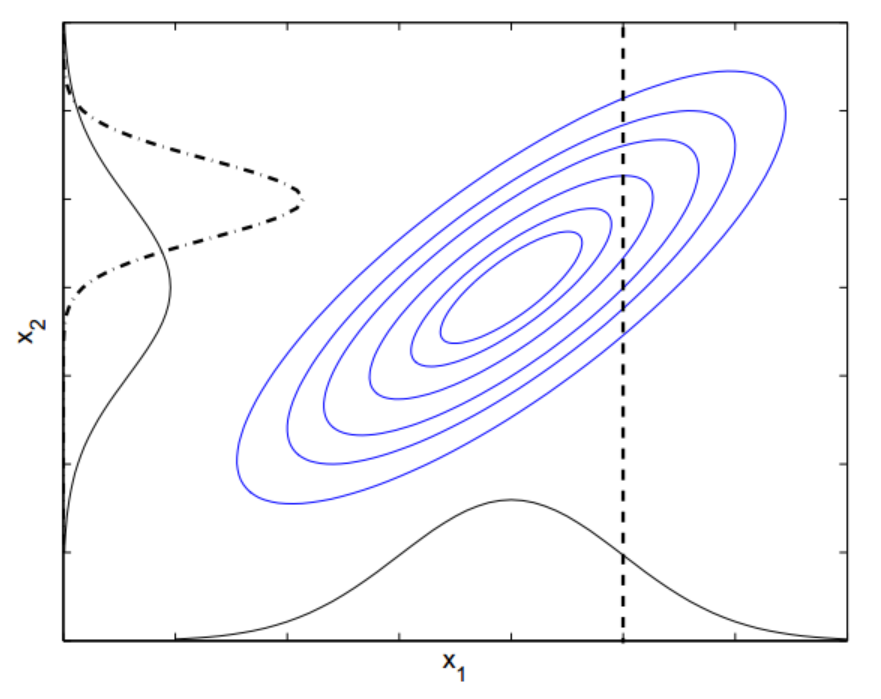

# Data-driven Ordinary Differential Equations

We have looked into the uncertainty propagation through an ODE in the previous lecture. The uncertainty may stem from:
- unknown boundary conditions (e.g. initial conditions)
- unknown parameters (reproduction rates, etc.)
- missing terms (hidden dynamics) of an ODE

The uncertainty in the solution can be reduced when data are available. This can be either in incremental or batch form:
- batch form: we have a set of data and we look for their explanation 
- incremental: common e.g. in temporal evolution, when the data are measured on the fly and systems can change in time (stochastic ODE)
  - if done right, the incremental solution also solves the batch problem.

## Fitting ODE solution to data

Since the ODE solver is a function like any other, it is possible to use general-purpose optimizers to optimize parameters of the ODE to match the output.
```julia
using Optim

function loss(θin,prob::ODEProblem,Y)
    prob.θ.=θin
    t,Xn=solve(prob,RK2(0.2))
    sum((Y.-Xn).^2)
end
θopt = copy(θ)
O=Optim.optimize(θ->loss(θ,prob,X),θopt)
Olb=Optim.optimize(θ->loss(θ,prob,X),θopt,LBFGS())
```

- using the power of automatic differentiation (of the numerical solver)
- in the case of ODE, the gradients can be modified to use the information about exact derivatives (adjoints) 

## Extending the ODE

The previous approach will work only if the data were generated by the exact ODE. If the structure of ODE is different, e.g. some terms are missing, we can never find an exact fit.

```math
\begin{align}
\dot{x}&=\alpha x-\beta xy + {\color{red} \omega y},\\\
dot{y}&=-\delta y+\gamma xy, 
\end{align}
```

We could "guess" what is the missing term or add a black box (neural network). The whole problem will become finding parameters ``\theta = [\theta_{ODE},\theta_{NN}]``. 
```math
\frac{d\mathbf{x}}{dt}=f(\mathbf{x},\theta_{ODE}) + NN(\mathbf{x},\theta_{NN})
```
In the limiting case, we may learn only the network:
```math
\frac{d\mathbf{x}}{dt}= NN(\mathbf{x},\theta_{NN})
```
known as the "Neural ODE" (Chen et. al. 2018).

# Neural Networks in Julia
Many possible packages implementing Neural Networks (Flux, Knets, MXnets, tensorFlow) etc. By far the most used package is the ```Flux.jl```

## Multi-layer perceptron
A simple feed-forward neural network (multi-layer-perceptron) 
```math
y=σ(W_n σ(W_{n-1}\ldots σ(W_{1}x+b_1)\ldots )+b_n)
```

is implemented as a ```Chain``` of layers:
```julia
struct Chain{T}
  layers::T
  Chain(xs...) = new{typeof(xs)}(xs)
  #...
end
```

The layers again follow the maths, e.g. ```Dense```
```julia
struct Dense{F, M<:AbstractMatrix, B}
  weight::M
  bias::B
  σ::F
end

Dense(W, b) = Dense(W, b, identity)

function (a::Dense)(x::AbstractArray)
  W, b, σ = a.weight, a.bias, a.σ
  return σ.(W*x .+ b)
end
```

Building an MLP is straightforward:
```julia
nx = 2
nn = Chain(Dense(rand(nx,nx),rand(nx)))
```

Now, we would like to optimize its parameters. It would be cumbersume to write into them.


### Functors.jl
In Flux, the standard mechanism is to compose an ```IdSet``` with a list of all parameters and operate on that list. 

```julia
ps = params(nn)
ps[1]
```
Now all operations (even gradients) can be defined on the list. The gradients are stored in an ```IdDict`` with pointer to the parameter as the key:

```
gs=gradient(nn,ps)
gs[ps[1]]
```

This approach has benefits and drawbacks:
- it allows to write a very general code easily, 
- the list of parameters is accessible for modifications:
  - removing parameter from optimization can be done by removing it from the parameter list
  - adding a parameter (e.g. from the ODE) allows composition of NN with other code
- it introduces and overhead
  - may be negligible for large models (hundrets of hidden neurons) that are dominated by matrix manipulation.
  - becomes significant for low dimensional models (ODEs)

## FastChain

As an alternative, package ```DiffEqFlux.jl``` introduces a different concept of the Chain and Layers, called FastChain and FastLayers.

```julia
abstract type FastLayer <: Function end
```
with interface 
```julia
paramlength(f) = 0
initial_params(f) = Float32[]
```
that need to be specialized for layers.

The layer that we will be working with is the ```FastDense```:

```julia
struct FastDense{F,F2} <: FastLayer
  out::Int
  in::Int
  σ::F
  initial_params::F2
  bias::Bool
  # function FastDense(...
end
```
It does not store its parameters but operates on an external parameter vector:
```julia
(f::FastDense)(x,p) = ((f.bias == true ) 
  ? (f.σ.(reshape(p[1:(f.out*f.in)],f.out,f.in)*x .+ p[(f.out*f.in+1):end])) 
  : (f.σ.(reshape(p[1:(f.out*f.in)],f.out,f.in)*x)))
```

The same behavior is replicated in FastChain:
```julia
struct FastChain{T<:Tuple} <: FastLayer
  layers::T
  # function FastChain(xs...)...
end
```
Since it is a Layer, it implements interfaces:
```julia
paramlength(c::FastChain) = sum(paramlength(x) for x in c.layers)
initial_params(c::FastChain) = vcat(initial_params.(c.layers)...)
```

and the functor:
```julia
(c::FastChain)(x,p) = applychain(c.layers, x, p)
applychain(::Tuple{}, x, p) = x
applychain(fs::Tuple, x, p) = applychain(Base.tail(fs), first(fs)(x,p[1:paramlength(first(fs))]), p[(paramlength(first(fs))+1):end])
```

This allows to implement layers with StaticArrays (allocating on the stack).

The same 2x2 network can be implemented as:
```julia
nn=FastDense(2,2)
p = initial_params(nn)
nn([1,2],p)
```

Effects of code composition in Julia:
- Toolboxes of Neural Networks in Julia are often lightweight
- the tools necessary for their training are not specific to NN (AD: Zygote, Enzyme)
- Combination with ODE is straigthforward

# Neural Networks in ODEs:

Neural networks are universal approximators. They can approaximate:
- the ODE, yielding NeuralODE, solved by an arbitrary solver
- the solution of an ODE - replacing the solver. Physics informed neural network (PINN)

## Neural Lotka-Volterra
Consider an extension of the LV ODE by a MLP:
```julia

function fnn(x,θ)
    α, β, γ, δ = θ[1:4]
    x₁, x₂ = x

    dx₁ = α*x₁ - β*x₁*x₂ 
    dx₂ = δ*x₁*x₂ - γ*x₂

    [dx₁, dx₂]+nn(x,@view θ[5:end])
end
```
Can be implemented via a closure (closing on nn).

Optimize using the same approach as before:
```julia
θnn = [0.2,0.2,0.3,0.2,0.01*initial_params(nn)...]
probnn = ODEProblem(fnn,tspan,u0,θnn)

θopt = copy(θnn)
O=Optim.optimize(θ->loss(θ,probnn,Xy),θopt,Optim.Options(iterations=10000))
```

The ``Xy`` data were generated with the ω version of the ODE, with parameters ``\theta=[0.2,0.2,0.3,0.2,0.1]``.

Optimization difficulties:
- the number of iteration in Nelder-Mead had to be increased
- LBGFS() optimizer extremely slow

Why?


## Physics-informed Neural Network

The idea is rather simple:
- neural network can approximate any function - why not solution to an ODE
- we need to define the objective. 

Architecture of NN?

A solution of ODE should satisfy:
- boundary (initial) conditions 
- the ODE at every point on the domain

While this would be dificult to satisfy in general, it is relatively simple to define on a grid. For the Lotka-Voltera problem, we have two conditions:
```math
\begin{align}
x(t)&=x0 && \text{for }t=0,\\
dx(t)&=f(x_t), && \text{for } t = \Delta{}t, 2\Delta{}t, \ldots , N\Delta{}t 
\end{align}
```

This can be summarized in a loss function:
```math
\mathcal{L}=||nn(0)-x0)|| + \frac{1}{N}\sum_{i=1}^N||f(x_i)-\nabla_x nn(x_i) ||
```

This straightforward approach was proposed relatively recently (2019).
- the training is not easy
- need for higher-order derivatives
- numerical issues

Very simple extension for known data:
```math
\begin{align}
\mathcal{L}=&||nn(0)-x0)|| + \frac{1}{N}\sum_{i=1}^N||f(x_i)-\nabla_x nn(x_i) ||\\
            & + \frac{1}{M}\sum_{i=1}^M||y_i - h(nn(x_i))||
\end{align}
```
where ``h()`` is a function transforming ODE solution to observations (e.g. identity, or selection of the relevant observations).

Worked out in the lab.

Can be combined with Neural ODE.

# Data assimilation in uncertain ODEs

So far, we have seen optimizations of the ODEs in the form of point estimate. We have seen an almost perfect fit. This may be dangerous when:
- the measurement are uncertain with large possible error
- the number of measurements is insufficient to fit the model.

Consider the Monte Carlo simulation from the previous lecture extended for unknown parameter:
```julia
K=100
X0 = [x0 .+ 0.1*randn(2) for k=1:K]
θ1 =[[θ0[1]+0.01randn();θ0[2:end]] for k=1:K]
Xens=[X=solve(f,X0[i],θ1[i],dt,N) for i=1:K]
```


We have observed data for every 100th sample with standard deviation 0.2.


Point estimate is the trajectory with the thick color.
- it is the one with minimum error
- is it really the solution?

Lets select all trajectories within a selected tolerance:



## Bayesian filtering

When the data are collected sequentially, the process of reduction of the uncertainty is repeated with every new measurement. The procedure is an iteration of two steps:
1. prediction - use ODE with uncertainty propagation to the next step,
2. correction - use the acquired measurement to reduce the uncertainty

In mathematics, it is direct application of the Bayes rule:
```math
\begin{align}
p(\mathbf{x},\mathbf{y})	=p(\mathbf{y}|\mathbf{x})p(\mathbf{x})=p(\mathbf{x}|\mathbf{y})p(\mathbf{y})
p(\mathbf{x}|\mathbf{y})	=\frac{p(\mathbf{y}|\mathbf{x})p(\mathbf{x})}{p(\mathbf{y})}=\frac{p(\mathbf{y}|\mathbf{x})p(\mathbf{x})}{\int p(\mathbf{y}|\mathbf{x})p(\mathbf{x})d\mathbf{x}}
\end{align}
```

Tradeoff between generality and speed
- A implementation of the whole procedure can be implemented on general level using types for probability distributions and operations on them.
- How exactly are these steps implemented depends on the assumptions made on the type of model uncertainty (initial conditions, parameters, noise) and the measurment uncertainty (noise).

We have done propagation of the Gaussian uncertainty through an ODE (GaussNum, Cubature rules). We will complement it by the correcton step here. 

Assumption of the Gaussian uncertainty in the ODE as well as the noise is one of the easiest to solve, due to nice properties of the Gaussian distribution. Specifically, joint distribution of a marginal and conditional Gaussian distribution is a Gaussian distribution:
```math
\begin{align}
p(\mathbf{x},\mathbf{y})&=\mathcal{N}\left(\begin{bmatrix}\mu_{x}\\
\mu_{y}
\end{bmatrix},\begin{bmatrix}\Sigma_{xx} & \Sigma_{xy}\\
\Sigma_{yx} & \Sigma_{yy}
\end{bmatrix}\right)\\p(\mathbf{y})&=\mathcal{N}\left(\mu_{y},\Sigma_{yy}\right)\\p(\mathbf{x}|\mathbf{y})&=\mathcal{N}(\mu_{x}+\Sigma_{xy}\Sigma_{yy}^{-1}(\mathbf{y}-\mu_{y}),\Sigma_{xx}-\Sigma_{xy}\Sigma_{yy}^{-1}\Sigma_{yx})
\end{align}
```



- marginal distributions are unaffected by the correlation
- the correlation determines the reduction of uncertainty in the conditional case

We have uncertainty in all our unknowns ``p(\mathbf{x})`` in the form of quadrature points. We assume that the probability of observation of ``p(\mathbf{y}|\mathbf{x})`` has mean given by ``x`` and variance ``\sigma_y``.
Hence, the means can be obtained by empirical samples of the cubature points ``X_p`` and measurements corresponding to cubature points.
```math
\mu_{x}=\overline{X_{p}}, \mu_{y}=\overline{Y_{p}},
```
e.g. if the measurements are only the ``x`` (prey variable) the ``Y_p = X_{1,p}``.

The covariance matrices can be obtained by empirical samples:
```math
\begin{align}
\Sigma_{xx}&=\frac{1}{2d}\sum_{j=1}^{2d}(x{}_{i}-\mu_{x})^{T}(x_{i}-\mu_{x}),\\\Sigma_{yx}&=\frac{1}{2d}\sum_{j=1}^{2d}(y{}_{i}-\mu_{y})^{T}(x_{i}-\mu_{x}),\\\Sigma_{yy}&=\frac{1}{2d}\sum_{j=1}^{2d}(y{}_{i}-\mu_{y})^{T}(y_{i}-\mu_{y})+\sigma_{y},
\end{align}
```

The uncertainty reduction is then application of the conditional distribution using the obtained means and variances. A common trick is to define the Kalman gain:
```math
\begin{align}
K&=\Sigma_{xy}\Sigma_{yy}^{-1},\\
\mu_{x|y}&=\mu_{x}+K(\mathbf{y}-\mu_{y}),\\
\Sigma_{x|y}&=\Sigma_{xx}-K\Sigma_{yx},
\end{align}
```

The full algorithms is then as follows:
1. generate sigma points from their mean ``\mu_x`` and ``\Sigma_{xx}``
1. run propagation of the cubature points ``Xp`` trough the ODE up to the point of the measuremnets
2. compute their mean ``\mu_x`` and variance ``\Sigma_{xx}``
3. for each cubature point compute the predicted measurement. Compute  mean ``\mu_y`` and covariance ``\Sigma_{yy}``
4. Compute the reduced uncertainty mean ``\mu_{x|y}`` and ``\Sigma_{x|y}``. These will be used to generate new cubature points in step 1.

TODO: code in the lab.