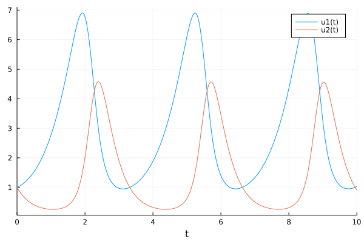
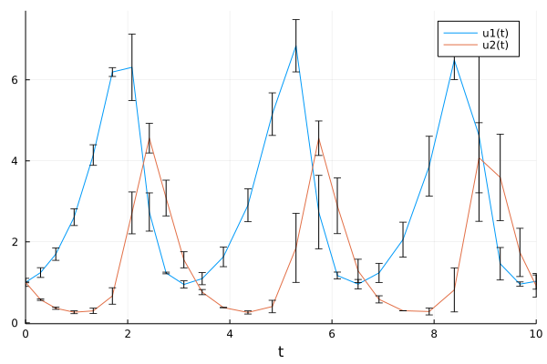

# Extensibility of the language

## DifferentialEquations

A package for solving differential equations, similar to ```odesolve``` in Matlab.

Example:

```julia
using DifferentialEquations, Plots

function lotka_volterra(du,u,p,t)
  x, y = u
  α, β, δ, γ = p
  du[1] = dx = α*x - β*x*y
  du[2] = dy = -δ*y + γ*x*y
end

u0 = [1.0,1.0]
tspan = (0.0,10.0)
p = [1.5,1.0,3.0,1.0]
prob = ODEProblem(lotka_volterra,u0,tspan,p)

sol = solve(prob)
plot(sol)
```



## Measurements

A package defining "numbers with precision" and complete algebra on these numbers:

```julia
using Measurements

a = 4.5 ± 0.1
b = 3.8 ± 0.4

2a + b
sin(a)/cos(a) - tan(a)
```

It also defines recipes for Plots.jl how to plot such numbers.

## Starting ODE from an interval

```julia
u0 = [1.0±0.1,1.0±0.01]

prob = ODEProblem(lotka_volterra,u0,tspan,p)
sol = solve(prob)
plot(sol,denseplot=false)
```



- all algebraic operations are defined, 
- passes all grid refinement techniques
- plot uses the correct  plotting for intervals

Who wrote the code connecting Measurements and DifferentialEquations?

Would this work with `scipy.integrate.solve_ivp`?

## Integration with other toolkits

**Flux:** toolkit for modelling Neural Networks. Neural network is a function.

- integration with Measurements,
- integration with ODE (think of NN as part of the ODE)

**Turing:** Probabilistic modelling toolkit

- integration with Flux (NN)
- integration with ODE
- using arbitrary bijective transformations, Bijectors.jl

## Back to the optimization example

```julia
optimize(z -> P(z...), z₀, Newton(); autodiff = AutoForwardDiff())
```

How does Optim get the gradient of `P`? 

Hint: ForwardDiff defines a new number type, just like Measurements.

## Julia from user's point of view

 1. **compilation** of everything to as specialized as possible
    + ✅ very fast code
    - ❌ slow interaction (caching..., much improved since 1.9)
    - ❌ generating libraries is harder 
        - think of ```fsum```, 
        - everything is ".h"  (Eigen library)
        - less concern with standalone executable/library compilation, Application binary interface (ABI), experimental `--trim` since 1.12
    - ❌ debugging is different to matlab/python

 2. **extensibility**, Multiple dispatch = multi-functions
    + ✅ allows great extensibility and code composition
    - ❌ not (yet) mainstream thinking
    - ❌ Julia is not Object-oriented
    - ❌ Julia is (not pure) functional language
    - ❌ less concern with public/private separation (`public` keyword since 1.11)
