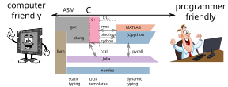
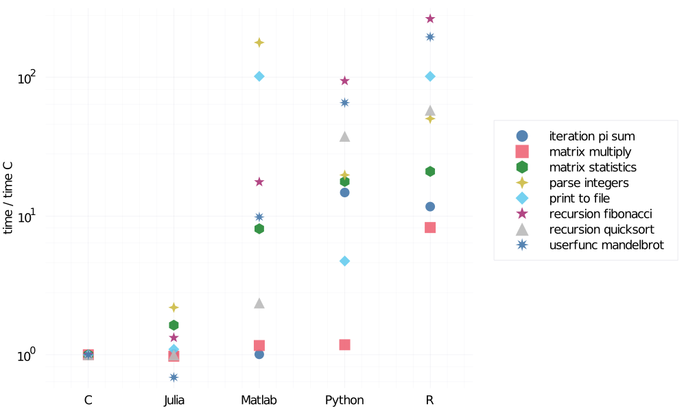
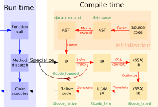

# Introduction to Scientific Programming

::: tip Loose definition of Scientific Programming

[Scientific programming languages](https://en.wikipedia.org/wiki/Scientific_programming_language)
are designed and optimized for implementing mathematical formulas and for computing with matrices.

:::

Examples of Scientific programming languages include ALGOL, APL, Fortran, J, Julia, Maple, MATLAB and R.

Key requirements for a Scientific programming language:

1. _**Fast**_ execution of the code (complex algorithms).
2. _**Ease**_ of code reuse / code restructuring.


::: tip Example of a scientific task

In many applications, we encounter the task of optimization a function given by a routine (e.g. engineering, finance, etc.)

```julia
using Optim
using ADTypes: AutoForwardDiff

P(x,y) = x^2 - 3x*y + 5y^2 - 7y + 3 # user defined function

z₀ = [0.0, 0.0] # starting point 

optimize(z -> P(z...), z₀, ConjugateGradient())
optimize(z -> P(z...), z₀, Newton())
optimize(z -> P(z...), z₀, Newton(); autodiff = AutoForwardDiff())
```

:::

Very simple for a user, very complicated for a programmer. The program should:
 - pick the right optimization method (easy by config-like approach)
 - compute gradient (Hessian) of a *user* function

How can a library compute the gradient of a function it has never seen?

## Classical approach: create a fast library and flexible calling environment

Crucial algorithms (sort, least squares...) are relatively small and well defined. Application of these algorithms to real-world problem is typically not well defined and requires more code. Iterative development. 

Think of a problem of repeated execution of similar jobs with different options. Different level 

- binary executable with command-line switches
- binary executable with configuration file
- scripting language/environment (Read-Eval-Print Loop)

It is not a strict boundary, increasing expressivity of the configuration file will create a new scripting language.

::: danger Two language problem

1. Low-level programming = computer centric
    - close to the hardware
    - allows excellent optimization for fast execution

1. High-level programming = user centric
    - running code with many different modifications as easily as possible
    - allowing high level of abstraction

:::

In scientific programming, the most well known scripting languages are: Python,  Matlab, R

- If you care about standard "configurations" they are just perfect.  (PyTorch, BLAS)
- You hit a problem with more complex experiments, such a modifying the internal algorithms.

The scripting language typically makes decisions (```if```) at runtime. Becomes slow.

### Examples

1. Basic Linear Algebra Subroutines (BLAS)--MKL, OpenBlas---with bindings (Matlab, NumPy)
1. Matlab and Mex (C with pointer arithmetics)
1. Python with transcription to C (Cython)

Back to the gradient: which side of the boundary is the optimizer, which side is the user function?

### Convergence efforts

1. Just-in-time compilation (understands high level and converts to low-level)
    - Numba, JAX, `torch.compile`
1. automatic typing (auto in C++) (extends low-level with high-level concepts)
1. new languages on top of Python (Mojo)

What subset of the language can they compile?

# Julia approach: fresh thinking

## Challenge

Translate high-level thinking with as much abstraction as possible into specific *fast* machine code.

Not so easy!

::: danger Indexing array x in Matlab

```matlab
x = [1,2,3]
y=x(4/2)
y=x(5/2)
```

In the first case it works, in the second throws an error.

- type instability 
- function ```inde(x,n,m)=x(n/m)``` can never be fast.
- Poor language design choice!

:::

Simple solution

- Solved by different floating and integer division operation ```/,÷```
- Not so simple with complex objects, e.g. triangular matrices. Why?

## Why a new language?



A dance between specialization and abstraction. 

- **Specialization**  allows for custom treatment. The right algorithm for the right circumstance is obtained by *Multiple dispatch*,
- **Abstraction** recognizes what remains the same after differences are stripped away. Abstractions in mathematics are captured as code through *generic programming*.

Julia was designed as a high-level language that allows very high level abstract concepts but *propagates* as much information about the specifics as possible to help the compiler to generate as fast code as possible. Taking lessons from the inability to achieve fast code compilation (mostly from python).



- julia is faster than C?

## Julia way

Design principle: abstraction should have *zero* runtime  cost

- flexible type system with strong typing (abstract types)
- multiple dispatch
- single language from high to low levels (as much as possible)
  optimize execution as much as you can during *compile time*
    - functions as symbolic abstraction layers



- AST = Abstract Syntax Tree
- IR = Intermediate Representation

## Teaser example

Function recursion with arbitrary number of arguments:

```julia
fsum(x) = x
fsum(x,p...) = x+fsum(p...)
```

Defines essentially a sum of inputs. Nice generic and abstract concept.

Possible in many languages:

- Matlab via ```nargin, varargin``` using construction
  ```if nargin==1, out=varargin{1}, else out=fsum(varargin{2:end}), end```

Julia solves this ```if``` at compile time. 

The generated code can be inspected by macro ```@code_llvm```?

```julia
fsum(1,2,3)
@code_llvm fsum(1,2,3)
@code_llvm fsum(1.0,2.0,3.0)
fz()=fsum(1,2,3)
@code_llvm fz()
```

Note that each call of fsum generates a new and different function.

Functions can act either as regular functions or like templates in C++. Compiler decides.

This example is relatively simple, many other JIT languages can optimize such code. Julia allows taking this approach further.


Generality of the code:

```julia
fsum('c',1)
fsum([1,2],[3,4],[5,6])
```

Relies on *multiple dispatch* of the ```+``` function.

More involved example:

```julia
using Zygote

f(x)=3x+1           # user defined function
@code_llvm f'(10)
```

The simplification was not achieved by the compiler alone.

- Julia provides tools for AST and IR code manipulation
- automatic differentiation via IR manipulation is implemented in Zygote.jl
- in a similar way, debugger is implemented in Debugger.jl
- very simple to design *domain specific* language

```julia
using Turing
using StatsPlots

@model function gdemo(x, y)
    s² ~ InverseGamma(2, 3)
    m ~ Normal(0, sqrt(s²))
    x ~ Normal(m, sqrt(s²))
    y ~ Normal(m, sqrt(s²))
end

chain = sample(gdemo(1.5, 2.0), NUTS(), 1000)
plot(chain)
```

Such tools allow building a very convenient user experience on abstract level, and reaching very efficient code.
