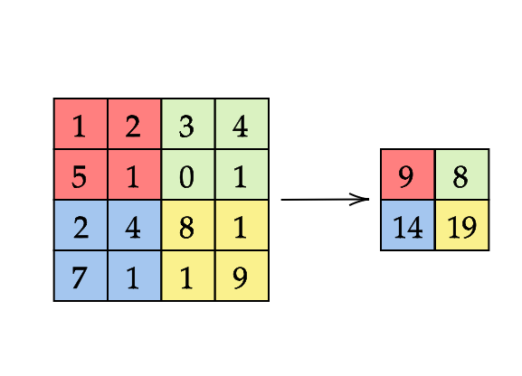

# Lab 09 - Custom Rules For Differentiation

In many scientific and engineering applications, we often encounter mathematical expressions that require differentiation, and efficiently computing derivatives is a key challenge. The `ChainRules.jl` package in Julia provides a flexible framework to define custom derivative rules for complex functions and compositions. By writing your own rrules, you can optimize the computation of derivatives in your specific use case, making it easier to handle non-standard or complex operations that are not supported out-of-the-box.

## Motivation
In our research, we often find that the bottleneck in experiments lies in the performance of basic functions. A common issue arises when working with loops and indexing, as Julia needs to track each index separately, which can slow down gradient computations significantly. However, if you understand your function well, you can write a custom rrule to bypass these limitations and achieve speedups of up to 1000 times. In this lab, you’ll experience this firsthand in one of the exercises you'll solve.

## ChainRules ecosystem

* `ChainRulesCore.jl` - It is a system for defining rules, and a collection of tangent types
* `ChainRules.jl` - a collection of rules for Julia Base and other standard libraries.
* `ChainRulesTestUtils.jl` - utilities for testing rules using finite differences

ChainRules is an AD-independent. The most widely used AD packages like `Zygote.jl`, `Diffractor.jl`, `Enzyme.jl` , and etc. automatically load `rule`s or at least support using them. 

# Key distinction between rules
In a relationship $ y=f(x) $, where $ f $ is a function, computing $ y $ from $ x $ is known as the primal computation. ChainRules focuses on propagating tangents of primal inputs to outputs (with `frule` for forward-mode AD) and cotangents of outputs to inputs (with `rrule` for reverse-mode AD).

## Forward-mode AD rule (`frule`)
The `frule` for $f$ encodes how to propagate the tangent of the primal input $\dot{x} = \frac{dx}{da}$ to the tangent of the primal output $\dot{y} = \frac{dy}{dx}$, i.e., $\dot{y} = \frac{dy}{dx}\dot{x}$.

The `frule` of function `foo(args...; kwargs...)` is 
```julia
function frule((Δself, Δargs...), ::typeof(foo), args...; kwargs...)
    ...
    return y, ∂Y
end
```
where `y = foo(args; kwargs...)` is primal output, and `∂Y` is the result of propagationg the input tangents `Δself, Δargs...`.

Example of `frule` for `sin(x)` is:
```julia
function frule((_, Δx), ::typeof(sin), x)
    return sin(x), cos(x) * Δx
end
```

## Reverse-mode AD rule (`rrule`)
The `rrule` for $f$ encodes how to propagate the cotangent of the primal output $\bar{y} = \frac{da}{dy}$ to the tangent of the primal input $\bar{x} = \frac{da}{dx}$, i.e., $\bar{x} = \bar{y}\frac{dy}{dx}$.

The `rrule` of function `foo(args...; kwargs...)` is 
```julia
function rrule(::typeof(foo), args...; kwargs...)
    ...
    return y, pullback
end
```
where `y = foo(args; kwargs...)` is primal output and `pullback` is a function to propagate the derivative information of `foo` with respect to `args`.

Example of `rrule` for `sin(x)` is: 
```julia
function rrule(::typeof(sin), x)
    sin_pullback(ȳ) = (NoTangent(), cos(x)' * ȳ)
    return sin(x), sin_pullback
end
```

### Tangent types
The types of tangents and cotangents depend on the types of the primals. However, sometimes our functions may have arguments which derivatives we can not compute or do not need. In that case, we represent it as `NoTangent`. `ZeroTangent` is used when tangent is equal to zero.


!!! warning "Exercise"
    ```@example lab09
    using ChainRulesCore, ChainRules, ChainRulesTestUtils
    ```
    Write custom `rrule` for following function $f(x,y) = x^2 + 3y$.

    ```@example lab09
    f1(x::T, y::T) where T<: Real = x^2 + 3*y
    ```
    You can test your solution using
    ```julia
    test_rrule(f1, randn(), randn())
    ```
    
```@example import_zygote
using Zygote
```

```julia
julia> gradient((a,b)->a^2 + 3*b, 2f0, 4f0)
(4.0f0, 3.0f0)

julia> gradient((a,b)->f1(a,b), 2f0, 4f0)
(4.0f0, 3.0f0)
```

For the function in this exercise, writing a custom rrule isn’t necessary; the composition of existing rrules in the ChainRules package will be just as fast as your implementation. But in case, where you work for example with indexing in loops, writing your own rule make computations much faster and lower number of allocations.

!!! warning "Exercise"
    Write your custom `rrule` for function `mymaximum` that finds maximal value of vector or matrix.
    ```@example lab09 
    mymaximum(x) = maximum(x)
    ```
    *HINT*
    - note that typical evaluation of primal maximum within `rrule` does not have to be the same as `mymaximum`
    - try to not look for the same maximum twice


```julia
julia> test_rrule(mymaximum, randn(10));
Test Summary:                            | Pass  Total  Time
test_rrule: mymaximum on Vector{Float64} |    7      7  0.0s

julia> test_rrule(mymaximum, randn(10,10));
Test Summary:                            | Pass  Total  Time
test_rrule: mymaximum on Matrix{Float64} |    7      7  0.7s
```

## Sum pooling on large matrices


To prepare for this task, we'll set up a few utility functions to simplify our implementation. There are multiple ways to approach this, but we'll focus on a straightforward setup for convenience.

First, we define the function `create_range`, which generates index ranges for pooling. We also define a AbstractUnitRange type, sortly `AUR`, for storing these ranges.
```@example lab09
create_range(len::Int, step::Int) = [i:min(i + step - 1, len) for i in 1:step:len]

AUR = Vector{UnitRange{Int64}}

x = randn(10,10);
s1 = create_range(10, 3);
s2 = create_range(10, 2);
```
Next, we’ll compare our custom rule to a basic implementation of this pooling operation, `pool_naive`.

```@example lab09
pool_native(x::AbstractArray, seg₁::AUR, seg₂::AUR) = [sum(x[sᵢ, sⱼ]) for sᵢ in seg₁, sⱼ in seg₂]
```
Calling `gradient` on `pool_naive` shows that the output gradient is a matrix of ones with the same size as `x`, which confirms its correctness. Note that, since the pooling function outputs a matrix, we sum this output to compute derivatives with `gradient`. Because the derivative of addition is one, this result aligns with our expectations.

```@repl lab09
gradient(a->sum(pool_native(a, s1, s2)), x)[1]
```
The `pool_naive` function is concise, but we could write it in a more structured way, as shown in `pool_sum` below.

```@example lab09
function pool_sum(x::AbstractArray, seg₁::AUR, seg₂::AUR)
    y = similar(x, length(seg₁), length(seg₂))
    for (i, sᵢ) in enumerate(seg₁)
        for (j, sⱼ) in enumerate(seg₂)
            y[i,j] = sum(x[sᵢ, sⱼ]) 
        end
    end
    return y
end
```
The functions `pool_naive` and `pool_sum` perform the same operation with the same performance and memory usage. However, the structured approach in `pool_sum` will be more convenient when writing a custom `rrule` for this pooling operation.

!!! warning "Excercise"
    Finish `rrule` function for sum pooling by implementing body of `pool_sum_pullback(ȳ)`.  After that test its functionality by `test_rrule` and measure speedup that you gaind using `@benchmark` on  larger matrix (100x100).

    ```julia
    function ChainRulesCore.rrule(::typeof(pool_sum), x::AbstractArray{T}, seg₁::AUR, seg₂::AUR) where T
        y = pool_sum(x, seg₁, seg₂) 

        function pool_sum_pullback(ȳ)
            ...
        end
        return y, pool_sum_pullback
    end

    ```
!!! note "Hint"
    1) 
    Let's work through a concrete example to build intuition. Suppose we have a simple 2×2 input matrix and we pool it into a single scalar by summing all elements.

    **Concrete example: sum of 2×2 matrix**
    
    ```julia
    x = [x₁₁  x₁₂]
        [x₂₁  x₂₂]
    
    y = sum(x) = x₁₁ + x₁₂ + x₂₁ + x₂₂
    ```

    Forward pass: `y` is the sum of all elements.
    
    Backward pass: if we receive a cotangent `ȳ` (scalar), we need to propagate it back to each element of `x`. Since each `xᵢⱼ` appears exactly once in the sum:
    
    ```julia
    ∂y/∂x₁₁ = 1
    ∂y/∂x₁₂ = 1
    ∂y/∂x₂₁ = 1
    ∂y/∂x₂₂ = 1
    
    x̄ᵢᵢ = ȳ * ∂y/∂xᵢᵢ = ȳ
    ```

    2) You can test is on following functions
    ```julia

    using BenchmarkTools, Test

    @benchmark gradient(a->sum(pool_native(a, s1, s2)), x)
    @benchmark gradient(a->sum(pool_sum(a, s1, s2)), x)

    @test gradient(a->sum(pool_native(a, s1, s2)), x) == gradient(a->sum(pool_sum(a, s1, s2)), x)
    ```


# Hausdorff distance example
While sum pooling or finding the maximum may seem straightforward, combining concepts from these examples enables us to write efficient rrules for more complex tasks, such as computing Chamfer or Hausdorff distances. These metrics are highly relevant to our research, and creating custom rules for them significantly accelerated our experiments.
Here is example of Hausdorff distance $d_{HD}(\mathbf{x},\mathbf{y}) = \max\big(h(\mathbf{x},\mathbf{y}), h(\mathbf{y},\mathbf{x}) \big)$, where $h(\mathbf{a},\mathbf{b}) = \max_{i} \min_{j} d(a_i, b_j)$

```@example lab09
function HausdorffDistance(c)
    d₁ = maximum(minimum(c, dims=1))
    d₂ = maximum(minimum(c, dims=2))
    maximum([d₁, d₂])
end

pool_naive(x::AbstractArray, seg₁::AUR, seg₂::AUR, f::Function=sum) = [f(x[sᵢ, sⱼ]) for sᵢ in seg₁, sⱼ in seg₂]

pool(x::AbstractArray, seg₁::AUR, seg₂::AUR, f::Function=sum) = [f(x[sᵢ, sⱼ]) for sᵢ in seg₁, sⱼ in seg₂]

function ChainRulesCore.rrule(::typeof(pool), x::AbstractArray, seg₁::AUR, seg₂::AUR, ::typeof(HausdorffDistance))
    y, argmaxmins = forward_pool_hausdorff(x, seg₁, seg₂)
    pullback = ȳ -> backward_pool_hausdorff(ȳ, x, seg₁, seg₂, argmaxmins)
    return y, pullback
end
```

!!! warning "Bonus Excercise (hard)"
    Implement functions `forward_pool_hausdorff` and `backward_pool_hausdorff`.
    The key is to identify the indices within each segment that contribute to the Hausdorff distance calculation, then propagate gradients only through these indices in the backward pass.
    *HINT*
    - The `forward_pool_hausdorff` function should compute the Hausdorff distance by finding relevant indices within each segment.
    - Store these indices in a `Matrix{CartesianIndex{2}}`
    - In backward function, first asign segment `o[sᵢ, sⱼ]` to temporary variable, then propagate `ȳ` in this segment and then make `o[sᵢ, sⱼ]` equal to temporary variable 
    - In backward_pool_hausdorff, use the index matrix from the forward pass to propagate gradients only through the identified indices. We suggest, temporarily store each segment’s values and restore them after updating the gradient.


```julia
@benchmark gradient(a->sum(pool_naive(a, s1, s2, HausdorffDistance)), x)
@benchmark gradient(a->sum(pool(a, s1, s2, HausdorffDistance)), x)
```


# Rotary position embedding
The final example in this lab is Rotary position embedding (RoPE). 
Rotary Position Embedding (RoPE) is a method used in neural networks, especially transformers, to encode positional information within sequences. Unlike traditional position embeddings that add positional values to token embeddings, RoPE multiplies the embeddings with sinusoidal functions, allowing for the preservation of relative distances between tokens in a more natural way. This approach is efficient for capturing long-range dependencies, especially in models dealing with sequential data like text.


```julia
function rotary_embedding(x::AbstractMatrix, θ::AbstractVector)
    d = size(x,1)
    2*d == length(θ) && error("θ should be twice of x")
    o = similar(x)
    @inbounds for i in axes(x,2)
        for (kᵢ, θₖ) in enumerate(θ)
            k = 2*kᵢ - 1
            sinᵢ, cosᵢ  = sincos(i * θₖ)
            o[k,i]   = x[k,i]   * cosᵢ  - x[k+1,i] * sinᵢ
            o[k+1,i] = x[k+1,i] * cosᵢ  + x[k,i]   * sinᵢ
        end
    end
    o
end

function ∂rotary_embedding(ȳ, x::AbstractMatrix, θ::AbstractVector)
    x̄ = similar(x)
    θ̄ = similar(θ)
    θ̄ .= 0
    @inbounds for i in axes(x,2)
        for (kᵢ, θₖ) in enumerate(θ)
            k = 2*kᵢ - 1
            sinᵢ, cosᵢ  = sincos(i * θₖ)
            x̄[k,i]   =  ȳ[k,i] * cosᵢ + ȳ[k+1,i] * sinᵢ
            x̄[k+1,i] = -ȳ[k,i] * sinᵢ + ȳ[k+1,i] * cosᵢ

            θ̄[kᵢ] += i* (- ȳ[k,i]   * x[k,i]  * sinᵢ - x[k+1,i] * ȳ[k,i] * cosᵢ 
                   - x[k+1,i] * ȳ[k+1,i] *sinᵢ + x[k,i] * ȳ[k+1,i] * cosᵢ)
        end
    end
    x̄, θ̄
end

function ChainRulesCore.rrule(::typeof(rotary_embedding), x::AbstractMatrix, θ::AbstractVector)
    y = rotary_embedding(x, θ)
    function rotary_pullback(ȳ)
        f̄ = NoTangent()
        x̄, θ̄ = ∂rotary_embedding(ȳ, x, θ)
        return f̄, x̄, θ̄
    end
    return y, rotary_pullback
end
```