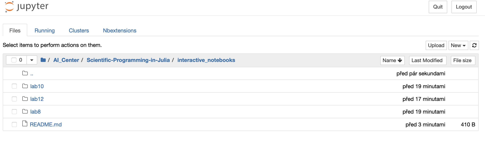
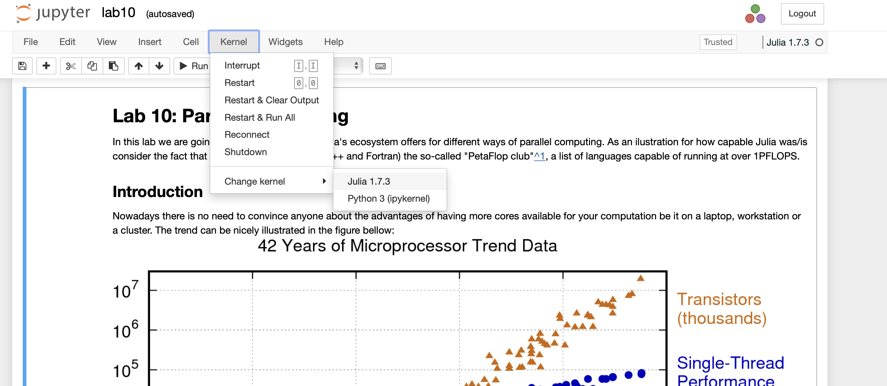

# Info  
**Only empty (without solutions) notebooks will be available until the end of the lab.**
<br/><br/>
# Usage instructions
All interactive notebooks are Jupyter notebooks. 
In order to use them some instalations are needed.

1) run julia (version is your choice) in terminal
2) you need to install `IJulia` -> `using Pkg; Pkg.add("IJulia")`
3) *run `notebook()`* and confirm installation of `Jupyter`
    ```julia
    julia> notebook()
    install Jupyter via Conda, y/n? [y]:
    ```
4) run `notebook()` again -> `Jupyter notebook` will open in your browser
5) navigate to folder with notebook
    
6) when you create or open existing notebook, make sure you are using `julia` kernel
    


More information on https://github.com/JuliaLang/IJulia.jl
